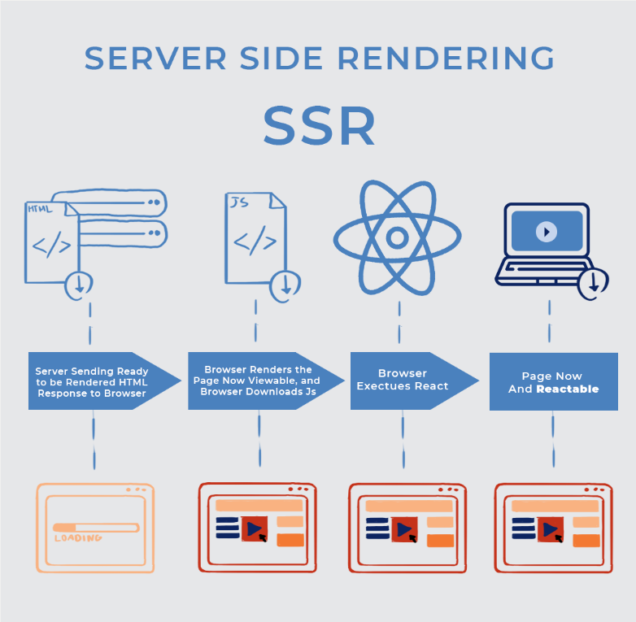
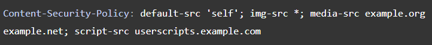

# **WEB và những khái niệm quan trọng**
1. *Web page (trang web)* : là ***file HTML*** ở server để khi trình duyệt (web browser, như Firefox, Chrome, Edge, Safari) gửi request đến những file này, nó sẽ được ***hiển thị trực tiếp*** trên trình duyệt. Tất cả web page (nếu được cấp quyền truy cập) đều có thể truy cập được thông qua một ***địa chỉ cụ thể và duy nhất*** trên thanh tìm kiếm (URL hoặc URI)

    
    
Địa chỉ của một web web page chínhpage

2. *Website* : là ***tập hợp các web page*** có ***cùng domain name***, và mỗi web page có thể link tới các web page khác. Để truy cập vào một website, đánh domain name vào thanh tìm kiếm, và ta được trả về ***trang web chính*** của website được gọi là ***homepage***

    
    
Địa chỉ của một website

❗Có những website chỉ chứa ***một web page duy nhất*** được gọi là ***single-page website***

3. *Web server* : là máy tính hoặc phần mềm ***host một hoặc nhiều website***. Host ở đây có thể hiểu là các web page và cái tài nguyên liên quan (CSS, Script...) đều có sẵn để sử dụng trong server đó, tức nó ***lưu trữ các tài nguyên*** đó. Chỉ cần nhận request từ trình duyệt là web server sẽ trả về tài nguyên tương ứng của request

❗Khi một website không hoạt động hoặc không thể truy cập, có thể là do server bị lỗi, và nếu lỗi thật thì tất cả website trong server đều không thể truy cập 

4. *Search engine (công cụ tìm kiếm)* : một ***dịch vụ web*** giúp ***tìm kiếm các web page***, như Google, Bing, Yahoo... và được truy cập ***thông qua trình duyệt*** (tức search engine ở trong web browser). Về cơ bản, nó chính là một ***website đặc biệt*** dùng để tìm các website khác hoặc các web page của các website đó. Các website hoặc trang web mà nó tìm được sẽ được sắp xếp vào ***search results***, hoặc gọi là ***rankings***, và tùy thuộc vào tiêu chí đánh giá của nó mà kết quả được sắp xếp từ cao tới thấp

❗Trình duyệt và search engine ***không hề giống nhau***. Trình duyệt là ***phần mềm*** giúp lấy và hiển thị web page, còn search engine là ***một website tìm kiếm*** các website khác hoặc web page. Tại sao lại dễ nhầm lẫn là bởi vì: khi khởi động trình duyệt lên, ***mặc định*** trình duyệt sẽ hiển thị ***homepage của search engine***. Cũng dễ hiểu thôi, vì rõ ràng điều đầu tiên mà bạn muốn làm khi khởi động là có một web page để hiển thị mà

    
    
Homepage của Google

5. *World Wide Web (WWW, W3 - the Web)* : là ***hệ thống liên kết nối*** các public web page thông qua Internet. Và Web và Internet không giống nhau: Web chỉ là một trong các ứng dụng, các dịch vụ được xây dựng trên Internet. Các thành phần chính của Web:
    * Giao thức HTTP: quản lý dữ liệu trao đổi giữa server và client
    * URL/URI: giúp truy cập được vào tài nguyên cụ thể nào đó
    * HTML

 

# **Cách thức hoạt động của Web**
- Trước mắt thì hầu hết các máy tính kết nối Internet đều thuộc mô hình Client-Server
- Bên cạnh các máy tính là client và server còn có:
    * Đường truyền kết nối Internet: giúp ***trao đổi dữ liệu*** giữa các máy tính trong Internet
    * TCP/IP: bộ giao thức TCP (Transmission Control Protocol) và IP (Internet Protocol) giúp định nghĩa ***cách thức*** mà dữ liệu sẽ được trao đổi trong Internet, tức dữ liệu sẽ được trao đổi ***như thế nào***
    * DNS: hệ thống phân giải tên miền, phân giải hostname thành IP và ngược lại
    * HTTP: giao thức truyền siêu văn bản, giống như một loại "ngôn ngữ" giao tiếp giữa client và server
    * Các file: do một website có thể chứa rất nhiều files, cụ thể là:
        * Source code: HTML, CSS, JS
        * Assets: ảnh, nhạc, video, file docs, PDFs... và các thứ khác mà không phải source code
## *Vậy thì, chính xác là điều gì xảy ra khi nhập địa chỉ, hay tên một website vào thanh tìm kiếm?*
- Trình duyệt sẽ thông qua DNS server để tìm ra được địa chỉ IP chính xác của server chứa website đó
- Sau khi có được địa chỉ IP, trình duyệt và server sẽ trao đổi dữ liệu thông qua mô hình Request - Response. Và cách mà chúng được trao đổi sẽ tuân theo bộ giao thức TCP/IP
- Nếu request được tiếp nhận và xử lý thành công, server sẽ trả về response tương ứng kèm theo dữ liệu mà client request. Nhưng dữ liệu không phải được gửi cả một cục, mà sẽ được phân nhỏ ra thành các gói tin (data packet)
- Client nhận được phản hồi sẽ ghép lại các gói tin đó và nhận được web page, hiển thị lên trình duyệt

## *Vậy thì, thứ tự phân tích (parse) file như thế nào?*
- Một file HTML thường chứa thẻ &lt;link> tham chiếu tới file CSS và thẻ &lt;script> tham chiếu tới file JS
- Đương nhiên, khi tải một web page, trình duyệt sẽ phải phân tích file HTML trước rồi, thế nên mới biết trong đó có thẻ &lt;link> và &lt;script> chứ
- Sau đó, với mỗi file CSS trong thẻ &lt;link> sẽ được trình duyệt request đến server để lấy các file đó về. Tương ứng nó sẽ lấy các file JS trong thẻ &lt;script>. Sau đó nó mới phân tích nội dung của các file CSS và JS đó

## *Gói tin (Packet)*
- Về cơ bản, dữ liệu được truyền qua web dưới dạng rất nhiều các gói nhỏ. Tại sao không phải gửi một cục thì là vì:
    * Sẽ có lúc xảy ra lỗi như mất kết nối. Nếu để cả cục dữ liệu và xảy ra lỗi trong quá trình truyền sẽ làm việc truyền tin phải bắt đầu lại từ đầu. Còn nếu chia thành các gói nhỏ thì thiếu gói nào, ta truyền lại gói đó
    * Việc chia nhỏ gói tin có thể được truyền mỗi gói theo mỗi đường khác nhau để đến cùng một đích, giúp tăng thời gian nhận tin, hiệu suất làm việc và nhiều người dùng có thể truy cập được tài nguyên trong cùng một lúc

 

# **Ngôn ngữ phía Client và ngôn ngữ phía Server**
## *Client-side language thì có gì?*
- HTML - HyperText Markup Language: ***tạo khung*** cho một web page
- CSS - Cascading Style Sheets: ***trang trí, tô son điểm phấn*** cho web page 
- JS - JavaScript: tạo ***sự tương tác*** với các thành phần trong web page
- VBScript
- AJAX

    ❗Các framework: ReactJS, Angular, Vue, Bootstraps...

    
    
Front-end Framework

## *Server-side language thì sao?*
- PHP
- C/C++
- Java và JSP
- Python
- Ruby

    ❗Các framework: Laravel, ExpressJS, Spring, Django, Ruby on Rails, CakePHP...

    
    
Back-end Framework

 

# **Database**
## *Khái niệm*:
- *Database* - cơ sở dữ liệu, là một ***hệ thống lưu trữ dữ liệu***
- *Database Management System (DBMS)* - hệ quản trị cơ sở dữ liệu, là phần mềm giúp ***tạo và quản lý cơ sở dữ liệu***. VD: XML...
- *Relational Database Management System (RDBMS)* là một ***phiên bản nâng cấp*** của DBMS khi mà các dữ liệu đều có thể có quan hệ với nhau bằng cách sử dụng ***bảng***. VD: MySQL, PostgreSQL, Oracle... Ngôn ngữ chính dùng để quản lý ***cơ sở dữ liệu quan hệ*** là ***SQL*** (Structured Query Language - ngôn ngữ truy vấn có cấu trúc)

    
    
RDBMS

- *NoSQL Database Management System* - một cách khác để lưu trữ dữ liệu mà không sử dụng bảng. VD: MongoDB, Cassandra, Redis...

    
    
NDBMS

 

# **XAMPP**
- XAMPP là một ***bộ phần mềm*** bao gồm:
    * Apache
    * MariaDB (hoặc MySQL)
    * PHP
    * Perl
    * Nhiều ứng dụng khác nữa như: phpMyAdmin, Webalizer, Tomcat, Mercury...
- XAMPP có thể hoạt động được trên nhiều hệ điều hành ***(Cross-platform)*** như Windows, Linux, Mac OS
- Ứng dụng: 
    * Giúp chạy server trên localhost, test chức năng trước khi cho ra Internet
    * Giúp quản lý CSDL
- Link cài: https://www.apachefriends.org/download.html

 

# **Client-side Rendering và Server-side Rendering**
## *Nhưng mà, render là gì?*
- Render là một quá trình mà ***biến web code thành web page*** nhờ một cái gọi là ***rendering engine/browser engine***
- ***Search engine optimization (SEO)*** : là cách để website hoặc trang web ***có thể được tìm thấy*** bởi các search engine, nhờ đó nó mới được hiện lên trên kết quả tìm kiếm gọi là search ***results/rankings***

## *Server-side rendering:*

    
    
Server-side Rendering

- Server-side rendering là quá trình ***render web page hoàn chỉnh*** ngay ***tại server*** sau đó trả về cho client
- Lúc này mới chỉ load được HTML tức chưa tương tác được. Đến khi trình duyệt tải xong cả các file JS và hoàn tất thực thi nó, trang web mới có thể tương tác được
- Các search engine đều crawl và index nội dung trước khi truyền tới người dùng nên điều này có ích cho SEO

    ❗*Crawl* : quá trình ***thu thập thông tin*** từ web page và index website đó

    ❗*Index* : đánh chỉ mục. Tức là lưu trang web đó vào cơ sở dữ liệu của search engine, nên nếu nó không có trong CSDL của search engine thì không ai có thể tìm được nó thông qua thanh tìm kiếm

|Ưu điểm|Nhược điểm|
|-|-|
|Load page lần đầu nhanh hơn|Chỉ cần một thay đổi nhỏ cũng phải load lại từ đầu|
|Hiệu quả hơn đối với các file tĩnh (static file, chỉ chứa ảnh và text)|Tốn tài nguyên server|
|SEO tốt do nội dung được rendered trước khi chuyển cho client|Lượng request nhiều|

## *Client-side rendering:*

    
    
Client-side Rendering

- Client-side rendering là quá trình render web page ở trình duyệt
- Server chỉ việc tải dữ liệu thô cho trình duyệt, sau đó sẽ được các thư viện JS ở trình duyệt xử lý

|Ưu điểm|Nhược điểm|
|-|-|
|Giảm tải tác vụ cho server|Lần đầu load thì lượng dữ liệu khá nặng|
|Việc load lại trang ở những lần sau nhanh hơn|Hiển thị nội dung chậm hơn ở lần đầu|
|Nhiều sự lựa chọn cho thư viện JS|SEO bị ảnh hưởng nếu code không được cài đặt phù hợp|

 

# **ORM**
- ORM - Object Relational Mapping, là một kỹ thuật được ví như ***cầu nối*** giữa ***lập trình hướng đối tượng*** và ***cơ sở dữ liệu***. Tức về cơ bản nó là code theo kiểu OOP, tạo một cái CSDL "ảo" ngay tại lúc code để thao tác trên các ***properties*** (chứa dữ liệu) và ***methods*** (cách xử lý dữ liệu)

    

- Khi tương tác với cơ sở dữ liệu bằng lập trình hướng đối tượng, cần sử dụng SQL để thực hiện các công việc trong CRUD (create, read, update, delete)
- ***ORM Tools*** là phần mềm được xây dựng sẵn giúp đơn giản hóa các tác vụ trên thay vì phải sử dụng truy vấn trong SQL
    
    VD: 

    

- Một số ORM tools:
    * Cho Java: Hibernate, Apache OpenJPA, EclipseLink...
    * Cho Python: Django, web2py...
    * Cho PHP: Laravel, CakePHP...
    * Cho .NET: Entity Framework, NHibernate...

|Ưu điểm|Nhược điểm|
|-|-|
|Tăng hiệu suất làm việc|Học sử dụng ORM tools có thể khá tốn thời gian|
|Tăng khả năng bảo mật, tránh bị SQLi|Nếu code không chắc thì khó thực hiện các truy vấn phức tạp|
|Lượng code ít hơn|Chậm hơn SQL|

 

# **REST và SOAP**
- Nhắc lại: API là giao diện lập trình ứng dụng, tức là một phần mềm giúp tương tác giữa 2 ứng dụng
- REST API và SOAP API là hai cách thức chính để có thể truy cập vào các dịch vụ web
## *SOAP:*
- Viết tắt của "Simple Object Access Protocol" - giao thức truy cập đối tượng đơn giản
- Là một giao thức được chuẩn hóa với các quy định nghiêm ngặt và sự phức tạp của nó (không như cái tên có chữ "đơn giản")
- Trao đổi dữ liệu bằng XML, vậy nên dữ liệu đôi khi có thể rất phức tạp
- Phụ thuộc nhiều vào ngôn ngữ lập trình sử dụng: có những ngôn ngữ phải build request thủ công, nhưng có ngôn ngữ có thể sử dụng shortcuts mà SOAP cung cấp
- Có khả năng xử lý lỗi bằng cách phản hồi lại thông tin của lỗi

## *REST:*
- Viết tắt của "Representational State Transfer", sự chuyển trạng thái đại diện, ra đời để giải quyết vấn đề về sự "cồng kềnh" và tốc độ của SOAP
- Trao đổi dữ liệu dưới nhiều dạng như HTML, JSON, XML, và cả plain text, hoặc thậm chí thông qua param của URL

## *Vậy khi tự tạo ra một dịch vụ web thì nên dùng cái nào?*

|SOAP|REST|
|-|-|
|Không phụ thuộc vào ngôn ngữ hay nền tảng sử dụng|Linh hoạt hơn trong việc lựa chọn định dạng truyền dữ liệu|
|Được tiêu chuẩn hóa|Dễ học hơn|
|Có khả năng xử lý lỗi|Nhanh hơn|
|Có hỗ trợ cho một vài ngôn ngữ|Không cần tool đắt tiền để tương tác với dịch vụ web|

 

# **Session và Cookie**
## *Session là gì?*
- Session - phiên làm việc, là ***khung thời gian nhất định*** mà trong khoảng thời gian đó người dùng ***thao tác*** trên website

    

- Một session bắt đầu từ khi client gửi request đến server, tồn tại cho đến khi ***hết thời gian*** (time-based expiration) hoặc người dùng ***đóng ứng dụng*** (tương đương với việc ***chủ động kết thúc session***)
- Session được dùng để ***lưu thông tin*** xuyên suốt các web page và được lưu ở ***phía server*** dưới dạng ***key-value***, do vậy khó bị sửa đổi

    

- Mỗi session sẽ có một định danh riêng, gọi là ***sessionID***
- Một phiên làm việc hầu như có 3 phần chính:
    1. Client thiết lập kết nối với server
    2. Client gửi request và đợi phản hồi
    3. Server phản hồi lại request tương ứng
- Ứng dụng chính của session là để giữ client đăng nhập trong suốt quá trình làm việc. Ngoài ra nó cũng có thể dùng để lưu dữ liệu tạm thời khác

## *Cookie là gì?*
- Cookie (browser cookie, web cookie) là ***một đoạn thông tin của người dùng*** được ***server gửi*** kèm trong response, giúp server ***nhận ra người dùng*** trong cái request sau đó
- Bởi vì giao thức HTTP được gọi là "stateless", tức là mỗi lần client vào website nào đó, client sẽ lại phải thiết lập kết nối mới với server, và server cũng không lưu bất kỳ thông tin gì về request trước của client
- Cookie được lưu ở ***phía client***, do vậy dễ bị sửa đổi hoặc đánh cắp

### *Phân loại Cookie:*
- *Session cookie* : dùng để ***track phiên làm việc của người dùng***, tức nó có giá trị bằng chính ***sessionID***. Nó không có thời gian hết hạn và bị xóa khi ***phiên làm việc kết thúc***
- *Persistent cookie* : giống session cookie, nhưng không bị xóa khi kết thúc phiên làm việc, chỉ bị xóa khi ***hết hạn***
- *Authentication cookie* : dùng để quản lý phiên làm việc
- *Tracking cookie* : dùng để ghi lại các thao tác của người dùng
- *Zombie cookie* : 
- *Third-party cookie* : là cookie của một website khác (bên thứ ba) dùng để tracking là chính

### *Ứng dụng của Cookie:*
- ***Duy trì đăng nhập*** cho người dùng mỗi khi truy cập vào website có yêu cầu tài khoản đăng nhập
- ***Lưu điểm*** trong ***trò chơi***
- Đối với các website bán hàng, cookie có thể giúp lưu ***thông tin trong giỏ hàng*** của người dùng
- Dùng để lưu các ***tùy chỉnh*** (preference, personalization) của người dùng lên website, như chủ đề, màu sắc, cách bố trí...
- Dùng để ***ghi lại, phân tích*** các thao tác của người dùng

### *Cách thức tạo ra Cookie:*
- Sau khi nhận request đầu tiên đến từ client, server có thể gửi kèm các ***Set-Cookie header*** trong response

    

- Trình duyệt sẽ lưu giá trị của cái header đó và mỗi lần gửi request cho server sẽ gửi kèm ***Cookie header*** với giá trị được lưu

    

- Cookie có thể được thay đổi thời gian hết hạn, hoặc cũng có thể giới hạn cho một domain hoặc path trong URL xác định. Thông tin thêm xem ở [Set-Cookie Header](https://developer.mozilla.org/en-US/docs/Web/HTTP/Headers/Set-Cookie)

 

# **Cách để lưu mật khẩu một cách bảo mật**
- Mật khẩu vốn được sinh ra để giải quyết vấn đề bảo mật, là một cách để xác minh người đang sử dụng có quyền truy cập vào một tài nguyên nào đó hay không
- Việc sử dụng các mật khẩu yếu hoặc dễ đoán thì dễ bị kẻ tấn công lấy được, nhưng việc tạo ra mật khẩu mạnh và khó nhớ thì cũng không hiệu quả do não người khó tiêu hóa được
- Vậy là bài toán lưu mật khẩu sao cho bảo mật ra đời, lưu ở đâu và lưu như thế nào là giải pháp cần tìm
## *Những điều không nên làm khi lưu mật khẩu:*
1. Lưu mật khẩu ở dạng plain text
2. Lưu mật khẩu vào giấy viết: ờm, cũng được, thế thì chuyển sang bài toán giữ không cho kẻ lạ vào nhà nhé
3. Tự email bản thân mật khẩu:

## *Vậy thì lưu như nào cho bảo mật? (Dựa vào OWASP)*
1. *Hash function* : hash là quá trình ***mã hóa một chiều***, tức mã hóa thì dễ nhưng để giải mã thì rất khó (chứ không phải là không thể). Một số hàm hash phổ biến: md5, SHA-1
2. *Salt* : salt là muối, nhưng salt trong bảo mật là một ***chuỗi ký tự ngẫu nhiên và duy nhất*** được gắn vào mật khẩu trước khi cho vào hàm hash. Bởi vì kẻ tấn công có thể phá hàm hash thông qua ***rainbow tables*** và ***database-based lookups***, việc "thêm muối" vào mật khẩu sẽ giúp hàm hash có thể tối ưu hơn, khó phá hơn

    

3. *Sử dụng các ứng dụng quản lý mật khẩu (Password Manager)* : những ứng dụng này có khả năng ***tạo ra mật khẩu ngẫu nhiên*** và lưu nó trong một nơi bảo mật được cài đặt theo cơ chế của ứng dụng. Vậy nên thay vì nhớ hàng trăm mật khẩu, lưu nó vào đây và việc duy nhất phải làm là nhớ mật khẩu truy cập vào ứng dụng

    
    
Một vài ứng dụng quản lý mật khẩu

 

# **Same-origin Policy (SOP) và Cross-Origin Resource Sharing (CORS)**
## *Nhưng mà origin là gì?*
- Origin (Gốc) được định nghĩa là bao gồm ***scheme*** (protocol, giao thức), ***hostname*** (domain) và ***port*** của URL
- Ví dụ của 2 đối tượng URL có cùng origin (same origin):

    

❗Như vậy chỉ cần khác giao thức hoặc khác domain và port là 2 đối tượng sẽ không cùng origin

- Việc truy cập vào origin khác để sử dụng tài nguyên được gọi là ***cross-origin***

## *Same-origin Policy (SOP) là gì?*
- Policy là chính sách, quy tắc, nguyên tắc cần được tuân theo. Vậy SOP hiểu là một ***cơ chế bảo mật*** của trình duyệt ***giới hạn tương tác*** của tài nguyên từ một origin nào đó với các ***origin khác***, hay nói cách khác là nó ***chặn request*** được gửi tới ***website mà không cùng origin***, hay cụ thể hơn là ***ngăn JS*** của một website có thể ***truy cập vào tài nguyên*** của một website khác
- SOP giúp ngăn chặn các tài nguyên có thể gây hại, giảm nguy cơ bị tấn công

### *Tại sao SOP lại cần thiết?*
- Khi trình duyệt của người dùng gửi request từ một website này sang một website khác, điều này đồng nghĩa với việc tất cả các cookies, bao gồm session cookies của phiên làm việc của người dùng đó, cũng sẽ gửi kèm trong cả request luôn
- Nếu không có SOP, nếu vô tình truy cập vào một cái web bẩn nào đấy thì session cookie sẽ bị lộ

### *Vậy khi nào ta cần truy cập tới tài nguyên của website bên ngoài (cross-origin)?*
- JS code trong &lt;script src="...">&lt;/script>
- CSS như &lt;link rel="stylesheet" href="...">. Nếu stylesheet có MIME không đúng hoặc nội dung không phải của CSS thì sẽ bị trình duyệt chặn
- Ảnh trong &lt;img> hoặc các media khác trong &lt;video> và &lt;audio>
- &lt;iframe>

### *Vậy thì làm thế nào để truy cập được tài nguyên ở cross-origin?*
- Sử dụng CORS (bên dưới chi tiết hơn)

## *Cross-Origin Resource Sharing (CORS) là gì?*
- Dịch nôm na là ***"việc chia sẻ tài nguyên khác gốc"***
- CORS là một cơ chế dựa vào HTTP header, cho phép server ***chọn ra các origin*** (khác cái của chính nó) mà trình duyệt ***được phép tải tài nguyên về*** 

    

- VD: front-end của ***`https://domain-a.com`*** sử dụng XMLHttpRequest (một đối tượng trong JS dùng để tương tác với server) để gửi request tới ***`https://domain-b.com/data.json`***
    * Về vấn đề bảo mật, trình duyệt sẽ chặn cái request đến server khác gốc này, giả sử khi XMLHttpRequest và Fetch API cùng tuân theo SOP
    * Những web app sử dụng API như vậy sẽ chỉ có thể request tài nguyên từ chính origin của nó, trừ khi trong response của cái origin được request tới chứa CORS header
- Nếu không được triển khai cẩn thận có thể dẫn tới ***CSRF - Cross-site Request Forgery***

### *Cơ chế hoạt động của CORS:*
#### ***Trường hợp đơn giản nhất:***
- Mô hình của trường hợp đơn giản nhất có dạng như sau:

    

- Ví dụ, web có origin `https://foo.example` muốn lấy tài nguyên từ web có origin `https://bar.other` thì trong đoạn code JS sẽ có kiểu như sau:

    

- Đoạn request khi mà trình duyệt chạy đến dòng code đó có dạng:

    

- Ta thấy có header ***Origin***, tức nó được thực hiện từ origin `https://foo.example`
- Đoạn response của origin được request tới (là `https://bar.other`) có dạng như sau:

    

- Ta thấy có header ***Access-Control-Allow-Origin*** với giá trị *, tức là tài nguyên được request tới có thể được truy cập bởi mọi origin. Còn nếu ông orgin `https://bar.other` chỉ muốn 1 mình ông `https://foo.example` được truy cập thôi thì giá trị của header sẽ là origin của ông đó

    

#### ***Thông qua preflighted request:***
- Trước hết ta cần biết *preflight request* là gì. Preflight có nghĩa là ***"xảy ra trước giờ máy bay cất cánh"***. Nhưng ở đây có thể hiểu là trước khi request chính được "bay" sang server tài nguyên
- Preflight request là ***CORS request*** được ***browser tự động gửi*** khi có thêm các ***custom header*** (không phải header do `user agent` tự tạo). Nó dùng để kiểm tra xem server tài nguyên có ***cho phép request*** chứa ***giao thức đó*** và ***các header được thêm vào*** để truy cập vào tài nguyên hay không
- Preflight request là một request với giao thức ***OPTIONS***, và có các header như:
    * Access-Control-Request-Method
    * Access-Control-Request-Headers
    * Origin
- Mô hình thông qua preflighted request có dạng như sau:

    

- Không giống như trường hợp đơn giản chỉ bao gồm 2 header Origin và Access-Control-Allow-Origin, trình duyệt trước khi gửi request chính sẽ gửi ***preflighted request*** với giao thức OPTIONS trước để kiểm tra xem cái request chính có an toàn thật khi gửi hay không
- Như vậy đoạn code JS của origin ban đầu sẽ có dạng như sau:

    

- Đoạn code trên tạo một thực thể của đối tượng XMLHttpRequest để thực hiện gửi request POST bao gồm header X-PINGOTHER và Content-type. Do nó có ***custom header*** (là 2 cái trên), nên request này cần có preflighted request
- Request của preflight có dạng:

    

- Nó chứa header ***Origin*** là origin của server yêu cầu tài nguyên, header ***Access-Control-Request-Method*** với giá trị POST để nói rằng request thật sẽ là giao thức POST, header ***Access-Control-Request-Headers*** với giá trị X-PINGOTHER, Content-Type để nói rằng request thật sẽ chứa 2 custom header kia
- Response của server tài nguyên trả về tương ứng là:

    

- Ta thấy server trả về có header ***Access-Control-Allow-Origin*** là `https://foo.example` tức origin này được phép truy cập tài nguyên, header ***Access-Control-Allow-Methods*** với các giao thức của request được phép gửi, header ***Access-Control-Allow-Headers*** với các header của request được phép thêm vào. Ngoài ra ta còn thấy header ***Access-Control-Max-Age***, dùng để chỉ thời gian lưu của cái response này trong bộ nhớ đệm, giá trị của nó là đơn vị giây

❗Tuy nhiên cần lưu ý là nếu request chính có header ***Authorization*** thì cách trên không thể thực hiện được

#### ***Thông qua credentialed request:***
- Cách này dùng để tạo một request chứa credential của người dùng, thường là cookie
- Giả sử JS code có dạng như sau:

    

- Ta thấy thuộc tính ***.withCredentials*** của thực thể invocation được set là true. Mặc định, trình duyệt sẽ bỏ qua response từ server mà không có header ***Access-Control-Allow-Credentials: true***. Thế nên việc set true mới làm cho trình duyệt nhận response từ server
- Vậy là ta có request và response tương ứng:

    

 

# **Content Security Policy**
- Content Security Policy, hay CSP, dịch là ***"Chính sách bảo mật nội dung"***
- Nó là một tầng bảo mật được thêm vào để phát hiện và ngăn chặn các kiểu tấn công như XSS hoặc Injection attack
- Nhìn chung để thực hiện CSP, ta cần làm server trả về header ***Content-Security-Policy***, ví dụ như sử dụng &lt;meta> tag như sau trong Front End:

    

## *Tại sao CSP lại ra đời?*
- Mục tiêu chính của CSP là ***ngăn chặn XSS***
- XSS là một lỗ hổng khi trình duyệt quá tin vào nội dung mà server trả về, mà server lại quá tin vào input của người dùng, dẫn đến khả năng có thể thực thi được script bẩn
- Về cơ bản CSP ngăn chặn XSS bằng cách chỉ ***cho phép trình duyệt thực thi*** script từ một ***vài domain nhất định***. Và trình duyệt cũng phải tương thích với mô hình CSP đó thì mới có thể bỏ script từ nguồn không được cho phép
- Ngoài ra bên cạnh giới hạn domain, CSP còn có thể giới hạn được ***giao thức***. VD: mọi nội dung tải về trình duyệt bắng HTTPS

## *Cách sử dụng CSP:*
- CSP có thể được triển khai thông qua thêm ***header Content-Security-Policy*** vào response
- Giá trị của header có dạng &lt;directive> &lt;value> (giống key-value nhưng không có dấu ":" và cách nhau bởi dấu cách). Mỗi cặp giá trị đó được gọi là ***policy***
- Các ***directive*** sẽ là một loại tài nguyên nhất định, và value của nó thường sẽ là domain nào đó
- Có một directive luôn cần phải được cho vào đó là ***default-src***, hiểu là các loại tài nguyên khác nếu chúng không được specify policy. Ngoài ra có các directive phổ biến như ***script-src*** dùng để chặn chạy các inline script, hoặc ***style-src*** để giới hạn inline style từ thẻ &lt;style> hoặc style attribute...
- Các directive có một giá trị đặc biệt là ***'self'***, tức ám chỉ rằng kiểu tài nguyên này chỉ được lấy từ ***chính origin của web*** (có bao gồm subdomain). VD header sau có nghĩa là: tất cả tài nguyên (content) phải đến từ chính website origin

    

- VD2: tất cả tài nguyên phải đến từ chính website origin hoặc từ các domain và subdomain của example.com

    

- VD3: tài nguyên ảnh thì có thể đến từ tất cả origin, nhưng tài nguyên audio hay video chỉ được đến từ các domain cho phép, script cũng thế, còn lại phải đến từ website origin

    

- Tham khảo thêm các giá trị của CSP header tại [đây](https://developer.mozilla.org/en-US/docs/Web/HTTP/Headers/Content-Security-Policy)

## *Test các policy:*
- Ngoài ra, các policy có thể ***không cần được triển khai***, nhưng mỗi ***sự vi phạm*** khi lấy tài nguyên từ nguồn khác cũng có thể được ***reported tới một URI nào đó***
- Lúc này ta sử dụng ***header Content-Security-Policy-Report-Only***
- Report gửi kiểu này sẽ có dạng JSON và được gửi bằng POST request
- Nhưng để vừa triển khai vừa report sự vi phạm, ta có thể thêm directive ***report-uri*** có giá trị là URI mà report sẽ gửi về. VD:

    

- VD: một page tại URL `http://example.com/signup.html` sử dụng policy như sau cho stylesheets:

    

- Đoạn code trong signup.html có dạng như sau:

    

- Có thể thấy ở đây vi phạm truy cập tài nguyên ở chỗ: stylesheets chỉ được phép tải từ `cdn.example.com`, vậy mà trong code vẫn tải từ chính origin của website (là `http://example.com/signup.html`). Thế nên trình duyệt nào mà thích ứng với mô hình CSP này sẽ gửi POST request tới `http://example.com/_/csp-reports` với nội dung như sau:

    

- Cấu trúc của file JSON đó có thể tham khảo tại [đây](https://developer.mozilla.org/en-US/docs/Web/HTTP/CSP#violation_report_syntax)

 

# Tài liệu tham khảo:
- Web:
    * [Deep dive về website](https://www.geeksforgeeks.org/what-is-a-website/)
    * [Viblo](https://viblo.asia/p/khai-niem-co-ban-ve-web-07LKX2AelV4)
    * [Các khái niệm cơ bản của web](https://developer.mozilla.org/en-US/docs/Learn/Common_questions/Pages_sites_servers_and_search_engines) (checked)
    * [WWW](https://developer.mozilla.org/en-US/docs/Glossary/World_Wide_Web) (checked)
    * [Cách web hoạt động](https://developer.mozilla.org/en-US/docs/Learn/Getting_started_with_the_web/How_the_Web_works) (checked)
- Client-side language and Server-side language:
    * [Geeksforgeeks](https://www.geeksforgeeks.org/server-side-client-side-programming/) (checked liệt kê xong)
    * [Server side](https://developer.mozilla.org/en-US/docs/Learn/Server-side/First_steps/Introduction)
- Database:
    * [Khác nhau giữa DBMS và RDBMS](https://www.geeksforgeeks.org/difference-between-rdbms-and-dbms/)
    * [Mozilla](https://developer.mozilla.org/en-US/docs/Glossary/Database) (checked, ngắn nhưng siêu bao hàm)
    * [NoSQL](https://www.mongodb.com/nosql-explained)
- Các framework:
    * TopDev [phần 1](https://topdev.vn/blog/top-10-web-framework-tot-nhat-dang-dung-nhat-phan-1/) và [phần 2](https://topdev.vn/blog/top-10-web-framework-tot-nhat-dang-dung-nhat-phan-2/) (checked)
- Client-side và Server-side rendering:
    * [Toidicodedao](https://toidicodedao.com/2018/09/11/su-khac-biet-giua-server-side-rendering-va-client-side-rendering/)
    * [Viblo](https://viblo.asia/p/server-side-rendering-vs-client-side-rendering-RQqKLz30l7z) (checked)
    * [Heavy.AI](https://www.heavy.ai/technical-glossary/server-side-rendering) (checked)
    * [Freecodecamp](https://www.freecodecamp.org/news/what-exactly-is-client-side-rendering-and-hows-it-different-from-server-side-rendering-bd5c786b340d/) (checked)
    * SEO:
        * https://searchengineland.com/guide/what-is-seo
        * [Viblo](https://viblo.asia/p/tim-hieu-ve-search-engine-optimization-ZabG9z6YvzY6) (checked, khá chi tiết)
- ORM:
    * [Viblo](https://viblo.asia/p/object-relational-mapping-djeZ1PQ3KWz) (checked)
    * [Freecodecamp](https://www.freecodecamp.org/news/what-is-an-orm-the-meaning-of-object-relational-mapping-database-tools/) (checked)
- SOAP và REST:
    * [Viblo](https://viblo.asia/p/khai-niem-co-ban-ve-soap-rest-va-cach-phan-biet-chung-oOVlYyoVl8W) (checked, lạm dụng google dịch quá)
    * [Smartbear](https://smartbear.com/blog/soap-vs-rest-whats-the-difference/) (checked)
    * [Viettus](https://viettuts.vn/web-service/web-service-la-gi#:~:text=SOAP%20l%C3%A0%20vi%E1%BA%BFt%20t%E1%BA%AFt%20c%E1%BB%A7a%20(Simple%20Object%20Access%20Protocol)%20%2D,v%C3%A0%20ng%C3%B4n%20ng%E1%BB%AF%20%C4%91%E1%BB%99c%20l%E1%BA%ADp.)
- Session và Cookie:
    * [Topdev](https://topdev.vn/blog/session-la-gi-cookie-la-gi/)
- Securely store password:
    * [Norton](https://us.norton.com/blog/how-to/how-to-store-passwords)
    * [Tài liệu Google](https://support.google.com/analytics/answer/2731565?hl=en#zippy=%2Cin-this-article)
    * [Cloudflare](https://www.cloudflare.com/learning/privacy/what-are-cookies/)
    * [Cookie từ mozilla](https://developer.mozilla.org/en-US/docs/Web/HTTP/Cookies) (checked)
- SOP và CORS:
    * SOP:
        * [Mozilla](https://developer.mozilla.org/en-US/docs/Web/Security/Same-origin_policy) (checked)
    * CORS:
        * [Mozilla về Preflight request](https://developer.mozilla.org/en-US/docs/Glossary/Preflight_request#:~:text=A%20CORS%20preflight%20request%20is,Headers%20%2C%20and%20the%20Origin%20header.) (checked)
        * [Mozilla](https://developer.mozilla.org/en-US/docs/Web/HTTP/CORS)
        * [Topdev](https://topdev.vn/blog/cors-la-gi/)
        * [Viblo](https://viblo.asia/p/tim-hieu-ve-cross-origin-resource-sharing-cors-Az45bGWqKxY)
- CSP:
    * [Mozilla](https://developer.mozilla.org/en-US/docs/Web/HTTP/CSP) (checked)
    * [Repor-Only Header](https://developer.mozilla.org/en-US/docs/Web/HTTP/Headers/Content-Security-Policy-Report-Only) (checked)