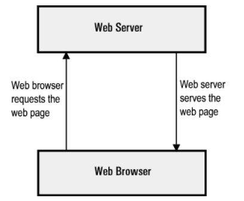

# **Operating System**
- Operating System, viết tắt là OS, dịch là ***"Hệ điều hành"***
- Là một ***phần mềm*** được tải bên trong một ***máy tính/thiết bị điện tử*** để ***quản lý*** tất cả ***các phần mềm ứng dụng*** khác (application program hoặc software) và ***phần cứng*** (hardware) và giúp chúng có thể ***tương tác*** với nhau
- Người dùng có thể tương tác với hệ điều hành thông qua ***giao diện người dùng*** và có 2 giao diện chính: ***GUI*** (Graphical User Interface) và ***CLI*** (Command-line Interface)

    

<!-- ## *Tại sao lại cần hệ điều hành?* -->

## *Chức năng của hệ điều hành:*
### ***1. Cung cấp giao diện người dùng:***
- CLI cho giao diện với các ***câu lệnh, tham số, và đối số*** để thực hiện các tác vụ. Do đó các ***người dùng có trình độ cao*** hoặc ***người quản lý hệ thống*** mới sử dụng giao diện này
- GUI cho giao diện bằng ***icon hoặc ký hiệu*** để người dùng tương tác thông qua các ***thiết bị*** như touchpad, màn hình và chuột. Do đó hầu hết các người dùng thường đều thích sử dụng giao diện này

### ***2. Quản lý các ứng dụng:***
- ***Quản lý tiến trình, luồng*** sao cho tối ưu bộ xử lý của máy
- Thực hiện xử lý lỗi bằng cách loại bỏ tiến trình
- ***Quản lý bộ nhớ*** mà không ảnh hưởng đến hệ điều hành và các ứng dụng khác
- ***Quản lý file***
- Có API cho phép các ứng dụng tương tác với hệ điều hành và phần cứng 

### ***3. Phân bổ tài nguyên phần cứng cho các ứng dụng đó:***
- Hệ điều hành cần nhận dạng phần cứng, nó sẽ tải driver của thiết bị tương ứng đó về, cho phép sử dụng thiết bị đó mà không cần biết cách thức hoạt động của phần cứng/thiết bị đó như nào

## *Phân loại hệ điều hành:*
- Thực tế có rất nhiều hệ điều hành khác nhau để phục vụ nhu cầu người dùng. Dưới đây chỉ là một số hệ điều hành phổ biến:
### ***1. General-purpose OS (GPOS):***
- Tạm dịch là ***"Hệ điều hành đa năng"***
- Hỗ trợ nhiều ứng dụng phát triển độc lập, có nhiều chức năng khác nhau

    VD: Microsoft Windows, Apple iOS, macOS, Linux...

    

### ***2. Network OS (NOS):***
- Thường được dùng để hỗ trợ việc giao tiếp giữa các thiết bị trong mạng nội bộ (LAN)
- Hiện nay, hệ điều hành này không còn mấy nổi trội do hầu như các loại khác đều hỗ trợ việc xử lý giao tiếp giữa các thiết bị qua mạng
- Tuy nhiên NOS vẫn được sử dụng cho các thiết bị mạng như router, switch, firewall...

### ***3. Real-time OS (ROS):***
- Thường được sử dụng khi có ***yêu cầu nghiêm ngặt về thời gian thực*** và phải có phản ứng gần như ***ngay lập tức và chính xác***

    VD: Các hệ thống quản lý nhiên liệu, robots, hệ thống giao thông, tên lửa...

# **Virtual Machine**
- Virtual Machine, viết tắt là VM, dịch là ***"máy ảo"***
- VM thường được gọi là ***guest***, còn máy chứa nó có OS xác định từ trước thì được gọi là ***host***
- Cũng giống như các máy tính vật lý khác (physical computer), VM là một cái ***máy tính ảo*** (virtual computer) hoặc ***máy tính phần mềm*** (software-based computer) nằm trong một cái máy tính vật lý
- VM cũng có ***CPU, bộ nhớ, disk*** để lưu file, và có thể ***kết nối mạng***

## *Cách thức hoạt động:*
- ***Virtualization*** (giả hóa?) là quá trình tạo ra một phiên bản giả của một cái gì đó, như là OS, server, thiết bị lưu trữ hoặc tài nguyên mạng...
- Virtualization trong VM sử dụng ***phần mềm giả lập phần cứng*** để tạo một ra một môi trường ảo
<!-- ...máy tính dựa trên phần mềm khi CPU, bộ nhớ của nó được ***"mượn"*** từ host hoặc từ một remote server, như server trên cloud. Virtualization yêu cầu phải có ***hypervisor*** -->
- VM là một file, thường được gọi là một image
- Nó cũng có hệ điều hành, có môi trường hoạt động riêng biệt so với host, tức việc nó chạy sẽ không ảnh hưởng gì tới host cả 

## *Ứng dụng:*
- Xây và deploy ứng dụng lên cloud
- Test các phiên bản OS
- Chạy các ứng dụng mà OS của máy chủ không tương thích

## *Lợi ích của VM:*
- ***Tiết kiệm*** : thay vì mua nhiều máy tính, ta mua hẳn con xịn và tải nhiều VM
- ***Linh hoạt, nhanh chóng*** : việc chạy VM (spin up a VM) nhanh và dễ hơn nhiều khi so với việc tạo hẳn một môi trường mới
- ***Khả năng mở rộng (Scalability)***: test ứng dụng trên được nhiều VM, tăng khả năng thích ứng và hiệu năng của ứng dụng
- ***Bảo mật*** : chạy các ứng dụng ***không rõ nguồn gốc*** hay ***tính bảo mật*** của nó mà không ảnh hưởng đến host

# **Hypervisor**
- Hypervisor, còn được gọi là Virtual Machine Monitor (VMM), dịch là ***"Phần mềm giám sát máy ảo"***
- Là phần mềm giúp ***quản lý máy ảo***, cho phép máy host có thể có nhiều guest VM bằng cách phân bổ (abstract/isolate/distribute) tài nguyên của host

<!-- ## *Tại sao lại cần đến Hypervisor?* -->
<!-- - Hypervisor giúp tối ưu hóa tài nguyên của host, tạo sự linh hoạt giữa các guest vì nó có thể được di chuyển -->

## *Phân loại:*

    

### ***1. Type 1 - Bare-metal:***
- Đóng vai trò là một ***hệ điều hành "nhẹ ký"*** và ***chạy trực tiếp trên phần cứng*** của máy host
- Do mỗi guest có OS riêng và cũng ***không phụ thuộc vào OS*** của host nên nếu một cái die thì cũng không ảnh hưởng/lan sang các cái khác
- Là loại phổ biến nhất do tính hiệu quả (efficiency) và hiệu suất cao (best-performance) nhờ việc không có hệ điều hành nào ***cạnh tranh tài nguyên*** với nó và ***tương tác trực tiếp*** với nhân (kernel)
- Thường được sử dụng bởi các ***tổ chức IT*** hay các ***doanh nghiệp điện toán*** (computing enterprise)
    
    VD:

    

### ***2. Type 2 - Hosted:***
- Đóng vai trò là một ***phần mềm*** như các ứng dụng khác, tức nó sẽ được tải trên host
- ***Phụ thuộc vào OS*** của host, nên nếu host bị die thì các VMs trong loại này cũng die theo
- Do phụ thuộc vào OS của host nên ***sự chậm trễ*** của các guest là không thể tránh khỏi: mọi hoạt động trên hypervisor và guest đều phải ***thông qua OS của host***
- Thường được sử dụng bởi ***người dùng phổ thông*** khi hiệu suất và vấn đề bảo mật không cần quá quan tâm

    VD:

    

### ***Vậy khi nào chọn Type 1 và Type 2?***
- Nếu làm việc cho một ***doanh nghiệp và tổ chức lớn*** và cần deploy hàng trăm guest thì Type 1 là sự lựa chọn phù hợp
- Nếu chỉ cần deploy cho ***tổ chức nhỏ*** hoặc đơn giản muốn ***test môi trường***, Type 2 sẽ hợp lý hơn do nó ít phức tạp và giá thành cũng rẻ hơn (nếu có)

|Type 1 - Bare-metal|Type 2 - Hosted|
|-|-|
|Được cài trực tiếp trên phần cứng|Được cài như một phần mềm|
|Không phụ thuộc vào OS của host|Phụ thuộc vào OS của host|
|Hiệu quả và hiệu năng cao hơn|Hiệu quả và hiệu năng thấp hơn (một tí)|
|Phù hợp cho môi trường yêu cầu tính bảo mật cao|Phù hợp để chạy test môi trường|

## *Hypervisor và Container có giống nhau không?*

|Hypervisor|Container|
|-|-|
|Cho phép ***các OS*** được chạy 1 cách ***độc lập*** trên phần cứng|Cho phép ***ứng dụng*** chạy 1 cách ***độc lập*** trên OS|
|Có thể chạy được nhiều OS thông qua ***Type 1 hoặc Type 2***|Có thể chạy trên nhiều OS thông qua ***container engine***|
|Các guest dùng ***chung tài nguyên*** phần cứng|Nhờ có container mà mọi ứng dụng đã có ***đủ những thứ nó cần*** để chạy|

# **Docker**
## *Các khái niệm làm quen:*
### ***Container là gì?***

    

- Container là một môi trường ***đóng gói source code, các thư viện và các dependency*** - các đoạn code bổ sung cần thiết cho đoạn code khác, để ***thực thi/chạy một ứng dụng*** trong mọi môi trường
- Là một ***tiến trình chạy độc lập***, không ảnh hưởng đến các tiến trình khác
- Là một ***thực thể của image***, hay nói cách khác là một image đang được chạy

### ***Image là gì?***
- Image, hay container image, là nơi chứa ***hệ thống file*** cho container, tức nó chứa ***tất cả những gì mà container cần đóng gói*** để chạy chương trình: dependency, các cấu hình, source code, biến môi trường... Tức ***image tạo ra container***
- Image sử dụng ***chung nhân (kernel) với OS*** nên nó không cần có OS riêng
- Được cấu tạo từ nhiều ***layer*** và được ghép vào một parent image (base image), giúp cho việc sử dụng các thành phần và cấu hình trong các image con

    ❗Thực ra base image và parent image có sự khác nhau nhẹ, nhưng nhìn chung vẫn có thể dùng thay phiên nhau được, trừ những trường hợp đặc biệt:
    
    +) Base image: là một ***image rỗng***, dùng để tạo image từ đầu

    +) Parent image: là cái ***image được tạo từ trước***, có một vài chức năng cơ bản. Có rất nhiều parent image có sẵn trên Docker Hub hoặc các container repository khác

- Cách tạo ra image:
    * Sử dụng ***Dockerfile***: một file cấu hình cho biết image cần có những cái gì
    * Tạo từ một image có sẵn: sửa image cũ để có image mới

    ❗Image ***tĩnh, không thể thay đổi được*** nên việc thay đổi duy nhất nội dung của một image là tạo mới nó từ parent image

### ***Vậy nói chung image và container khác gì nhau?***
- Image tạo ra môi trường cho container chạy
- Container là một thực thể của môi trường đó, chạy trên container engine (Docker, CoreOS)
- Nhiều container có thể được chạy trên một image, và các container đó sẽ giống hệt nhau

## *Oce, vậy Docker là gì?*

    

- Docker là một trong những ***container engine*** phổ biến nhất giúp ***hỗ trợ*** và ***đơn giản hóa*** việc phát triển ứng dụng
- Link cài tại [đây](https://docs.docker.com/get-docker/)
- Docker Desktop là ứng dụng cung cấp GUI cho Docker, vậy nên Docker Desktop KHÔNG phải là ***container engine***. Bản chất, Docker Desktop chính là một máy ảo (virtual machine) chạy trên Linux
<!-- Ủa nhưng mà máy ảo sao lại vẫn truy cập được vào hệ thống file trên host? -->
## *Cách sử dụng Docker:*
### ***Cách build image từ Dockerfile:***
- Sử dụng câu lệnh: `docker build -t <tên image> .`
    * Flag "-t" dùng để ***đặt tên*** cho image
    * Dấu chấm ở cuối là tìm vị trí Dockerfile, tức là ở ***dir hiện tại***

    ❗Các image không thể có cùng tên, vậy nên nếu ta build 2 image cùng tên, cái mới nhất sẽ ghi đè lên image cũ

### ***Cách chạy một container từ image đã có:***
- Sử dụng câu lệnh: `docker run -dp <port1>:<port2> <tên image>`
    * Flag "-d" dùng để chạy container trong chế độ gọi là ***"detached" - chạy ngầm***. Nếu bỏ flag này nó sẽ ***chạy trực tiếp trên terminal***
    * Flag "-p" tạo sự ***ánh xạ*** giữa ***port của host*** (cổng của lap mình/server) là port1 với ***port của container*** là port2. Nếu port của host đang được sử dụng, câu lệnh fail và trả về lỗi
    *  Ngoài ra câu lệnh còn ***trả về container ID***

    ❗Có thể truy cập vào container thông qua localhost

### ***Liệt kê các image/các container:***
- Liệt kê image: `docker images`

- Liệt kê container ***đang chạy***: `docker ps`

- Liệt kê tất cả container: `docker ps -a`

### ***Dừng/Xóa container:***
- Muốn xóa container, nó phải được dừng trước
- Dừng container: `docker stop <container ID>`
- Chạy container: `docker start <container ID>`
- Xóa container: `docker rm <container ID>`
- Buộc xóa container (dù nó đang chạy): `docker rm -f <container ID>`
    
    ❗ Muốn xóa image, các container chạy bởi nó phải được dừng trước
- Xóa image: `docker rmi <image ID>`

### ***Up image lên Docker Hub:***
- Tạo repo trong tài khoản
- Đăng nhập vào tài khoản thông qua terminal: `docker login -u <tên tài khoản>`
- Muốn logout thì: `docker logout`
- Để đổi tên tag của image: `docker tag <tên image cũ> <tên image mới>`
- Để up lên repo: `docker push <tên account>/<tên repo>:tagname`

## *Vậy thì khi nào thì dùng Docker?*
### ***Khi dev team thay đổi thành viên liên tục***
- Nếu dever mới vào dự án, họ phải bắt đầu từ đầu môi trường dev của dự án trên local, như local server, DB...
- Tùy thuộc vào độ phức tạp của dự án mà việc set up mất hàng giờ đến hàng ngày
- Docker giúp tự động hóa việc setup này qua một câu lệnh với ít thời gian hơn rất nhiều

### ***Khi ứng dụng cần được chạy trên nhiều môi trường khác nhau***
- Riêng việc chạy trên local và server đã có thể có sự khác nhau trong ứng dụng rồi, chưa kể đến về tay của người dùng
- Docker cho phép ứng dụng chạy trong container, không phụ thuộc gì vào môi trường chứa nó

### ***Khi ứng dụng ngày càng phát triển và càng có nhiều các thành phần hơn***
- Dever add thêm thư viện, thêm tính năng, và các dependency mới vào ứng dụng mỗi ngày. Càng phức tạp thì càng khó để quản lý được các thành phần
- Nếu không có Docker, mọi sự thay đổi của app phải được thông báo cho các dever còn lại và thực hiện lưu lại sự thay đổi đó. Nếu không thì version cũ sẽ không thể hoạt động được và các dever kia cũng không hiểu tại sao
- Nhờ Docker, các thành phần mà ứng dụng cần đều nằm trong file cấu hình như Dockerfile hoặc docker-compose.yml và nếu có bất kỳ sự thay đổi nào trong sự cấu hình này, nó sẽ tự động add cho các dever khác

## *Thế thì khi nào không nên dùng Docker?*
### ***Ứng dụng là desktop app***
- Docker làm việc tốt nhất đối với các web app chạy trên server hoặc phần mềm phụ thuộc vào màn console
- Tuy nhiên nếu ứng dụng là desktop app với GUI cao, Docker không nên là một sự lựa chọn. Tức là về cơ bản thì có thể, nhưng nó không phải là môi trường phù hợp để chạy GUI app và đôi khi có thể khá khó khăn

### ***Team chỉ có 1 dever***
- Do Docker giúp tạo sự đồng bộ giữa các dever, nên nếu chỉ có 1 dev thì không cần điều đó

# **Web server**
- Web server là một server phục vụ các ứng dụng web
- Web server có thể là ***phần cứng*** hoặc ***phần mềm***, hoặc ***cả hai***:
    * *Trên phương diện phần cứng*: web server là một ***máy tính*** chứa ***chương trình*** và các ***file thành phần*** như HTML, CSS, JS, ảnh... Web server được ***kết nối với mạng***
    * *Trên phương diện phần mềm*: nó chứa các ***thành phần*** liên quan đến việc người dùng có thể ***truy cập được vào các files mà nó host***. Tối thiểu nhất, nó phải là một ***HTTP server*** - phần mềm hiểu được ***URL*** và ***HTTP***. HTTP server có thể được truy cập thông qua ***tên miền*** của website
- Trong trường hợp đơn giản nhất, trình duyệt (client) cần file gì ở trên server, nó ***gửi request*** đến file đó thông qua ***giao thức HTTP***. Khi tiếp nhận được request, HTTP server tìm nội dung tương ứng và cũng ***trả về response*** thông qua HTTP. Nếu không tìm được, nó trả về lỗi ***404 - Not Found***

    

- Muốn deploy website lên mạng, cần phải có web ***server tĩnh*** (static) hoặc ***động*** (dynamic):
    * *Web server tĩnh*: gồm một máy tính chứa HTTP server. Nó gọi là "tĩnh" do ***server gửi đi y nguyên các file được yêu cầu*** tới trình duyệt
    * *Web server động*: gồm ***web server tĩnh*** và vài phần mềm khác, thông thường là ***application server và DB***. Nó gọi là "động" vì application server cập nhật lại các file trước khi gửi nó cho trình duyệt

        VD: để tạo ra trang web, application server cần lấy nội dung từ DB để điền vào một cái gọi là "HTML template". Có những website chứa hàng nghìn trang web, nên những trang này thường có vài HTML templates và một DB khủng chứa nội dung, thay vì có hàng nghìn file HTML tĩnh

## *Đi sâu thêm một tí nào*
### ***First of all, Shared hosting, VPS hosting, Dedicated hosting là gì?***
### **1. Shared hosting:**

    

- Là một ***dịch vụ web hosting*** cho phép nhiều website được host trên cùng một máy chủ vật lý, và tài nguyên trên server đó sẽ được chia sẻ giữa các web
<!-- - Tưởng tượng: giống như sở hữu chung bể bơi, phòng tập gym, siêu thị trong chung cu -->
- Các website sẽ có cùng một địa chỉ IP của máy chủ vật lý
- Đối tượng: blog cá nhân, doanh nghiệp nhỏ

|Pros|Cons|
|-|-|
|Dễ dàng quản lý dịch vụ, có thể host nhiều website|Tài nguyên có giới hạn, hiệu suất thấp, băng thông chậm do phải chia sẻ chung với các website khác|
|Chi phí rẻ do phí duy trì được phân bổ cho các người dùng|Bảo mật không cao do dùng chung IP|
|Không cần kiến thức nâng cao để vận hành server|Có ít quyền quản lý, truy cập vào server|

### **2. VPS hosting:**
- VPS, hay Virtual Private Server, là một máy chủ ảo, tức nó là một máy ảo.  VPS hosting là ***dịch vụ web hosting*** cung cấp VPS trên một máy chủ vậy lý
- Do được host trên máy ảo nên các máy ảo khác trên cùng máy chủ vật lý không ảnh hưởng gì đến nhau được chia tài nguyên riêng

|Pros|Cons|
|-|-|
|Băng thông không bị ảnh hưởng bởi các máy ảo khác|Chi phí nhỉnh hơn Shared hosting|
|Được toàn quyền kiểm soát máy ảo|Yêu cầu kiến thức chuyên sâu hơn|

### **3. Dedicated hosting:** 
- Dedicated dịch là "dành riêng", dedicated hosting tạm dịch là "việc lưu trữ riêng biệt" là dịch vụ cung cấp dedicated server (máy chủ riêng biệt) chạy trên nền tảng một hoặc nhiều máy chủ vật lý
- Các dedicated server được đặt tại trung tâm dữ liệu (data center) và được đảm bảo các máy chủ hoạt động liên tục và bảo mật cao
- Như tên gọi của nó, người dùng có toàn quyền sử dụng lượng tài nguyên lớn với hiệu năng cao, và bạn chỉ việc sử dụng còn duy trì các server này đã được bên thứ ba lo

<!-- ### ***Việc lưu trữ (host) các files:***
- Web server đương nhiên là phải lưu trữ files như HTML, CSS, JS và nhiều file khác. Dĩ nhiên là vẫn có thể host đống file đó trên máy tính của mình, nhưng sẽ thuận tiện hơn rất nhiều nếu sử dụng các dịch vụ web hosting
- Do hầu như các web hosting nào cũng cung cấp các dịch vụ như tính có sẵn (availability - server luôn chạy), hầu như cố định IP, và phí duy trì bảo trì cũng do bên cung cấp phụ trách, việc tìm nơi cung cấp web hosting đúng là sự khởi đầu cho việc xây dựng website
- Sau khi đã chọn được dịch vụ web hosting phù hợp, việc của mình chỉ là upload file lên web server mà nó cung cấp thôi

### ***Giao tiếp với client qua HTTP:***

### ***Content tĩnh và động là sao?*** -->

- Một số web server phổ biến: Apache, Nginx, Internet Information Services (IIS), Apache Tomcat...

    

# **Proxy**
- Proxy server, hoặc proxy, là một cái máy tính hoặc một phần mềm hệ thống đóng vai trò như ***vật trung gian*** giữa ***thiết bị đầu cuối*** (máy tính, người dùng, client) và ***server***

    

- Proxy làm việc ở ***tầng 7 (Application layer)***
- Về cơ bản, nó cũng là một máy tính trên Internet nên nó có ***địa chỉ IP riêng***
- Như vậy có thể hiểu rằng, proxy người dùng truy cập vào các website với địa chỉ IP khác. Tuy nhiên, proxy ***không cung cấp mã hóa*** (javatpoint bảo thế)
- Người dùng thường hầu như không thấy được proxy, nhưng trình duyệt có những ***cài đặt cấu hình*** để kết nối với proxy nào đó

## *Ứng dụng:*
- Hạn chế sự kết nối trực tiếp giữa client và server, giúp tăng tính ẩn danh
<!-- - Tính ẩn danh cho client: -->
- Tăng tốc độ truy cập tài nguyên cho client bằng cách lưu vào trong bộ nhớ đệm (cache) của nó, đồng thời đỡ băng thông cho server
- Truy cập vào các website bị chặn
- Chặn truy cập vào các website không mong muốn
- Quản lý log

## *Cách thức hoạt động:*
- Khi proxy server ***nhận request*** tới một tài nguyên nào đó, nó sẽ tìm tài nguyên đó trong ***bộ nhớ đệm*** của nó (local cache). Nếu nó ***tìm ra*** thì nó ***trả về cho client luôn***. Còn ***không tìm ra*** thì nó ***gửi lên server, nhận response, lưu vào cache*** rồi mới trả về cho client

    

## *Phân loại proxy:*
### ***1. Forward proxy:***

    

- Dùng để ***đại diện client*** gửi request client tới server
- Người dùng có thể truy cập vào forward proxy bằng cách truy cập trực tiếp vào địa chỉ thông qua URL hoặc cấu hình proxy trong trình duyệt
- Forward proxy giúp ***vượt qua tường lửa***, tăng sự riêng tư và bảo mật của người dùng nhưng cũng thông qua đây mà có thể trao đổi, tải những tài nguyên phi pháp

### ***2. Reverse proxy:***

    

- Dùng để ***đại diện server*** xử lý request tới các tài nguyên, hoạt động như server được request tới
- Giúp tăng khả năng ẩn danh cho server
- Giúp Load Balancing (mục sau)

### ***3. Transparent proxy:***
- Không thay đổi gì request hay response, tức gửi y nguyên request và response
- Lợi ích chính là khả năng cache lại response

### ***4. Anonymous proxy:***
- Ẩn danh người dùng bằng cách ẩn địa chỉ IP

### ***5. Highly anonymous proxy:***
- Không include proxy type và địa chỉ IP của client vào request header nên người dùng không thể bị lần ngược lại được
### ***Và nhiều nhiều loại proxy khác lười kể đến, tham khảo tại [đây](https://www.geeksforgeeks.org/what-is-proxy-server/)***
## *Sự khác nhau giữa Proxy và VPN:*

|Tiêu chí|Proxy|VPN|
|-|-|-|
|**Mã hóa**|Không|Có|
|**Tốc độ**|Nhanh hơn|Chậm hơn|
|**Bộ nhớ đệm**|Có|Không|
|***Tính ẩn danh***|Tuy giấu được IP của người dùng nhưng proxy server có được IP của người dùng và các hoạt động cũng được lưu trong log|IP của người dùng được ẩn hoàn toàn|
|***Làm việc ở***|Tầng ứng dụng|Tầng hệ điều hành|

# **Load Balancer**
- Load Balancing tạm dịch là ***"cân bằng tải"*** là việt ***phân phối*** lượng giao thông mạng ***hiểu quả*** giữa các server
- Những website với lượng giao thông lớn (lượng request lớn và cần có response nhiều) phục vụ hàng triệu người dùng một cách nhanh chóng và tốt nhất. Để đảm bảo phục vụ lượng giao thông lớn, có một cách ***hiệu quả và cũng đáng với tiền bỏ ra*** (cost-effective) là ***thêm nhiều server*** hơn

    

- Nhưng có một cách khác là sử dụng ***Load Balancer*** - một thứ đóng vai trò như "cảnh sát giao thông mạng" ở giữa client và server, ***chỉ đường*** cho request đến các server để thực hiện request đó sao cho đạt được ***tốc độ nhanh nhất*** và ***tối ưu được công suất***, đảm bảo không có server nào bị quá tải. Nếu một server sập thì load balancer sẽ điều hướng giao thông sang các server còn lại
- Như vậy Load Balancer có những chức năng sau:
    * Phân bổ lượng request một cách hiểu quả giữa các server
    * Đảm bảo tính có sẵn và chất lượng tốt bằng cách gửi request tới các server đang online
    * Tạo sự linh hoạt trong việc thêm hoặc giảm lượng server
- Load Balancer vốn là một phần cứng nằm ở trung tâm dữ liệu. Nhưng ngày nay nó đã được cải tiến và trở thành Application Delivery Controller (ADC), nhiều chức năng hơn như bảo mật (Security), nhanh chóng hơn (Accelaration), và có tính xác thực (Authentication), và đặc biệt được gói gọn trong một phần mềm

## *Layer 4 Load Balancing:*

    

- Là Load Balancing tại tầng 4 trong mô hình OSI. Nó sử dụng dữ liệu ở tầng 4 - tầng mạng để quyết định phân bổ request tới các server
- Các Load Balancer ở tầng này lấy quyết định dựa trên địa chỉ IP của máy nguồn và máy đích (cả port) ở trong header của gói tin (packet header) mà không quan tâm gì đến nội dung gói tin
- Do gói tin được truyền tới Load Balancer nên địa chỉ IP của nó sẽ là địa chỉ IP đích của gói tin trong server. Nhận request xong thì nó thực hiện NAT (Network Address Translation) để đổi địa chỉ IP đích từ của nó sang server mà nó chọn. Tương tự, khi nhận response từ server, nó cũng đổi địa chỉ IP nguồn từ server sang thành của nó
- Thường được cung cấp bởi bên bán và chứa phần mềm độc quyền bởi bên bán đó, và việc thực hiện NAT thường là do chip chứ không phải phần mềm

## *Layer 7 Load Balancing:*
- Là Load Balancing tại tầng 7 trong mô hình OSI
- Các Load Balancer dựa trên nội dung của mỗi gói tin, tức giao thức truyền tin như HTTP, URL và cookie, để chọn ra server phù hợp nhất. Do đó L7LB chuyên sâu hơn về mặt tính toán và xử lý so với L4LB, nên sẽ thường hiệu quả hơn

## *Một số thuật toán trong Load Balancing:*
- Thuật toán trong Load Balancing quyết định server nào nhận request nào 
    
    #### 1. ***Round-robin*** : các server đều được nhận request theo một thứ tự nhất định
    #### 2. ***Least connection*** : server nào có ít giao thông tới server đó
    #### 3. ***IP Hash*** : IP của client được dùng để quyết định server nào nhận request
    #### Và nhìu thuật toán khác 

# **WAF**

❗Tường lửa (Firewall): là một thuật ngữ rộng cho firmware dùng để bảo vệ mạng máy tính bằng cách ***lọc các gói tin tới***. Có nhiều loại firewall được phân ra dựa trên cách thức và thứ nó bảo vệ

    

- WAF, viết tắt của Web Application Firewall, là ứng dụng/thiết bị thuộc một loại của firewall giúp bảo vệ ***web app*** bằng cách ***lọc và quản lý truy cập thông qua xử lý HTTP(S)***

    ❗Như tên gọi của nó, nó chỉ tập trung ngăn chặn các cuộc tấn công qua mạng tới các web app

- WAF đóng vai trò hư  ***reverse proxy***
- Cụ thể, nó là lớp bảo vệ ở ***tầng 7*** trong mô hình OSI
- Có thể giúp ngăn chặn ***CSF, XSS, File Inclusion, SQLi***...
- Để tối đa hóa bảo mật, WAF thường được sử dụng với các biện pháp khác như hệ thống pháp hiện đột nhập (In trusion detection system IDS), hệ thống phòng tránh đột nhập (Intrusion prevention system IPS), tường lửa truyền thống...

## *Cách thức hoạt động:*
- WAF phân tích HTTP request gửi tới server, áp dụng cách quy định cho trước để xem cái nào là được phép, cái nào bị chặn
- Hầu hết WAF sẽ phân tích GET và POST request
- Các hướng tiếp cận chính của WAF:
    - *Blocklist (Blacklist) WAF* : là WAF ***chặn*** các đối tượng nằm trong danh sách có sẵn, ***ngăn không cho truy cập*** vào hệ thống. Tuy chiếm ít tài nguyên hơn nhưng nó cũng có thể chặn các request thường
    - *Allowlist (Whitelist) WAF* : là WAF chỉ ***cho phép*** các đối tượng nằm trong danh sách có sẵn ***được truy cập*** vào hệ thống. Tuy chặn được nhiều request xấu, nhưng yêu cầu nhiều tài nguyên hơn để lưu trữ danh sách
- Do blocklist và allowist đều có ưu và nhược điểm riêng nên nhiều WAF ngày nay đã có sự pha trộn của cả hai

## *Phân biệt network-based, host-based, cloud-based WAF:*
- *Network-based WAF* : được xây dựng dựa trên ***phần cứng***. Được đặt tại ***trung tâm dữ liệu*** nên nó tối đa hóa được ***tốc độ***, nhưng bù lại ***đắt nhất*** và yêu cầu nơi ***lưu trữ*** và ***bảo trì*** các thiết bị vật lý của nó
- *Host-based WAF* : được tích hợp thành một ***phần mềm, do vậy giá thành hợp lý hơn*** network-based và có nhiều ***sự tùy chỉnh*** hơn. Vì là phần mềm nên hạn chế là nó ***tiêu tốn tài nguyên*** của host, việc sử dụng thì ***phức tạp***, và vẫn cần ***phí duy trì***
- *Cloud-based WAF* : là lựa chọn có giá thành ***hợp lý nhất, dễ cài đặt*** và sử dụng, được ***bảo trì*** bởi ***bên cung cấp***. Chỉ cần trả phí định kỳ là có dịch vụ sử dụng ngay và luôn. Do được bảo trì và quản lý bởi bên thứ ba nên hạn chế là vài tính năng, hoặc tùy chỉnh sẽ ***không được can thiệp***

# **CDN**

    

- CDN, viết tắt của Content Delivery Network, dịch tạm là ***"Mạng vận chuyển dữ liệu"***
- Là một ***mạng lưới các server*** liên kết với nhau, được phân bố ở nhiều nơi phục vụ cho việc ***vận chuyển nhanh nội dung/tài nguyên***
- CDN giúp vận chuyển các tài nguyên như HTML, CSS, JS, ảnh, video... để giảm tải thời gian load tài nguyên từ server gửi về

## *Cách thức hoạt động:*
- Có thể thấy, khi ta càng xa server, việc truy cập tài nguyên - gửi request và nhận về response, thời gian thực hiện ngày càng chậm do các dữ liệu phải có thời gian truyền trên đường đi của nó, chưa kể khả năng tắc nghẽn, đường truyền mạng mạnh hay yếu...
- trong hệ thống mạng lưới server, cái nào gần nhất với máy tính phát ra yêu cầu thì nó xử lý yêu cầu đó

## *Lợi ích:*
- Tăng khả năng load web
- Giảm giá băng thông: CDN giúp chia nhỏ các điểm truy cập, lượng data tới server gốc cũng được phân bố tới điểm truy cập, nên giá thành duy trì băng thông cũng được giảm
- Tăng tốc độ website
- Tăng bảo mật: tránh DDoS

# **Cloud Computing (Đặc tính, mô hình)**
## *Nhưng, Cloud là gì?*

    

- Cloud là đám mây. Nhưng ở đây, The Cloud, hoặc Cloud được hiểu như tất cả các servers mà có thể được truy cập thông qua Internet, cùng với các phần mềm và DB của nó

    ❗VD của dịch vụ Cloud Computing:

    

- Cloud server được đặt ở trung tâm dữ liệu trên khắp thế giới

## *Oce vậy cloud computing là gì?*
- Dịch là ***"Điện toán đám mây"***, là việc vận chuyển các "đám mây", hay cụ thể hơn là các dịch vụ như servers, lưu trữ, DB, mạng, phần mềm... thông qua Internet. Việc sử dụng Cloud Computing giúp người dùng truy cập vào dịch vụ thông qua Cloud, và giúp cho các công ty, doanh nghiệp không cần phải quản lý các server vật lý hoặc chạy phần mềm trên chính máy tính của họ
- Người dùng có thể sử dụng dịch vụ cloud qua trình duyệt hoặc qua app kết nối với Internet, bất kể thiết bị nào người đó sử dụng

## *Cách thức hoạt động:*
- Cloud Computing được hình thành nhờ [Virtualization](#cách-thức-hoạt-động)
- Mô hình Cloud Computing dựa trên việc sử dụng chung tài nguyên, phần mềm thông qua Internet như lưu trữ, các dịch vụ mạng..., những thứ được lưu trữ ở remote servers và được quản lý bởi bên cung cấp dịch vụ
- Do với tính sẵn có ngay và luôn, người dùng chỉ cần trả tiền (thậm chí là không cần) và có thể sử dụng được ngay dịch vụ

## *Các mô hình dịch vụ chính:*
- Các mô hình dịch vụ định nghĩa các dịch vụ có thể cung cấp thông qua Cloud

    

### ***SaaS (Software-as-a-Service):***
- Thay vì phải tải ứng dụng về máy, SaaS app được hosted ở trên cloud server, và người dùng truy cập chúng thông qua Internet. SaaS giống như thuê nhà: chủ nhà thì duy trì nhà, còn người ở thì ở như nhà của mình (nhưng vô duyên là được)

### ***PaaS (Platform-as-a-Service):***
- Các công ty, doanh nghiệp không cần mua các hosted app mà họ chỉ cần bỏ tiền ra cho những nền tảng (platform) cần thiết để build app lên. Các bên cung cấp theo mô hình PaaS đều có những nền tảng như dev tool, cơ sở hạ tầng, hệ điều hành...

### ***Iaas (Infrastructure-as-a-Service):***

### ***FaaS (Function-as-a-Service):***
- Có tên gọi khác là ***serverless computing***. Nó chia chỏ app thành các thành phần nhỏ hơn, chỉ cần dùng thì gọi nó

## *Các cách triển khai CLoud (Cloud Deployment):*
- Các cách triển khai cloud liên quan đến việc các cloud server đặt ở đâu và người quản lý chúng là ai

    #### ***1. Private cloud:*** dành riêng cho một tổ chức/cá nhân
    #### ***2. Public cloud:*** được sử dụng bởi nhiều tổ chức/cá nhân
    #### ***3. Hybrid cloud:*** kết hợp của private cloud và public cloud
    #### ***4. Multi-cloud:*** kết hợp của nhiều public cloud, tức tổ chức sẽ thuê nhiều server và dịch vụ từ nhiều bên cung cấp

## *Mô hình Cloud khác gì với mô hình Client-Server?*
- Cloud server không chỉ gửi phản hồi lại cho client như mô hình Client-Server, nó còn có thể chạy ứng dụng trên đó và lưu trữ dữ liệu hộ khách hàng

# Tài liệu tham khảo:
- OS:
    * [Techtarget](https://www.techtarget.com/whatis/definition/operating-system-OS) (checked)
    * [Geeksforgeeks](https://www.geeksforgeeks.org/what-is-an-operating-system/) (checked)
- VM:
    * [VMware](https://www.vmware.com/topics/glossary/content/virtual-machine.html)
    * [Azure](https://azure.microsoft.com/en-ca/resources/cloud-computing-dictionary/what-is-a-virtual-machine/) (checked)
    * [IBM](https://www.ibm.com/topics/virtual-machines)
- Hypervisor:
    * [VMware](https://www.vmware.com/topics/glossary/content/hypervisor.html) (checked)
    * Techtarget:
        * [Chung](https://www.techtarget.com/searchitoperations/definition/hypervisor) (checked)
        * [Khác nhau giữa Type 1 và Type 2](https://www.techtarget.com/searchitoperations/tip/Whats-the-difference-between-Type-1-vs-Type-2-hypervisor?) (checked)
- Docker:
    * Container và Image:
        * [Viblo](https://viblo.asia/p/phan-biet-docker-image-vs-container-bJzKmz4wZ9N)
        * [DockerDocs](https://docs.docker.com/get-started/)
        * [IBM](https://www.ibm.com/topics/containers) (container)
        * [Aquasec](https://www.aquasec.com/cloud-native-academy/container-security/container-images/) (image)
        * [Techtarget](https://www.techtarget.com/searchitoperations/definition/container-image) (image)
    * [Viblo](https://viblo.asia/p/docker-la-gi-kien-thuc-co-ban-ve-docker-maGK7qeelj2)
    * [Khi nào nên sử dụng, khi nào nên tránh](https://accesto.com/blog/when-to-use-and-when-not-to-use-docker/) (checked)
* Webserver:
    * [Topdev](https://topdev.vn/blog/web-server/)
    * [Mozilla](https://developer.mozilla.org/en-US/docs/Learn/Common_questions/What_is_a_web_server)
    * Các dịch vụ Hosting:
        * Shared:
            * [Youtube](https://www.youtube.com/results?search_query=shared+hosting) (checked)
        * VPS: https://www.hostinger.com/tutorials/what-is-vps-hosting#What_Is_VPS
        * Dedicated: https://hostingviet.vn/dedicated-server-la-gi
* Proxy:
    * [Techtarget](https://www.techtarget.com/whatis/definition/proxy-server)
    * [Matbao](https://wiki.matbao.net/proxy-server-la-gi-cach-ket-noi-internet-an-toan-cho-nguoi-dung/)
    * [Javatpoint](https://www.javatpoint.com/what-is-a-proxy-server-and-how-does-it-work) (checked)
    * [Viblo - phân biệt forward và reverse](https://viblo.asia/p/forward-proxy-reverse-proxy-va-khac-biet-giua-chung-ByEZkx62lQ0) (checked)
* Load Balancer:
    * [Nginx](https://www.nginx.com/resources/glossary/load-balancing/) (checked)
    * [Techtarget](https://www.techtarget.com/searchnetworking/definition/load-balancing)
    * [Viettelidc](https://viettelidc.com.vn/tin-tuc/load-balancing-la-gi-cac-loai-load-balancer-va-loi-ich-cua-load-balancer)
* WAF:
    * [Cloudflare](https://www.cloudflare.com/learning/ddos/glossary/web-application-firewall-waf/) (checked)
    * [Techtarget](https://www.techtarget.com/searchsecurity/definition/Web-application-firewall-WAF)
* CDN:
    * [Cloudflare](https://www.cloudflare.com/learning/cdn/what-is-a-cdn/)
    * [Matbao](https://wiki.matbao.net/cdn-la-gi-tong-hop-nhung-thong-tin-can-biet-ve-cdn/)
    * [Hostinger](https://www.hostinger.vn/huong-dan/cdn-la-gi)
* Cloud Computing:
    * [Azure](https://azure.microsoft.com/en-us/resources/cloud-computing-dictionary/what-is-cloud-computing/)
    * [Techtarget](https://www.techtarget.com/searchcloudcomputing/definition/cloud-computing)
    * [Cloudflare](https://www.cloudflare.com/learning/cloud/what-is-the-cloud/)