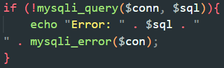
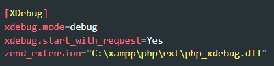
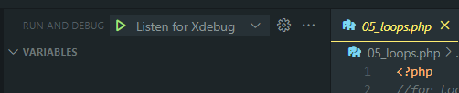
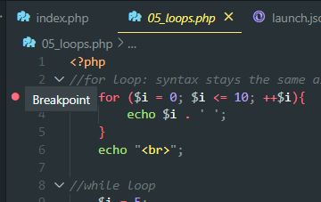

# Một số lỗi thường gặp khi code PHP
- Thiếu ";" hoặc "}". Lỗi này có thể được tránh được nhờ sử dụng IDE phù hợp hoặc Text Editor như VSCode
- Sai tên biến, hoặc sử dụng nhầm "=" và "=="
- Ghép chuỗi SQL nhầm dấu nháy đơn hoặc nháy kép, dẫn đến chuỗi chưa chính xác. Lỗi này có thể tránh được nhờ sử dụng ***hàm mysqli_error($conn)*** kèm lệnh echo để in ra lỗi

    

- Nếu script PHP không trả về bất cứ nào (blank page) thì check file php.ini đã set display_errors hay chưa
- Hàm isset() có thể trả false khi biến không tồn tại hoặc biến rỗng

# Cách debug PHP bằng Xdebug:
- Cách chạy PHP trên CMD:
    * Bật XAMPP Apache
    * Mở CMD tại thư mục mà mình muốn chạy PHP
    * Nhập lệnh php -S localhost:&lt;port muốn chạy>
- Hướng dẫn cấu hình Xdebug:
    * Copy ***output*** của phpinfo.php rồi paste vào ***xdebug.org/wizard***
    * Bên dưới trang web có hướng dẫn lun
    * Ngoài ra bổ sung vào file php.ini đoạn sau (Đây là đối với XDebug 3):

    

❗***Port mặc định*** của XDebug là ***9003*** (đối với phiên bản 3) và ***9000*** (đối với phiên bản 2) và ***host mặc định*** là ***localhost***. Nếu muốn đổi port và host, cho thêm 2 dòng là xdebug.client_host = &lt;host> và xdebug.client_port = &lt;port> vào php.ini. Sau khi đổi xong thì reset xampp để lưu lại tùy chỉnh

- Tải và cấu hình xong Xdebug thì lên VSCode tải ***PHP Debug***. Sau đó vào Folder muốn debug PHP, chọn tab Run > Add Configeration > PHP. Nếu nó hiện ra cái khác PHP thì vào Folder đó trong CMD rồi dùng lệnh "code ."

### Cách Debug:
* Start debug bằng cách ấn vào cái nút màu xanh

    

* Đặt breakpoint tại dòng muốn debug

    

