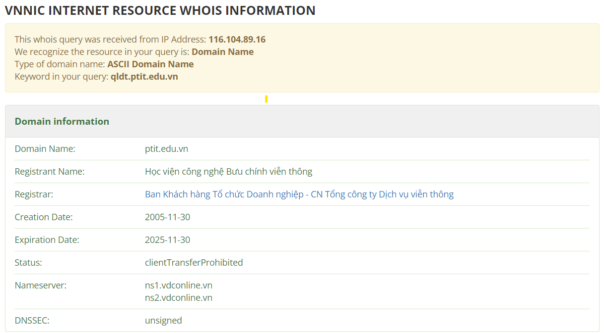
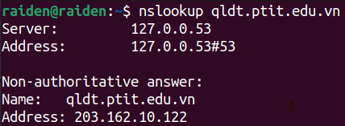
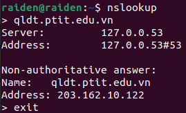
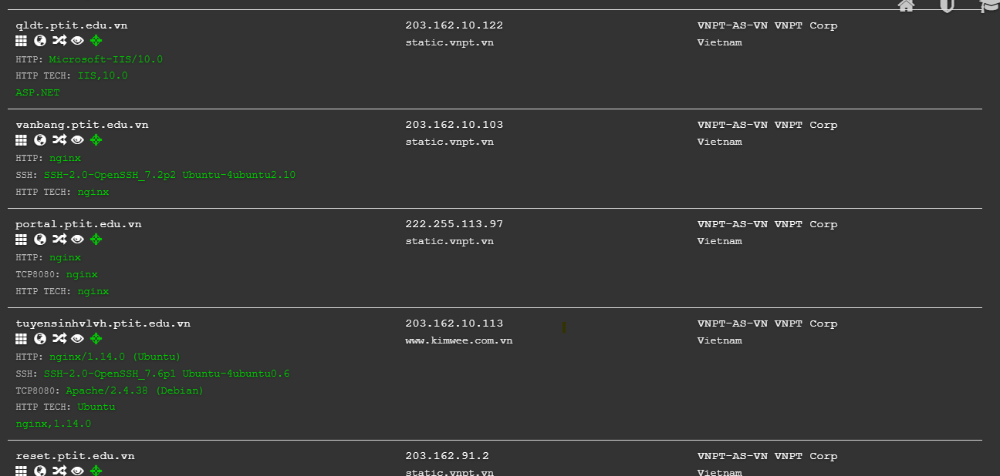
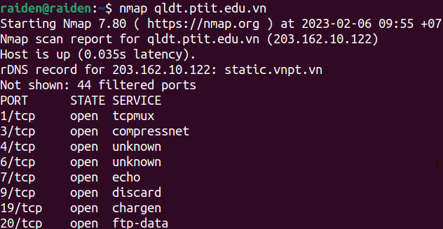
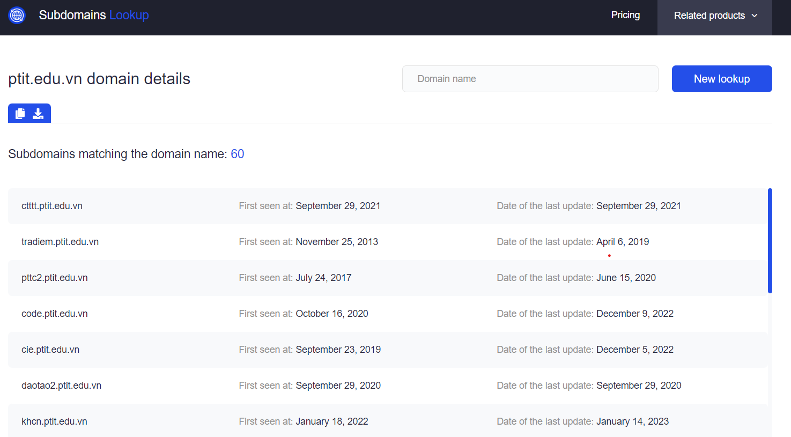
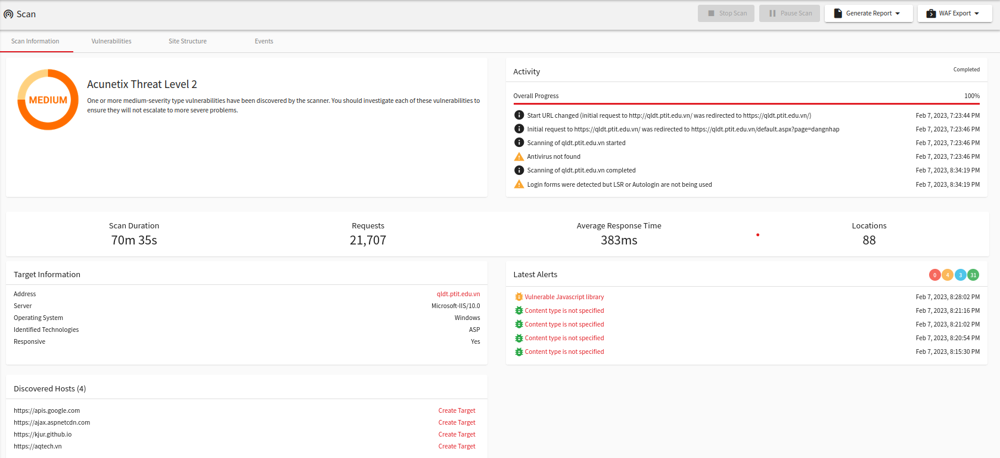
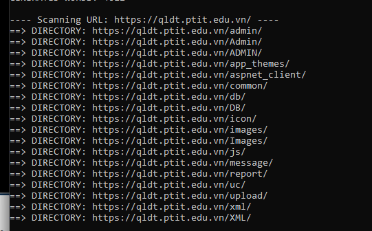
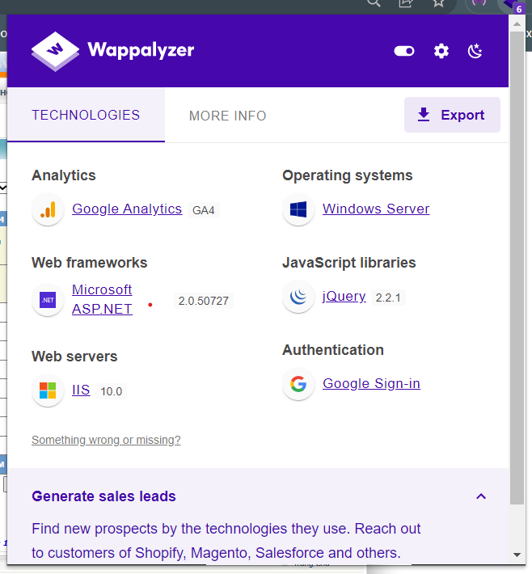

## *Câu 1: Tìm hiểu công cụ whois, nslookup, google... Tìm tất các dải mạng của unitel và các domain của Unitel. Tìm hiểu công cụ nmap và dùng nmap quét dịch vụ trên các dải mạng tìm được*
## **Whois:**
* Link tool: https://whois.domaintools.com/ hoặc https://who.is/
* Là công cụ tìm kiếm tên miền trên Internet để ***kiểm tra thông tin*** của tên miền đó
* Whois không chỉ cho biết tên miền ***đã được đăng ký hay chưa*** mà còn có cả các thông tin của người đăng ký tên miền, bên cung cấp tên miền và cả bên bảo vệ tên miền (nếu có)
* Cách dùng: ***whois &lt;hostname>***

(Dưới đây là do whois trên terminal lẫn link trên đều không trả lại được kết quả, nên nó đề xuất tới http://www.vnnic.vn/en)

    

### **Thông tin hiển thị trên Whois**
* *Registrar* : ***nơi cung cấp*** tên miền
* *Registrant* : ***người đăng ký*** tên miền / người đứng tên
* *Contacts* : thông tin liên hệ
* *Name Servers* : địa chỉ của DNS trỏ tới tên miền
* *Domain Status* : tình trạng tên miền
* *Registration Date* : ngày đăng ký
* *Expiry Date* : ngày hết hạn
* *Updated Date* : lần cập nhật gần nhất

    ❗Do tính "lộng hành" của những ứng dụng/tool như này, có một số bên cung cấp dịch vụ để bảo vệ thông tin của người đăng ký tên miền khỏi bị leak ra ngoài

## **Nslookup:**
* Viết tắt của ***Name Server Lookup***
* Là công cụ được cài sẵn trên máy (cả Windows và Linux) dùng để ***truy vấn địa chỉ IP*** ứng với tên miền được cung cấp hoặc ngược lại (gọi là reverse DNS lookup - ***truy vấn tên miền*** ứng với địa chỉ IP được cung cấp), ngoài ra cũng có thể xem được ***các bản ghi DNS***
* Mục đích chính là cung cấp thông tin chi tiết về tên miền được yêu cầu, giúp giải quyết các vấn đề liên quan đến DNS
* Ngoài ra nó cũng được dùng để chẩn đoán lỗi cho dịch vụ DNS lookup
* Cách dùng: ***nslookup &lt;domain>***

### **Các modes:** 
### *1. Non-interactive:*

    

* Lấy data từ DNS server cache thông qua "Non-authoritative answer", tức data không được lấy trực tiếp từ chính server mà host data
* Name là URL cần truy vấn, address là địa chỉ IPv4

### *2. Interactive:*

    

* Mode này được thực hiện khi không có tham số nào khác truyền vào command
* Có thể truy vấn nhiều domain

## Quét dải mạng và các domain/subdomain:
- Sử dụng [DNSDumpster](https://dnsdumpster.com/)

    

## **Nmap:**
- Là tool giúp tìm các port đang mở của một website
- Cách dùng: nmap &lt;domain>

    

- Ta có thể thấy có qldt có rất nhiều ports kèm các dịch vụ

## *Câu 2: Tìm hiểu các kĩ thuật và công cụ scan subdomain của một domain, đề xuất công cụ scan tốt nhất (có thể tự viết tool kết hợp nhiều công cụ). Thực hiện tìm tất cả subdomain của ptit.edu.vn*
1. DNSDumpster:
- [Link](https://dnsdumpster.com/)

    

* Cung cấp giao diện trực quan kèm địa chỉ IP tương ứng
* Nhanh, cũng chính xác
* Tìm được 46 subdomain của ptit.edu.vn

2. WhoisXMLAPI:
- [Link](https://subdomains.whoisxmlapi.com/)

    

* Cung cấp giao diện trực quan
* Nhanh, cũng chính xác
* Tìm được 60 subdomain của ptit.edu.vn, mỗi tội cần trả phí để sử dụng thêm dịch vụ

## *Câu 3: Tìm hiểu công cụ Acunetix. Chọn một website trong danh sách tìm được (nghi ngờ có lỗi) và thực hiện scan bằng Acunetix*
- Acunetix là một tool mạnh giúp test các lỗ hổng bảo mật trên các website

    

## *Câu 4: Tìm hiểu các công cụ scan file ẩn và thư mục ẩn (burpsuite, dirb, fileburster, ...), đề xuất công cụ scan tốt nhất. Thực hiện scan file ẩn và thư mục ẩn*
### **1. Dirb:**
- Là một công cụ scan nội dung website trên terminal, bao gồm file và thư mục (có thể đã bị ẩn)
- Scan theo kiểu brute force, tức dựa trên một danh sách có sẵn, phân tích phản hồi trả về của website
- Vì nó chỉ scan file và thư mục ẩn nên không được tính là scan lỗ hổng
- Mặc định dirb sử dụng wordlist nó có sẵn, nhưng người dùng có thể cho nó sử dụng wordlist khác (wordlist mặc định nằm ở /usr/share/dirb/wordlists/common.txt)
- Cú pháp: `dirb &lt;url>`
- Một vài flags thông dụng:
    * `-r`: không cho scan recursive
    * `-o`: lưu output vào file
    * `-x`: điều hướng đến file wordlist khác 

    

### **2. Burp Suite:**
- Burp Suite cũng có thể sử dụng để scan file/thư mục bằng cách bắt request ném vào Intruder, đặt payload vào path và cho chạy trên list của mình
## *Câu 5: Kiểm tra công nghệ, framework được sử dụng trong các website: kiểm tra lần lượt mỗi website hoặc dịch vụ đang chạy, lấy thông tin framework, phiên bản (gợi ý: phân tích http header, url đặc biệt hoặc sử dụng tool wappalyzer,...)*
- Để (gần như ngay lập tức) biết được một website đang sử dụng framework, CMS (Content Management System - Hệ quản trị nội dung) nào, sử dụng extension Wappalyzer là nhanh nhất
- Wappalyzer giúp phát hiện công nghệ sử dụng trong website bằng cách inspect source code, HTTP headers, cookies, biến trong JS...

    

