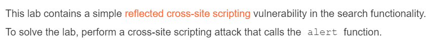

# ***Reflected XSS***
# Lab 1: Reflected XSS into HTML context with nothing encoded
## Lab Description:

    

* Input không được kiểm duyệt gì

## Solution:
* Nhập vào thanh tìm kiếm payload sau

    

* Sau đó màn hiện thông báo alert, và lab được solved

    

 

# Lab 7: Reflected XSS into attribute with angle brackets HTML-encoded
## Lab Description:

    

* Lab đã mã hóa HTML dấu < và >
* Khai thác giữa các attributes của tag

## Solution:
* Thử search một chuỗi bất kỳ, thấy giá trị của nó được lưu vào trong thuộc tính value của thẻ input

    

* Thử thêm dấu nháy kép vào chuỗi, ta thấy giá trị của value bị đóng lại và chuỗi bị nằm bên ngoài

    

* Thử payload như sau, nhưng có thể thấy dấu "<" và ">" đã bị mã hóa, nên ta ko thể thêm tag mới được

    

* Ta có thể nghĩ tới việc thêm thuộc tính mới. Sử dụng thuộc tính onmouseover="alert(1)", tức mỗi lần di chuột vào thẻ này sẽ hiện alert

    

 

# Lab 9: Reflected XSS into a JavaScript string with angle brackets HTML encoded
## Lab Description:

    

* Khai thác thông qua chuỗi trong JS

## Solution:
* Search một chuỗi bất kỳ, ta thấy chuỗi đó được pass vào script sau

    

    ❗Giải thích script:
    1. Tạo biến searchTerm thông qua giá trị người dùng nhập
    2. Mã hóa URL biến đó rồi truyền vào hàm document.write()

* Thử thêm dấu nháy đơn ở trước chuỗi, ta thấy nó đóng lại dấu nháy trước đó và payload giờ nằm bên ngoài

    

* Để hoàn chỉnh các cú pháp trong JS, ta thay đoạn payload sau (2 dấu gạch ở cuối dùng để comment, tức vô hiệu hóa đoạn code phía sau của dòng đó), và lab đã được solved

    

 

# Lab 17: Reflected XSS into HTML context with most tags and attributes blocked
## Lab Description:

    

* Hầu hết các tags, attributes, events đã bị WAF chặn thông qua một list

## Solution:
* Test thử giá trị chuỗi ngẫu nhiên, ta có thấy giá trị trả về trong phản hồi, nhưng F12 không thấy có script nào liên quan đến giá trị này cả, nên ta không biết được cách mà chuỗi này được chèn như thế nào

    

* Thử chèn payload gồm các thẻ, ta bị chặn và trang hiển thị "Không được phép dùng tag"

    

* Nhưng khi thử một tag không tồn tại hoặc những cú pháp giống tag, ta lại không bị chặn, không những thế source code còn include cả tag đó vào

    

* Có thể đoán được ở đây web sẽ lọc theo một list các tags. Ta ném request vào intruder, lấy payload của PortSwigger tất cả các thẻ, rồi attack

    

* Khi attack thành công, ta thấy tất cả các tag đều trả về lỗi 400, nhưng riêng tag &lt;body> lại trả về 200

    

* Vậy là tag đó ko bị web chặn, ta kèm thêm attribute như sau nhưng khi gửi, ta lại bị chặn và nhận dòng tin "Không được phép sử dụng attribute"

    

* Làm tương tự, ném vào intruder để attack, nhưng payload lần này là tất cả các event

    

* Khi attack xong, ta thấy tất cả các attribute đều trả về lỗi 400, nhưng có 3 tag trả về 200

    

* Nhưng event onratechange thì dùng cho thẻ &lt;video> khi video được thay đổi rate (nhanh hơn hoặc chậm lại), còn onbeforeinput thì lại dùng đối với các tag  &lt;input> hoặc  &lt;textarea> là những tag yêu cầu sự thay đổi về nội dung. Còn event onresize được dùng với tag  &lt;body> khi cửa sổ được thay đổi kích cỡ. Như vậy ta có payload như sau:

    

 

# Lab 19: Reflected XSS with some SVG markup allowed
## Lab Description:

    

* Hầu hết các tags, attributes, events đã bị WAF chặn thông qua một list

# Solution:
* Bài này các tags bị chặn theo list, nên ta brute xem những tag nào bị chặn, thì ta thấy chỉ có 4 tags &lt;image>, &lt;svg>, &lt;title> và &lt;animatetransform> là không bị chặn

    

* Do &lt;svg> và &lt;animatetransform> hay đi kèm nhau nên trong bài này ta sử dụng cả hai. Chèn payload như sau vào nhưng các events cũng bị chặn

    

* Tương tự cho vào intruder brute event, ta có mỗi event onbegin là không bị chặn

    

* Như vậy ta có payload sau:

    

 

# ***Stored XSS***

# Lab 2: Stored XSS into HTML context with nothing encoded
## Lab Description:

    

## Solution:
* Chọn một bài post bất kỳ rồi vào comment đoạn payload sau

    

* Sau khi gửi comment, web trả về thông báo sau

    

* Giờ mỗi lần vào post đó sẽ có một đoạn alert hiển thị lên, là lab được solved

    

 

# Lab 8: Stored XSS into anchor href attribute with double quotes HTML-encoded
## Lab Description:

    

## Solution:
* Vào bài post bất kỳ, điền đầy đủ các trường comment, tên, email, website. Có thể thấy có thẻ &lt;a> với href đến đường link mình điền vào website

    

* Thử thêm dấu nháy kép vào trước website, ta thấy giờ thuộc tính đã bị đóng và payload của ta nằm ở ngoài giá trị thuộc tính

    

* Sử dụng thêm thuộc tính onmouseover để hiện thị alert mỗi lần di chuột qua, thế là lab được solved

    

 

# Lab 14: Exploiting cross-site scripting to steal cookies
## Lab Description:

    

## Solution:
* Vào một post bất kỳ, viết comment như sau, và đoạn script thực hiện được bình thường, có nghĩa là ở đây đã bị Stored XSS

    

* Nhưng để có thể lấy được cookie của những người dùng truy cập trang này, ta phải thông qua Burp Collaborator. Ta vẫn vào mục comment nhưng script sẽ là như sau:

    

    ❗Đoạn script dùng để thực hiện gửi request POST đến cái URL kia, với body chứa cookie của những người gặp phải cái comment này

* Gửi script đó, quay lại Burp Collaborator và Poll Now. Đợi một lúc sẽ thấy xuất hiện:

    

* Bên dưới phần request, xem xuống body thấy có giá trị session của người dùng

    

* Copy giá trị đó, rồi bật Intercept lên, thay session của mình bằng cái kia, và thế là ta đã đăng nhập dưới session của người khác

    

 

# ***DOM-based XSS***

# Lab 3: DOM XSS in document.write sink using source location.search
## Lab Description:

    

* Web sử dụng document.write() để viết data lên page và data được lấy thông qua window.location.search (là phần param của URL)

## Solution:
* Search một đoạn bất kỳ trên thanh. Inspect thử đoạn script thì ta thấy nội dung sau

    

    ❗Đoạn script có những nội dung sau:
    1. Tạo hàm tên trackSearch với tham số query
    2. Hàm document.write(...) dùng để ghi trực tiếp chuỗi trong hàm lên HTML. Ở đây dùng để chèn thêm tag  với src là path được gắn chuỗi query một cách trực tiếp lên trang tại vị trí đó
    3. window.location.search trả về chuỗi truy vấn (search) của đối tượng location (mang thông tin về URL) trong đối tượng window. Ở đây sẽ là ?search=abc
    4. Constructor URLSearchParams() lấy giá trị bên trên làm tham số và được dùng để tạo một đối tượng URLSearchParams chuyên làm việc với chuỗi truy vấn của URL
    5. Đối tượng URLSearchParams có một phương thức là get(param) dùng để trả về giá trị của param
    6. Nói chung, query sẽ có giá trị bằng "abc"
    7. Nếu query ko rỗng thì gọi tới hàm trackSearch. Do đó bên dưới ta có thêm thẻ 

* Do việc nối chuỗi trực tiếp như trong script, ta chèn payload như sau vào thanh search

    

* Thông báo alert hiện ra, và lab được solved

        ❗Giải thích payload: Dấu nháy kép đầu tiên dùng để kết thúc thuộc tính src, dấu ">" tiếp theo dùng để đóng tag . Đoạn payload của ta nằm ở trong <script>. Do đó trên trang hiển thị dòng "> như là phần còn thừa của script 

 

# Lab 4: DOM XSS in innerHTML sink using source location.search
## Lab Description:

    

* Web sử dụng innerHTML để thay đổi data trên page, và data được lấy thông qua window.location.search

## Solution:
* Search một đoạn bất kỳ trên thanh. Inspect thử đoạn script thì ta thấy nội dung sau

    

    ❗Đoạn script có những nội dung sau:
    1. document.getElementById(id) dùng để trả về đối tượng có id được truyền vào
    2. Đối tượng đó có phương thức là innerHTML, dùng để trả về nội dung của thẻ đó, tức text và các tag con trong nó
    3. Ở đây, đối tượng nào trong document có id là "searchMessage" sẽ được thay thế nội dung thành query. Và bên trên có một thẻ span với id như vậy

* Do đó, ta chèn được đoạn payload như sau:

    

* Bởi tính chất của phương thức innerHTML, ta có thể sửa/thêm các tags khác vào. Ở đây alert hiện ra là do src có giá trị lỗi nên thuộc tính onerror được gọi tới và sinh ra alert

    

 

# Lab 5: DOM XSS in jQuery anchor href attribute sink using location.search source
## Lab Destruction:

    

## Solution:
* Vào trang feedback, nộp một cái feedback bất kỳ, thấy ko có gì xảy ra cả. Để ý trên URL có một param "returnPath=\", đoán là nó sẽ liên quan đến link tới trang gốc, xem source thì thấy có một thẻ &lt;a> có href tới source

    

* Thử thay param đó thành giá trị khác, thấy giá trị của href cũng thay đổi theo, chứng tỏ ở đây có thể có DOM-based XSS

    

* Thay value sau vào param, click vào thì alert hiện ra, là lab được solved

    

 

# Lab 10: DOM XSS in document.write sink using source location.search inside a select element
## Lab Description:

    

* Web sử dụng document.write() để viết data, mà data lấy từ location.search
* Data nằm trong &lt;select>

## Solution:
* Chọn một bài post bất kỳ, kéo xuống dưới cùng thấy chức năng Check stock. Vào source xem thấy có một đoạn script như sau:

    

    ❗Biến store nhận giá trị của param storeId trên path URL mà ko có khâu kiểm duyệt nào, nên ta có thể chèn thêm param đó

* Truyền vào param vs giá trị ngẫu nhiên, ta thấy trong thẻ &lt;select> xuất hiện giá trị mới là giá trị ta nhập vào

    

* Từ đó ta thay thành payload như sau, và alert() sẽ hiện ra

    

 

# ***Các lab tổng hợp***

# Lab 12: Reflected DOM XSS
## Lab Description:

    

## Solution:
* Search một chuỗi bất kỳ, ta ko thấy điều gì bất thường. Vào xem request và response trả về trong HTTP History, ta thấy phản hồi cho request có dạng JSON như sau:

    

* Check JS source thì thấy có đoạn code sau:

    

* Sau khi test thêm vài lần nữa, ta thấy dấu nháy kép bị escape bằng cách chèn thêm ký tự backslash. Do đó ta bypass bằng cách payload kèm thêm dấu backslash ở đầu. Như vậy payload sẽ có dạng như sau:

    

    ❗Trong payload, dấu ngoặc nhọn ở cuối dùng để đóng JSON lại, hai dấu // dùng để comment, hay vô hiệu hóa đoạn code đằng sau

# Lab 13: Stored DOM XSS
## Lab Description:

    

## Solution:
* Vào một bài post bất kỳ và đăng một chiếc comment bình thường, thấy nội dung vẫn hiển thị ra như sau:

    

* Khi chèn payload có dạng &lt;script>alert(...)&lt;/script>, ta lại nhận được như sau. Check source cho thấy một cặp tag đã bị replace

    

* Nhưng có vẻ cặp <> chỉ bị mã hóa 1 lần, ta thêm vào payload một cặp nữa, và thế là script đã được thực thi

    

