# **Khái niệm**

    

* Cross-site scripting (XSS): là lỗ hổng cho phép chèn một đoạn ***mã độc*** (script) ở dạng ***javascript/html*** vào một trang web, từ đó ***lấy cắp thông tin*** của ***người dùng*** khi họ truy cập vào một web đó
* Là ***client-side attack*** thuộc kiểu ***code injection***

## **Nguyên nhân:**
* Xác thực đầu vào chưa chặt chẽ, phù hợp
* Truy cập vào URL linh tinh, ko rõ nguồn gốc

## **Hậu quả:**
* JS có thể truy cập được tới ***tất cả đối tượng*** ở trên trang web. Do đó nếu lấy được cookies chứa session tokens, kẻ tấn công có thể ***mạo danh người dùng***
* Lấy quyền người dùng ***vượt qua khâu đăng nhập***
* Có thể ***thay đổi các đối tượng*** trên trang web thông qua ***DOM***, từ đó dễ lòe người dùng hơn vào những thủ đoạn khác nhau

## **Phân loại:**
* Reflected XSS
* Stored/Persistent XSS
* DOM XSS

    (Bên dưới trình bày kỹ hơn từng loại)

## **Các bối cảnh của XSS (XSS Contexts):**
* Nhiệm vụ đầu tiên khi thực hiện test lỗ hổng XSS là xác định được ***bối cảnh XSS***, tức là xác định:
    * ***Vị trí*** mà có thể tiêm script mà tại đó dữ liệu nhập vào có thể xuất hiện lên trên trang web
    * Các ***khâu kiểm duyệt*** lên dữ liệu đó

# **Reflected XSS:**
* Xảy ra khi ứng dụng có thể được chèn những đoạn ***script có thể thực thi được*** ngay trên ***param URL*** của một trang web, và khi người dùng khác (nạn nhân) truy cập thông qua URL đó, script sẽ ***tự động được thực thi*** nếu không có khâu kiểm duyệt input phù hợp
- Đoạn script có thể gửi các ***thông tin bảo mật*** của người dùng tới một server mà kẻ tấn công quản lý được
- Script có thể tạo thêm thẻ HTML mới, như vậy nghĩa là chuỗi được chèn sẽ được ***thêm trực tiếp*** trên trang web

    ↪ Thường xuất hiện ở ***trường tìm kiếm***, hoặc các trường yêu cầu nhập input nói chung

### ***Ví dụ:***
- Đoạn URL chứa param `term=gift` để tìm kiếm có dạng như sau:

    

- Sau đó trên web trả về một thẻ chứa value `gift` của param đó

    

- Nếu app không có khâu kiểm duyệt phù hợp, thay vì là một chuỗi vô hại, một đoạn script có thể chèn vào param như sau

    

❗ Đoạn script trên tức là tạo một thẻ &lt;a> với src là web của kẻ tấn công nối với cookie của người dùng, tức phải gửi request tới web đó để lấy ảnh. Bằng cách nào đó, kẻ tấn công khiến người dùng truy cập được vào link đó, thế là trình duyệt thực thi đoạn script, và kẻ tấn công có được cookie của người dùng

    

↪ Nhìn chung, người dùng cần phải ***truy cập vào URL*** được xây dựng bởi kẻ tấn công (tức trình duyệt của người dùng cần gửi request đến URL đó) thông qua link, tin nhắn, mail, phishing hoặc ***social engineering*** thì mới có thể bị tấn công

❗*Social engineering* : là kỹ thuật tấn công thông qua "quan hệ xã hội", tức là các chiêu trò ***phi kỹ thuật*** như xây dựng các mối quan hệ, niềm tin để lòe nạn nhân thực hiện điều gì đó có thể dẫn tới các cuộc tấn công ***kỹ thuật***

## *Cách khai thác:*
### **1. XSS giữa các HTML tags:**
* Sử dụng payload dưới dạng các thẻ HTML để truyền script vào:

    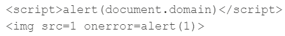

### **2. XSS giữa các thuộc tính (attributes) trong HTML tag:**
* Thông thường giá trị của thuộc tính nằm trong ***dấu nháy kép***, vậy nên tùy thuộc vào bối cảnh, nếu XSS nằm trong thuộc tính thì ta có thể thêm ***thuộc tính mới***, hoặc đóng tag hiện tại để thêm ***tag mới***. Ví dụ bên dưới là đóng thuộc tính và tag hiện tại để thêm tag mới:

    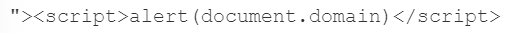

* Thông thường dấu ">" sẽ bị ***lọc*** hoặc ***mã hóa*** bằng khâu kiểm duyệt, tức input không thể đóng được tag. Lúc này có thể sử dụng ***attribute mới*** mà thực thi được script, như là các ***event handler*** (các thuộc tính xử lý sự kiện, lỗi), ví dụ như:

    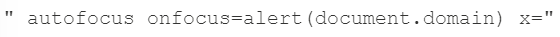

❗`autofocus` là một ***thuộc tính*** thường thấy ở các thẻ ***input***, thường được dùng để ***định vị*** và ***tự động "focus"*** vào thẻ input này mỗi khi vào trang web. `onfocus` là một ***event***, và nó xảy ra (hay nội dung trong nó được thực thi) khi cái ***input này được focus vào***, như vậy giá trị của nó sẽ là một script. Ở ví dụ trên, khi kết hợp với `autofocus`, tag này sẽ vừa tự động được focus tới, vừa gọi tới event `onfocus` và thực hiện alert ra domain của web. Ở cuối có *x="* đóng vai trò như một ***attribute bất kỳ***, ở đây dùng để ***đóng cái nháy kép còn lại trong source code*** bởi vì cái ***nháy kép ở đầu*** đã dùng để ***đóng cái nháy kép đầu tiên*** trong source rồi
* Đôi khi một vài thuộc tính có thể nhận ***giá trị thực thi được script*** nên ta không cần phải đóng thuộc tính đấy lại nữa mà chèn trực tiếp payload vào luôn. VD như thuộc tính href của thẻ `<a>` có thể nhận giá trị script như sau (payload này được gọi là ***giả JS*** - JavaScript pseudo-protocol):

    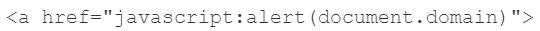

### **3. XSS trong JS:**
*a. Đóng script hiện tại:*
* Payload chứa ***&lt;/script>*** để đóng script hiện tại lại và mở một script mới. VD source code có đoạn script sau:

    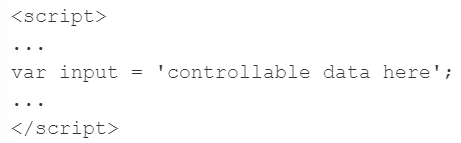

Ta có thể chèn payload như sau vào value của input để tự viết một đoạn script khác:

    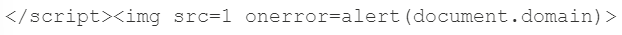

Về bản chất thì đoạn payload trên chưa phải là hoàn thiện, bởi vì giá trị của input đang bị treo do ***ko có dấu nháy đơn đóng*** mà đã đóng script rồi. Nhưng JS thì ***không có compiler***, nên các đoạn script sau vẫn sẽ được thực thi bình thường nếu phần code trước nó có bị sai đi chăng nữa

❗Đoạn payload bên trên hoàn toàn có thể là bất kỳ thẻ HTML nào, miễn là nó có thể dùng để thực thi script là được

*b. Đóng chuỗi:*
* Tức là XSS sẽ nằm ở trong chuỗi (trong dấu nháy đơn hoặc nháy kép). Thay vì đóng cả cái script và viết script mới hoặc khi ***dấu ngoặc nhọn đã bị encoded hay lọc*** (tức không thể đóng script), ta có thể trực tiếp chèn payload vào trong script hiện tại
* Dựa vào chuỗi trong nháy đơn hay nháy kép thì dùng dấu nháy tương ứng để đóng chuỗi, ví dụ như các payloads sau:

    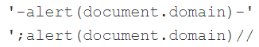

* Nếu khâu kiểm duyệt lọc các dấu quote đi bằng cách ***chèn thêm*** dấu backslash "\\" trước nó để ***escape*** ký tự đó, ta có thể sử dụng thêm dấu "\\" vào payload để việc chèn thêm đó sẽ là escape cho ký tự backslash trong payload, ví dụ:

    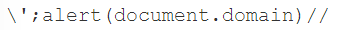

* Nếu khâu kiểm duyệt giới hạn các ký tự được phép sử dụng, như ***không cho sử dụng các dấu ngoặc đơn***, ta có thể sử dụng *throw statement* kèm với ***exception handler*** (xử lý ngoại lệ). Cách này sẽ giúp ta truyền tham số vào hàm mà không cần dùng đến dấu ngoặc đơn. Xét ví dụ bên dưới:

    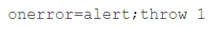

Ở đây, mỗi lần có lỗi xảy ra thì sẽ gọi tới hàm alert. Và throw 1 dùng để truyền tham số (ở đây là 1) tới exception handler gần nó nhất, ở đây chính là onerror

*c. Tận dụng mã hóa HTML:*
* Mỗi lần render một trang web, trình duyệt sẽ phải HTML decode tất cả các tag, attribute, value. Do đó nếu web ***chặn hoặc sanitize*** một vài ký tự đặc biệt của XSS, ta sử dụng ***mã hóa HTML*** cho những ký tự đó. VD:
    * Nháy đơn --> \&apos; hoặc \&#39;
    * Nháy kép --> \&quot;
    * Đóng ngoặc nhọn > --> \&gt;
    * Mở ngoặc nhọn < --> \&lt;

*d. JS template literal/string:*
* JS template literal là một chuỗi được đóng trong dấu ***backticks*** (dấu \`...`) và có thể chèn các biến/expression thông qua các ***placeholders*** có dạng ${...}. ***Tất cả các ký tự*** trong template literal đều được coi là ***ký tự bình thường***, ngoại trừ trong placeholder
* Nếu XSS ở trong này, thay vì đóng template literal lại bằng cách chèn thêm backtick, ta có thể chèn payload trực tiếp vào các placeholder. Ví dụ source code như sau:

    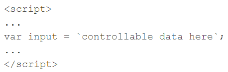

Ta có thể chèn payload vào trong template literal đó như sau:

    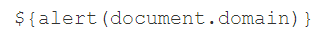

# **Stored/Persistent XSS:**
* Xảy ra khi những đoạn ***script có thể thực thi được*** có thể được chèn thông qua các trường yêu cầu nhập input nhưng thay vì hiển thị ngay trên web giống Reflected XSS, script được ***lưu trong server***, ví dụ như trong database. Như vậy mỗi lần load lại trang chứa script đó, script sẽ tự động được thực thi

    ↪ Thường xuất hiện ở trường bình luận, các bài đăng, thông báo...

### ***Ví dụ:*** 
- Một trang web cho phép bình luận lên các bài viết, và khi gửi bình luận thì trình duyệt gửi request POST như sau:

    

- Sau khi comment được gửi và lưu trên server, tất cả người dùng khác truy cập vào URL tới bài viết chứa comment đó đều có thể thấy được nó, hay nói cách khác, response trả về để load trang web đó sẽ chứa comment đó

    

- Nếu app không có khâu kiểm duyệt phù hợp, thay vì là một comment vô hại, một đoạn script có thể chèn vào như sau

    

- Từ đó trình duyệt sẽ trả về phản hồi tương ứng với value truyền vào, đoạn script được thực thi. Như vậy mỗi lần có người dùng truy cập vào đoạn URL có chứa script, nó sẽ tự động được thực thi

    

↪ Nhìn chung, Stored XSS nguy hiểm Reflected XSS vì nó ***lưu trữ lâu dài*** (persistent) trên app, và mọi người dùng truy cập trang chứa script đều bị tấn công, khác với Reflected XSS là chỉ người dùng truy cập vào chính URL chứa script đó thì mới bị tấn công

### ***Cách khai thác:***

# **DOM-based XSS:**
* Là kiểu tấn công làm thay đổi cấu trúc DOM (Document Object Model) của web

VD: thay đổi src của &lt;img>, href của &lt;a> để thực thi các script

* Thông thường, HTML là ngôn ngữ ***tĩnh*** (static), tức cấu trúc của một trang web sẽ giống y hệt như nó được code trên server, và JS sinh ra để làm cho nó ***có tính tương tác*** hơn (dynamic/interactive). Do vậy khi trình duyệt phân tích một trang web để tạo ra DOM, nếu nó gặp script thì nó sẽ thực thi script đó, nói cách khác, ***trình duyệt*** mới là ***nơi thực thi script của JS***
* DOM-based xảy ra khi user input (source) được nhận vào và truyền tới một hàm nào đó để in nó ra trang web (sink) một cách ko an toàn
    * Source: một hàm hoặc thuộc tính JS nào đó ***nhận user input*** từ page, ví dụ như param trong URL (location.search), hoặc các thuộc tính khác của đối tượng DOM
    * Sink: một hàm của JS trả về giá trị input của source một cách thiếu an toàn, ví dụ như innerHTML, document.write(), element.onevent()...

    VD: một trang web có param có URL như sau

    

    
    - Check source thì thấy có đoạn script như sau với nội dung: biến store lưu giá trị của param trên URL có tên là "storeId". Sau đó nó chèn trực tiếp giá trị đó vào document.write(...) trong thẻ <option>

    

    - Như vậy chỉ cần cài vào nó một script alert, ta hoàn toàn có thể làm script đó thực thi

    

* DOM-based có thể kết hợp được với cả Reflected và Stored, tham khảo trong PortSwigger

# II. Cách khai thác:

### ***4. XSS thông qua client-side template injection:***
* Một vài webs sử dụng framework như AngularJS
* Nếu ko được kiểm duyệt kỹ các input, attacker có thể lấy luôn cả payload từ chính framework này để tấn công

## Đối với Reflected XSS:
* Tìm tất cả các ***entry point*** (các dữ liệu đầu vào): param trong URL (đối với GET) hoặc trong body (đối với POST), thậm chí có thể ở trong cả HTTP headers

    VD: các entry point của Reflected XSS thường ở thanh tìm kiếm
* Test các vị trí entry point bằng các ***giá trị ngẫu nhiên*** và xem nó có được ***"phản chiếu"*** lên phản hồi hay ko. Tùy vào ***khâu kiểm duyệt*** ở mỗi entry point mà sẽ có ***payload khác nhau*** sao cho vượt qua được khâu kiểm duyệt đó
* Xác định ***bối cảnh*** của Reflected XSS: có thể xuất hiện giữa các HTML tags, có thể trong các attributes của 1 tag nào đó, có thể trong JS script...
* Test các ***XSS payload*** xem nó có được thực thi và "phản chiếu" lên web hay ko; thường là đặt ở sau hoặc trước cái payload ngẫu nhiên ở bước 2

## Đối với Stored XSS:
* Bên cạnh check các entry point còn cần check xem ***exit point*** (dữ liệu đầu ra) ở đâu, vì đó mới là nơi script được thực thi

    VD: các entry point của Stored XSS thường là những nơi mang tính ***lưu trữ***, ví dụ như comment, blog post...
* Đảm bảo rằng nội dung của exit point được hiển thị trên mọi phiên làm việc, tức ai cũng có thể bị tác động

## Đối với DOM-based XSS:
* Test các HTML sinks:
    * Thử các giá trị ngẫu nhiên vào source (vd: location.search), sau đó inspect xem nó xuất hiện ở đâu
    * Sau khi tìm được chỗ nó xuất hiện, xác định ***bối cảnh XSS***
* Test các JS sinks:
    * Ở đây, ko phải input nào cũng ở trong DOM nên sẽ khó tìm. Có thể tham khảo JS Debugger
* Sử dụng các source và sink khác nhau:
    * document.write() thường đi với thẻ &lt;script>
    * innerHTML thường đi với &lt;img> hoặc &lt;iframe> với các event handler onload hoặc onerror

* Có thể tham khảo [XSS Cheatsheet](https://portswigger.net/web-security/cross-site-scripting/cheat-sheet)

# Cách phòng chống
* Lọc input đầu vào chặt chẽ
    * Chặn các ký tự đặc biệt như <, >, nháy đơn nháy kép bằng cách escape nó, hoặc sử dụng các loại mã hóa
    * Sử dụng WAF chặn các request chứa input nghi ngờ
* Đối với người dùng, không nên truy cập vào những đường link, URL lạ
* Sử dụng các framework hiện đại

 

# Tài liệu tham khảo:
### **Khái quát chung:**
1. [PortSwigger](https://portswigger.net/web-security/cross-site-scripting)
    * [Reflected XSS](https://portswigger.net/web-security/cross-site-scripting/reflected)
    * [Stored XSS](https://portswigger.net/web-security/cross-site-scripting/stored)
    * [DOM-based XSS](https://portswigger.net/web-security/cross-site-scripting/dom-based)
2. [OWASP](https://owasp.org/www-community/attacks/xss/)
3. [Acunetix](https://www.acunetix.com/websitesecurity/cross-site-scripting/)
4. [Viblo](https://viblo.asia/p/ky-thuat-tan-cong-xss-va-cach-ngan-chan-YWOZr0Py5Q0)
5. [Techtarget](https://www.techtarget.com/searchsecurity/definition/cross-site-scripting)
6. [Imperva](https://www.imperva.com/learn/application-security/cross-site-scripting-xss-attacks/)
    * [Reflected XSS](https://www.imperva.com/learn/application-security/reflected-xss-attacks/#:~:text=Reflected%20XSS%20attacks%2C%20also%20known,enables%20execution%20of%20malicious%20scripts.)
7. [CloudFlare](https://www.cloudflare.com/learning/security/threats/cross-site-scripting/)

### **Các bối cảnh của XSS:**
1. https://portswigger.net/web-security/cross-site-scripting/contexts

### **Reflected XSS in-depth:**
1. https://securitydaily.net/ky-thuat-khai-thac-xss-phan-1-reflected-xss/
2. https://www.geeksforgeeks.org/reflected-xss-vulnerability-in-depth/

### ***Stored in-depth:***

### ***DOM-based in-depth:***
* https://medium.com/@fath3ad.22/understanding-dom-based-xss-sources-and-sinks-c17ae4bc7455