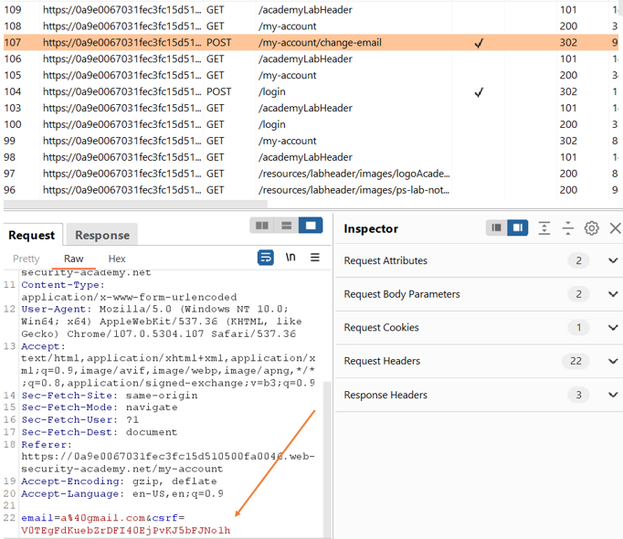

# Lab 1: CSRF vulnerability with no defenses
## Description:
- CSRF dưới dạng đơn giản nhất
## Solution:
- Đăng nhập bằng tài khoản cho trước, vào mục `My Account`, thấy phần Update Email. Thử update và email được cập nhật

    

- Vào Burp Pro, chuột phải vào cái request POST cập nhật email đó, chọn Engagement Tools >> Generage CSRF PoC

    

- Cửa sổ mới hiện ra, chọn Options >> Include auto-submit script >> Regenerate

    

- Cửa sổ trả về payload. Copy payload đó, vào Exploit Server, dán vào body, rồi chọn Deliver to victim, và lab được solved

# Lab 2: CSRF where token validation depends on REQUEST method
## Description:
- CSRF đã có token để ngăn chặn, nhưng bypass được thông qua việc đổi method sang GET
## Solution:
- Đăng nhập bằng tài khoản cho trước và vào mục Update Email. Nhưng lần này ta nhận ra trong body của POST có thêm param `csrf`

    

- Thử thay đổi value của `csrf`, ta nhận ra request không thực hiện việc đổi email được và nhận về thông báo "CSRF token không hợp lệ"

    

- Bắt request lúc chuyển, ta đổi sang GET request, ta nhận ra việc thay đổi giá trị của token không còn có ý nghĩa nữa và email vẫn bị đổi gì token không đúng
- Ta lại generate CSRF PoC từ Burp, nhưng lần này ta thêm thuộc tính `method="GET"` vào thẻ form

    

- Deliver to victim, và lab được solved

# Lab 3: CSRF where token validation depends on token being present
## Description:
- CSRF đã có token để ngăn chặn, nhưng bypass được thông qua việc xóa token đi
## Solution:
- Đăng nhập bằng tài khoản cho trước và vào mục Update Email. Nhưng lần này ta nhận ra trong body của POST có thêm param `csrf`. Đổi value của `csrf`, ta nhận ra request không thực hiện việc đổi email được và nhận về thông báo "CSRF token không hợp lệ". Chuyển sang GET request thì cũng vẫn không thực hiện được, và nhận thông báo "Giao thức không được phép"

    

- Thế nhưng khi ta xóa toàn bộ param `csrf` đi, tác vụ vẫn được thực hiện bình thường. Như vậy, lại vào CSRF PoC Generator, lấy payload nhưng bỏ đi thẻ `input` chứa `name` là `csrf`. Gán payload vào Exploit Server, Deliver to Victim và lab được solved

    

# Lab 4: CSRF where token is not tied to user session
## Description:
- CSRF đã có token để ngăn chặn, nhưng bypass được thông qua việc tráo token giữa các người dùng
## Solution:
- Đăng nhập bằng 2 tài khoản được cấp, ta đều nhận được mỗi tài khoản là một param `csrf` khác nhau, và khi thay đổi một trong hai thì các tác vụ

    

- Ta thử lấy cái giá trị token của một trong hai rồi gán vào cái còn lại, ta thấy tác vụ vẫn thực hiện được bình thường. Lấy CSRF PoC, cho vào Exploit Server, và lab được solved

# Lab 5: CSRF where token is tied to non-session cookie
## Description:
- SRF đã có token để ngăn chặn, có thêm cả cookie tên `CSRFkey`
## Solution:
- Đăng nhập vào tài khoản được cấp, thực hiển đổi email. Xem request thấy có param `csrf` kèm thêm cookie `csrfKey`. Việc đổi giá trị của param `csrf` hay giá trị của cookie `csrfKey` đều bị deny tác vụ

    

- Đăng nhập vào tài khoản khác ở Incognitive, ta thấy giá trị của param `csrf` hay giá trị của cookie `csrfKey` khác. Thử thay thế cả hai sang cho tài khoản ban đầu, ta thấy tác vụ được thực hiện

    

- Để có thể chèn thêm cookie vào trong tài khoản khác, ta lợi dụng lỗ hổng `HTTP Header Injection`. Trong mục search của lab, ta thấy giá trị của search đó được chèn vào trong `Set-Cookie` header từ response từ web với tên `LastSearchTerm`

    

- Như vậy để thực hiện `HTTP Header Injection`, ta chèn payload như sau:

    

Giải thích: `%0d` là ký tự xuống dòng, `%0a` là ký tự lùi đầu dòng được mã hóa URL, vậy nên ta chèn vào để ta xuống dòng tạo Header mới và chèn payload của chúng ta vào

- Như vậy để lấy PoC và set thêm cookie mới thông qua `HTTP Header Injection`, ta chèn thêm một thẻ ảnh với src chính là payload của chúng ta bên trên

    

- Deliver to victim và lab được solved (làm mãi vẫn ko xanh?)

# Lab 6: CSRF where token is duplicated in cookie
## Solution:
- Đăng nhập vào tài khoản được cấp, thử đổi email, bắt request ta thấy có cookie `csrf` có giá trị giống hệt param `csrf` gửi kèm
- Ta đổi thử cả hai giá trị khác miễn là giống nhau, ta vẫn thực hiện được
- Xây dựng payload giống bài trước và thực hiện `HTTP Header Injection` để chèn cookie mới vào trong mục Search
- Lập PoC vào Exploit server, và bằng cách nào đấy lab vẫn chưa solved được

# Lab 11: CSRF where Referer validation depends on header being present
## Solution:
- Đăng nhập vào tài khoản được cấp, đổi email, bắt request và ta thấy, không có param csrf token nào

    

- Generate PoC, test thử thì ta nhận được thông báo `Referer không hợp lệ`

    

- Như vậy, website sử dụng `Referer` để check xem request có được gửi từ chính website đó không. Ta thử xóa header đi, thấy tác vụ được thực thi được. Như vậy payload của chúng ta cần thêm `<meta>` với payload như sau và lab được solved

    

