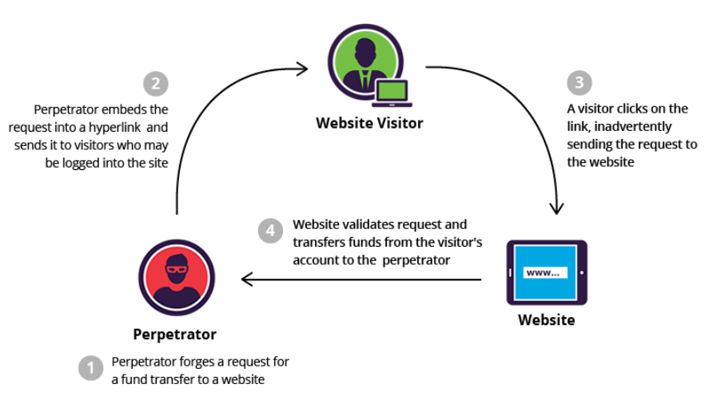
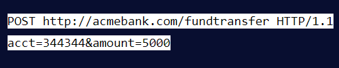
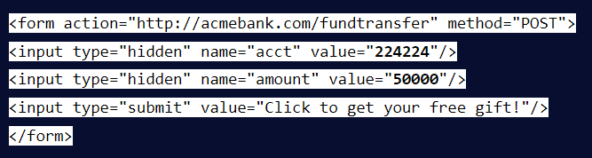
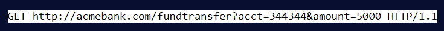
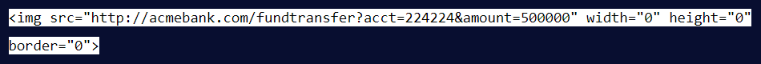
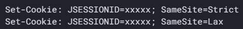

# **CSRF là gì?**
- Viết tắt của ***Cross-site Request Forgery***, tạm dịch là "Giả mạo request tới trang web khác"

    

- Bản chất là một kiểu tấn công làm người dùng ***truy cập vào một trang web của kẻ tấn công***, và với ***quyền chứng thực*** (credentials - creds, ở đây là cookies) mà người dùng này có, trang web này sẽ ***gửi request*** tới trang web bị lỗ hổng, từ đó làm người dùng đó ***thực hiện những tác vụ không mong muốn*** hoặc thậm chí đánh cắp được thông tin người dùng

    ↪ Lợi dụng việc các website "chéo nhau" (cross-site) cũng có thể gửi request cho nhau
- Dựa trên cơ chế các request đến website có phiên làm việc đều chứa Cookie để xác định người dùng
- Kiểu tấn công này chỉ thực hiện được khi người dùng ***vẫn còn đang ở trong phiên đăng nhập*** với website mục tiêu

## *So sánh XSS và CSRF:*
|XSS|CSRF|
|-|-|
|Lợi dụng lòng tin của người dùng vào một website|Khai thác lòng tin của website vào người dùng|
|Script được thực thi ngay trên web mục tiêu|Script cần được tạo trên web khác để gửi request tới web mục tiêu|
|Cần phải có JS|Có thể không cần dùng đến JS|
|Có thể đánh cắp được thông tin người dùng|Không đánh cắp được thông tin người dùng|
|-|Bị giới hạn bởi những chức năng và quyền của người dùng trên web mục tiêu|
|Mô hình tấn công 2 chiều: thực hiện script, nhận response|Mô hình tấn công 1 chiều: chỉ có thể thực hiện gửi request nhưng không nhận được response|

## *Hậu quả của CSRF:*
- Ảnh hưởng đến người dùng, làm người dùng thực thi những tác vụ không có chủ đích (đổi mail, đổi mật khẩu...)
- Tạo ra những con ***worms*** trên trang web (đăng tải lên forum)
- Thực hiện các giao dịch ngoài ý muốn

## *Các yêu cầu của CSRF:*
1. Ứng dụng có lỗ hổng phải có những ***chức năng*** mà kẻ tấn công muốn thực hiện: đổi mật khẩu, đổi mail, xóa tài khoản...
2. ***Phiên làm việc*** trên cookie: ứng dụng chỉ đơn thuần xác nhận người dùng bằng session cookie
3. Không có các ***tham số "khó đoán"*** trong request: ở đây nói đến là web mục tiêu không sử dụng anti-csrf token

## *Kịch bản tấn công:*
- Xây dựng một trang web có thể dùng để request tới trang web mục tiêu
- Lừa người dùng truy cập vào trang web đó để có thể tự động lấy được thông tin của người dùng
- Và đương nhiên trang web mục tiêu phải đạt được những yêu cầu bên trên

# **Cách khai thác:**
## *1. Thông qua form (CSRF with POST request):*
- Ví dụ ta có một POST request dùng để bank tiền vào tài khoản `acct` với số tiền `amount` tại một website ngân hàng nào đó

    

- Kẻ tấn công có thể tạo một cái request tương tự như vậy với tài khoản của hắn và số tiền mong muốn. Muốn gửi được request đó cho web mục tiêu thì cần làm người dùng truy cập vào URL mà kẻ tấn công dựng lên. URL của kẻ tấn công có thể chỉ chứa payload như sau:

    

- URL của kẻ tấn công có thể cho thêm script tự động submit form mà người dùng không cần phải tương tác gì thêm. Như vậy chỉ cần truy cập vào URL, người dùng đã có thể bị thực hiện giao dịch ngoài mong muốn

## *2. Thông qua URL (CSRF with GET request):*
- Thường sử dụng với các thẻ có `src` attribute (`, <script>, <background>`) hoặc `href` (`<a>, <link>`)
- Vẫn ví dụ trên nhưng là với GET request, ta vẫn bank tiền vào tài khoản `acct` với số tiền `amount`

    

- Kẻ tấn công có thể tạo ra URL với payload sau:

    

- Như vậy khi truy cập vào URL đó, nếu người dùng còn đang trong phiên làm việc với web mục tiêu, thẻ `` của URL này sẽ gửi GET request như trong payload tới web mục tiêu đó, và thực hiện giao dịch ngoài mong muốn của người dùng

# **Cách phòng chống:**
## *Read-only GET request:*
- Nếu trang web sử dụng GET request, dùng nó chỉ để đọc (READ), chặn các trường hợp tạo (CREATE), sửa (UPDATE), xóa (DELETE
)
## *Anti-Forgery Token:*
- Khi có request gửi tới trang, cần sử dụng một cái gọi là ***secret token / unique token*** để xác thực request gửi từ chính trang này chứ không phải từ trang khác
- Token thường là một chuỗi ngẫu nhiên lưu trong cookie hoặc server và gửi trong ***hidden field*** để khi gửi request lên server, nó sẽ kiểm tra và xác nhận token
- Cần đảm bảo được ***tính ngẫu nhiên*** của mỗi token để đảm bảo được tính "khó đoán", như là làm mới đối với ***mỗi phiên*** làm việc của người dùng hoặc thậm chí ***mỗi request*** khác nhau

|Per session|Per request|
|-|-|
|Không bảo mật bằng cái kia|Bảo mật hơn cái kia (do thời gian khai thác được thành công token là bị giảm đi)|
|Token được lưu ở mỗi phiên làm việc và được dùng kèm với các request trong phiên|Ảnh hưởng đến trải nghiệm người dùng (ví dụ như nút Back trên trình duyệt)|
- Đây là phương pháp được đánh giá là bảo mật nhất

## *Đảm bảo cookie được gửi kèm với attribute là SameSite:*
- `SameSite` là một thuộc tính trong `Set-Cookie header` ở response có thể giúp phòng tránh CSRF
- Ý nghĩa của `SameSite`: giúp trình duyệt quyết định xem có ***gửi kèm cookie*** trong các request đến từ website khác 
- Value có thể có:
    * `Strict`: ***bất kỳ request*** nào đến từ ***site khác*** tới site bạn đều sẽ ***không được include*** cookie
    * `Lax`: cho phép GET request từ site khác tới site bạn chứa cookie, và chỉ có GET request thôi. Điều này giúp người dùng không cần phải log in lại một lần nữa để vào site bạn khi click vào link từ một site khác (VD: link từ google search). Đây là value mặc định của Chrome, kể từ 2021
    * `None`: tắt cơ chế SameSite đi

    

## *Referer Header:*
- `Referer` header chứa đường dẫn trang web mà gửi request để lấy tài nguyên
- Như vậy website sẽ biết được request đến từ website nào để có những phương án phù hợp
- Tuy nhiên một số trang web có thể bypass được cái này bằng cách bỏ hẳn đi header

## *Thêm một tầng xác thực nữa đối với các tác vụ quan trọng:*
- Thường là bước tái xác nhận một lần nữa

    VD: đổi password thì cần phải nhập lại mật khẩu hiện tại; hoặc xác nhận thông qua link gửi về mail

- Ngoài ra còn có thể là Double Submit Cookie
# Tài liệu tham khảo:
- [CSRF Prevention Cheatsheet](https://cheatsheetseries.owasp.org/cheatsheets/Cross-Site_Request_Forgery_Prevention_Cheat_Sheet.html)
- [Hướng dẫn tạo token](https://freetuts.net/ky-thuat-tan-cong-csrf-va-cach-chong-csrf-106.html)