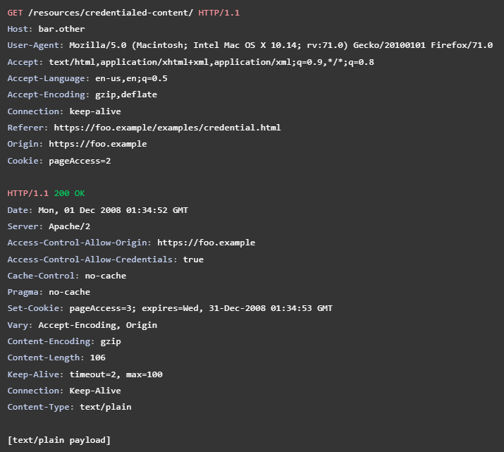

# **Cross-Origin Resource Sharing (CORS)**
## *Nhưng mà origin là gì?*
- `Origin` (Gốc) được định nghĩa là bao gồm ***scheme*** (protocol, giao thức), ***hostname*** (domain) và ***port*** của URL
- Ví dụ của 2 đối tượng URL có cùng origin (same origin):

    

❗Như vậy chỉ cần khác giao thức hoặc khác domain và port là 2 đối tượng sẽ không cùng origin

- Việc truy cập vào origin khác để sử dụng tài nguyên được gọi là ***cross-origin***

## *Trước tiên ta cần biết, Same-origin Policy (SOP) là gì?*
- Policy là chính sách, quy tắc, nguyên tắc cần được tuân theo. Vậy `SOP` hiểu là một ***cơ chế bảo mật*** của trình duyệt ***giới hạn tương tác*** của tài nguyên từ một origin nào đó với các ***origin khác***, hay nói cách khác là nó ***chặn request*** được gửi tới ***website mà không cùng origin***
- SOP giúp ngăn chặn các tài nguyên có thể bị truy cập trái với mục đích ban đầu, giảm nguy cơ bị tấn công

### *Tại sao SOP lại cần thiết?*
- Khi trình duyệt của người dùng gửi request từ một website này sang một website khác, điều này đồng nghĩa với việc ***tất cả các cookies, bao gồm session cookies*** của phiên làm việc của người dùng đó, cũng sẽ gửi kèm trong cả request luôn
- Việc để bị lộ session cookie của người dùng vào tay kẻ tấn công là một trong những điều nguy hiểm hàng đầu của một website

### *Vậy khi nào ta cần truy cập tới tài nguyên của website bên ngoài (cross-origin)?*
- JS code trong ``
- CSS như `<link rel="stylesheet" href="...">`
- Ảnh trong `` hoặc các media khác trong `<video>` và `<audio>`
- `<iframe>`

### *Vậy thì làm thế nào để truy cập được tài nguyên ở cross-origin?*
- Sử dụng CORS (bên dưới chi tiết hơn)

## *Cross-Origin Resource Sharing (CORS) là gì?*
- CORS là một cơ chế sử dụng ***HTTP header*** để có thể ***truy cập được vào tài nguyên khác origin***, cụ thể là ***chọn ra các origin*** mà trình duyệt ***được phép tải tài nguyên về*** 

    

- VD: front-end của ***`https://domain-a.com`*** sử dụng XMLHttpRequest (một đối tượng trong JS dùng để tương tác với server) để gửi request tới ***`https://domain-b.com/data.json`***
    * Về vấn đề bảo mật, trình duyệt sẽ chặn cái request đến server khác gốc này, giả sử khi XMLHttpRequest và Fetch API cùng tuân theo SOP
    * Những web app sử dụng API như vậy sẽ chỉ có thể request tài nguyên từ chính origin của nó, trừ khi trong response của cái origin được request tới chứa CORS header
- Nếu không được triển khai cẩn thận có thể dẫn tới ***CSRF - Cross-site Request Forgery***

### *Cơ chế hoạt động của CORS:*
#### ***Trường hợp đơn giản nhất:***
- Mô hình của trường hợp đơn giản nhất có dạng như sau:

    

- Ví dụ, web có origin `https://foo.example` muốn lấy tài nguyên từ web có origin `https://bar.other` thì trong đoạn code JS sẽ có kiểu như sau:

    

- Đoạn request khi mà trình duyệt chạy đến dòng code đó có dạng:

    

- Ta thấy có header ***Origin***, tức nó được thực hiện từ origin `https://foo.example`
- Đoạn response của origin được request tới (là `https://bar.other`) có dạng như sau:

    

- Ta thấy có header ***Access-Control-Allow-Origin*** với giá trị *, tức là tài nguyên được request tới có thể được truy cập bởi mọi origin. Còn nếu ông orgin `https://bar.other` chỉ muốn 1 mình ông `https://foo.example` được truy cập thôi thì giá trị của header sẽ là origin của ông đó

    

#### ***Thông qua preflighted request:***
- Trước hết ta cần biết *preflight request* là gì. Preflight có nghĩa là ***"xảy ra trước giờ máy bay cất cánh"***. Nhưng ở đây có thể hiểu là trước khi request chính được "bay" sang server tài nguyên
- Preflight request là ***CORS request*** được ***browser tự động gửi*** khi có thêm các ***custom header*** (không phải header do `user agent` tự tạo). Nó dùng để kiểm tra xem server tài nguyên có ***cho phép request*** chứa ***giao thức đó*** và ***các header được thêm vào*** để truy cập vào tài nguyên hay không
- Preflight request là một request với giao thức ***OPTIONS***, và có các header như:
    * Access-Control-Request-Method
    * Access-Control-Request-Headers
    * Origin
- Mô hình thông qua preflighted request có dạng như sau:

    

- Không giống như trường hợp đơn giản chỉ bao gồm 2 header Origin và Access-Control-Allow-Origin, trình duyệt trước khi gửi request chính sẽ gửi ***preflighted request*** với giao thức OPTIONS trước để kiểm tra xem cái request chính có an toàn thật khi gửi hay không
- Như vậy đoạn code JS của origin ban đầu sẽ có dạng như sau:

    

- Đoạn code trên tạo một thực thể của đối tượng XMLHttpRequest để thực hiện gửi request POST bao gồm header X-PINGOTHER và Content-type. Do nó có ***custom header*** (là 2 cái trên), nên request này cần có preflighted request
- Request của preflight có dạng:

    

- Nó chứa header ***Origin*** là origin của server yêu cầu tài nguyên, header ***Access-Control-Request-Method*** với giá trị POST để nói rằng request thật sẽ là giao thức POST, header ***Access-Control-Request-Headers*** với giá trị X-PINGOTHER, Content-Type để nói rằng request thật sẽ chứa 2 custom header kia
- Response của server tài nguyên trả về tương ứng là:

    

- Ta thấy server trả về có header ***Access-Control-Allow-Origin*** là `https://foo.example` tức origin này được phép truy cập tài nguyên, header ***Access-Control-Allow-Methods*** với các giao thức của request được phép gửi, header ***Access-Control-Allow-Headers*** với các header của request được phép thêm vào. Ngoài ra ta còn thấy header ***Access-Control-Max-Age***, dùng để chỉ thời gian lưu của cái response này trong bộ nhớ đệm, giá trị của nó là đơn vị giây

❗Tuy nhiên cần lưu ý là nếu request chính có header ***Authorization*** thì cách trên không thể thực hiện được

#### ***Thông qua credentialed request:***
- Cách này dùng để tạo một request chứa credential của người dùng, thường là cookie
- Giả sử JS code có dạng như sau:

    

- Ta thấy thuộc tính ***.withCredentials*** của thực thể invocation được set là true. Mặc định, trình duyệt sẽ bỏ qua response từ server mà không có header ***Access-Control-Allow-Credentials: true***. Thế nên việc set true mới làm cho trình duyệt nhận response từ server
- Vậy là ta có request và response tương ứng:

    

