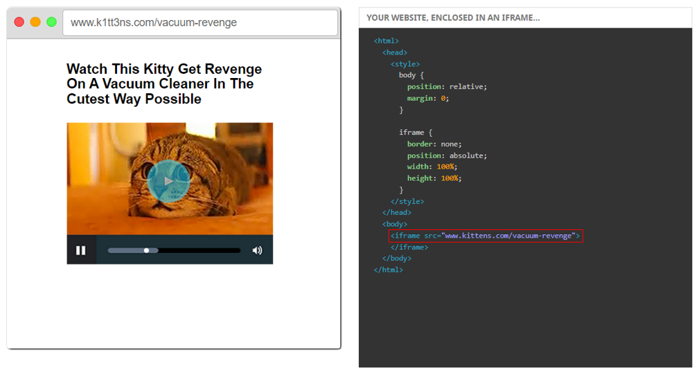
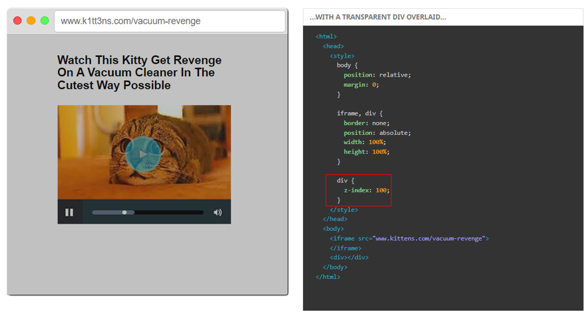
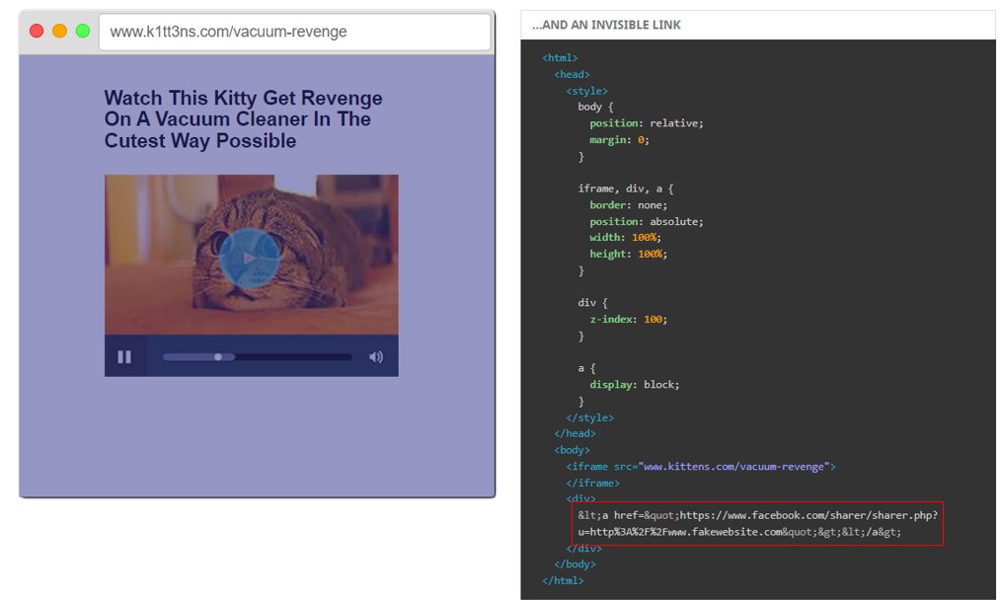
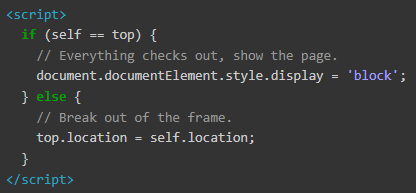

# **Clickjacking**
- Clickjacking là một kỹ thuật tấn công lừa người dùng ***click*** vào một ***đường link độc hại*** nào đó, thông thường là ***đã được che giấu*** bằng một cái gì đó khác khác mà người dùng không nhận ra được
- Thông thường clickjacking có thể được thực hiện bằng việc ***chèn phần tử web vô hình*** (thẻ `
`) lên những chỗ mà người dùng nghĩ rằng nó vô hại
- Thuộc kiểu tấn công ***Client Side***

## *Hậu quả:*
- Làm người dùng thực hiện các tác vụ không mong muốn
- Phát tán malware bằng cách làm người dùng download nó
- Phát tán những con ***worms***
- Làm người dùng bật cam hoặc mic

# **Cách khai thác**
- Nếu trang web mục tiêu không có biện pháp phòng tránh tối ưu, kẻ tấn công có thể ***tạo ra một site*** với ***URL gần như tương tự***, và sử dụng `<iframe>` tới trang web mục tiêu
- Giả sử ta có website `www.kittens.com`, và kẻ tấn công dựng một site như bên dưới

    

- Kẻ tấn công có thể chèn một thẻ `
` tàng hình phủ lên iframe

    

- Và thẻ `
` đó được để trong một thẻ `a`

    

- Như vậy người dùng nào muốn xem cái video kia đều có thể bị lừa thực hiện các tác vụ mà kẻ tấn công muốn
- Về phía trình duyệt, người dùng đã chọn click vào link của kẻ tấn công, nên nó sẽ thực hiện bất kể điều gì nằm đằng trong cái link đó

# **Cách phòng thủ**
## *Sử dụng CSP - Content Security Policy Header:*
- `Content-Security-Policy` là một HTTP Header, được dùng để cho phép tải tài nguyên nào từ domain nào, hoặc cho phép domain nào được embed site mình vào
- Để quản lý site nào có thể embed site của mình, sử dụng directive `frame-ancestors` với cú pháp như sau:

    `Content-Security-Policy: frame-ancestors <uri>`
#### ***Ví dụ:***
- `frame-ancestors 'none'`: không site nào được phép cho site mình vào frame (kể cả trang của mình)
- `frame-ancestors 'self':` trang chỉ có thể được cho vào frame của site trang có cùng origin
- `frame-ancestors <uro>`: trang chỉ có thể được cho vào frame của site được ghi trong vị trí của uri

## *Sử dụng X-Frame-Options Header:*
- `X-Frame-Options` cũng là một HTTP header, được dùng để cho biết trình duyệt có được phép render trang trong `<frame>, <iframe>, <object>` hay không. Nhưng dường như giờ đã bị CSP Header lấn át rùi
- Có 3 giá trị:
    * *`DENY:`* không site nào được phép cho site mình vào frame (kể cả trang của mình)
    * *`SAMEORIGIN:`* trang chỉ có thể được cho vào frame của site trang có cùng origin
    * *`ALLOW-FROM <uri>:`* trang chỉ có thể được cho vào frame của site được ghi trong vị trí của uri

## *Frame-killing trong JS:*
- Ngày trước, đây là phương pháp phổ biến nhất. Hiện nay thì thực ra vẫn còn nhưng ít hơn:

    

