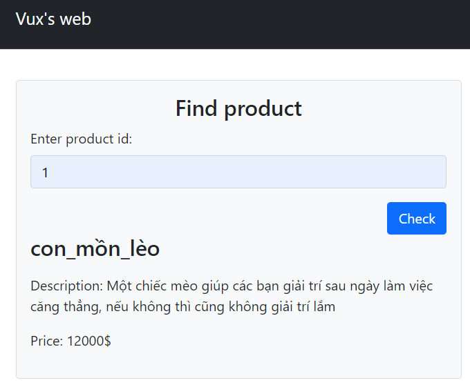
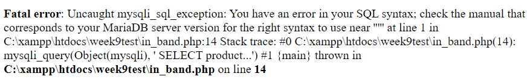
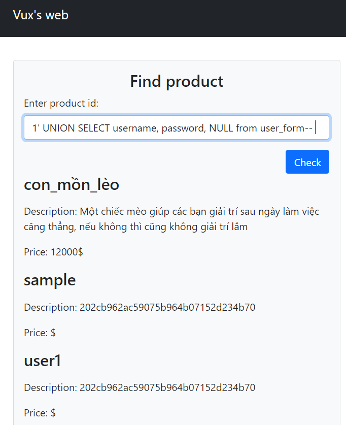
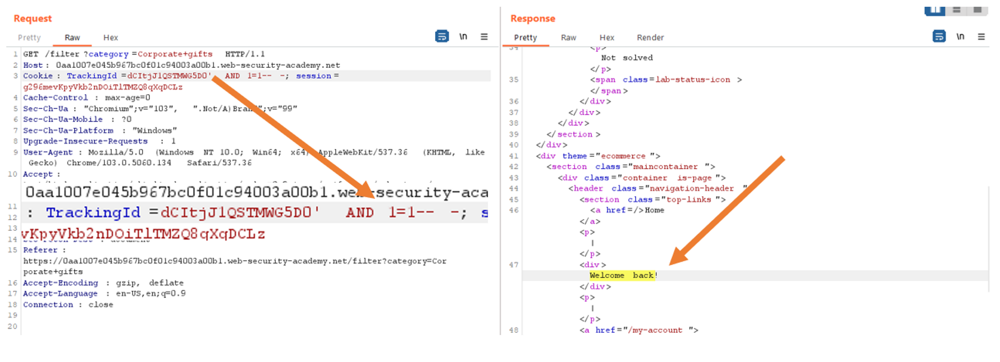
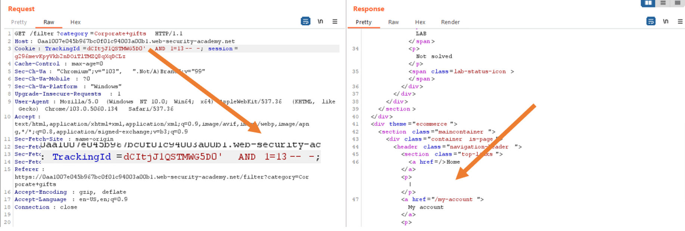
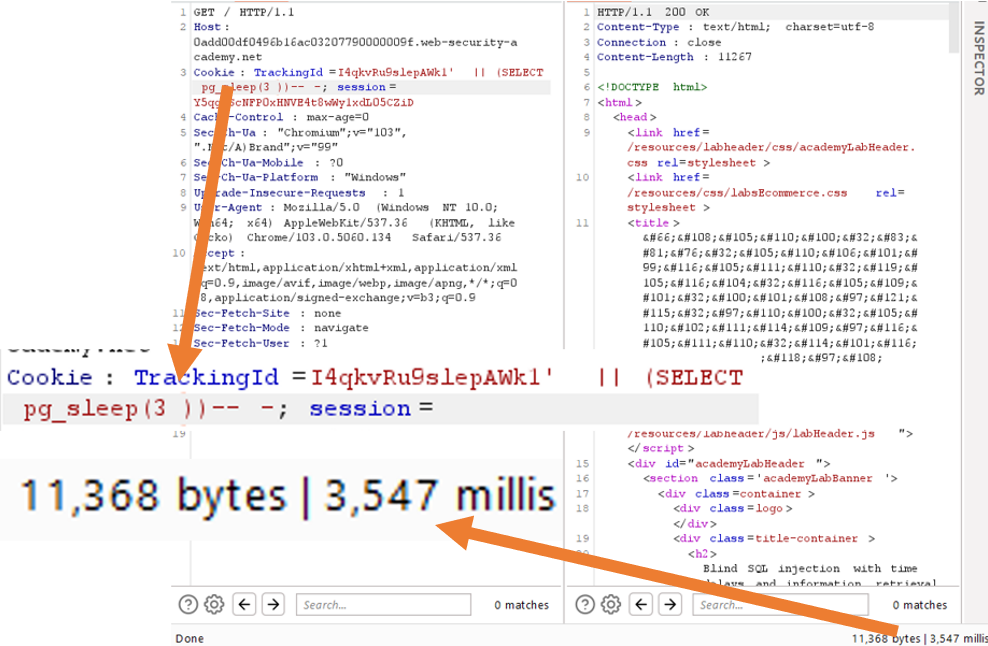
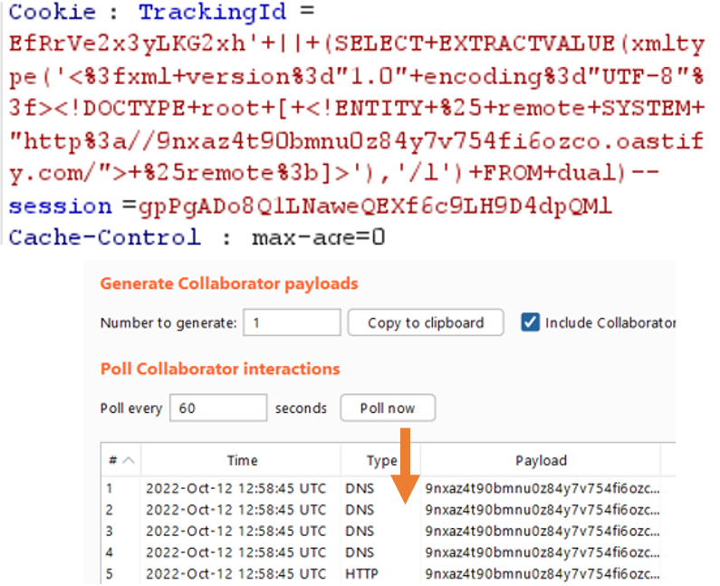

# **Khái niệm SQL Injection**
* Là kỹ thuật lợi dụng những ***lỗ hổng về câu truy vấn*** _(query)_ của các ứng dụng/website để tác động, khai thác cơ sở dữ liệu
* Kiểu tấn công này có thể được thực hiện bằng cách ***"tiêm" SQL*** thông qua (thường là) các ô nhập ***input*** để làm sai lệch đi câu truy vấn ban đầu, từ đó ***khai thác*** được dữ liệu từ cơ sở dữ liệu

    VD: login form, searching field, ...

## *Nguyên nhân dẫn đến lỗ hổng SQL Injection:*
* Do việc tạo các câu truy vấn bằng cách ***ghép chuỗi*** chưa phù hợp
* Sử dụng trực tiếp input người dùng mà không sanitize nó

## *Ảnh hưởng của lỗ hổng SQL Injection:*
* Vượt qua khâu ***xác thực người dùng*** (bypass login)
* Xem được dữ liệu người dùng hoặc các ***thông tin quan trọng*** khác, thậm chí có thể thay đổi dữ liệu _(update, insert, delete)_
* ***Kiểm soát*** máy chủ DB

# **Phân loại và cách khai thác**
## *1. In-band SQLi (kiểu classic)*
* Kết quả của câu truy vấn có thể được thấy ngay trên web
* Cách khai thác:
    * Error-based SQLi: 
        * Tận dụng ***error messages*** trả về từ DB để lấy thông tin về structure của DB đó
        * Cách khai thác: lợi dụng Numeric Overflow (tràn số); nhập các ký tự đặc biệt (nháy đơn, nháy kép, ...)

            VD: Đây là một chiếc web với chức năng tìm kiếm sản phẩm bình thường. Nhập bình thường vẫn hiện kết quả. Nhập ký tự đặc biệt (sử dụng dấu nháy đơn) thì hiện lỗi.

        
        
        
        => Từ chiếc thông báo lỗi này có thể khai thác được nhiều thứ khác (hệ DB đang sử dụng, version, câu query, etc.)

    * Union-based SQLi:
        * Tận dụng ***toán tử UNION*** trong SQL để kết hợp kết quả của nhiều SELECT queries thành 1 kết quả trả về (dùng để lấy data từ table khác)
        * Cách khai thác: 
            * Có thể lấy được số cột kết quả trả về của query bằng cách `UNION SELECT NULL` (nhưng có cách đơn giản hơn là dùng `ORDER BY`)
            * Có thể lấy được data type của cột bằng cách thử dữ liệu khi UNION SELECT 
            * Có thể lấy được thông tin về cơ sở dữ liệu, từ đó lấy được thông tin về các bảng/cột trong nó thông qua các bảng về metadata có sẵn
        
VD: Vẫn ở cái web bên trên, ta có thể lấy được thêm cả dữ liệu từ bảng khác thông qua vài bước (ở đây skip đến bước cuối cùng là lấy được bảng và cột)
        

## *2. Inferential SQLi (Blind SQLi)*
* Là kiểu tấn công được sử dụng khi mục tiêu (ứng dụng/website) đã ẩn đi chức năng hiện thông báo lỗi nhưng vẫn không chịu vá lỗ hổng đấy
* Cách khai thái:
    * Content-based BSQLi: thực hiện các ***truy vấn kiểu Boolean*** (payloads), sau đó phân tích các phản hồi trả về từ DB
    
Ví dụ: trong Lab 11 của PortSwigger, ta có thể khai thác được SQLi qua cookie vì nếu câu truy vấn có có kết quả, màn hình sẽ có dòng chữ “Welcome back!”, và ngược lại thì không. Do đó ta có thể lợi dụng những câu truy vấn mang tính Boolean để khai thác được thông tin

    
    
Câu truy vấn đúng

    
    
Câu truy vấn sai

    * Time-based BSQLi: thực hiện các truy vấn buộc DB phải ***chờ một thời gian*** trước khi thực hiện một truy vấn nào đó (thường thông qua _sleep()_)
    
Ví dụ: trong Lab 12 của PortSwigger, ta có thể khai thác được SQLi qua cookie vì tuy không có kết quả nào được trả về dù truy vấn đúng hay sai, ta dựa trên được thời gian mà server trả về phản hồi. Do đó có thể sử dụng các cú pháp làm chậm delay tương ứng với mỗi hệ DB để khai thác thông tin

    
    
* Nhược điểm: ***tốn thời gian*** do truy vấn mang tính rời rạc, riêng lẻ hoặc đơn giản là nó cũng tốn nhiều thời gian (time-based)

## *3. Out-of-band SQLi*
* Kẻ tấn công không nhận được phản hồi từ mục tiêu trên cùng kênh liên lạc nhưng vẫn lam mục tiêu gửi dữ liệu đến một nơi nào đó mà mình kiểm soát được
* Chỉ hữu hiệu nếu server có command có thể kích hoạt DNS hoặc HTTP request => ít phổ biến hơn
* Có thể dùng Burp Collaborator để thực hiện DNS Lookup

    

# Các phương pháp:
Có thể tiếp cận theo nhiều khía cạnh khác nhau, nhưng có 2 khía cạnh chính:
1. Black-box Testing Perspective:
* Định nghĩa: không được cho bất kỳ thông tin nào về mục tiêu, ngoài cái URL
* Cách khai thác: 
    * Crawl các chức năng có thể khai thác được (đi qua các pages có thể truy cập được, xem các input có khả năng bị SQLi, kiểm tra tính logic, xem các subdomains và directories)
    => Có thể dùng tool để scan/crawl thông tin nhưng những tool này chỉ dùng với những lỗ hổng mức độ thấp; để tìm lỗ hổng nghiêm trọng (và chính xác hơn) thì nên tự crawl
    * Fuzzing: tìm lỗi bằng các payloads, xem mục tiêu phản hồi những gì => chủ động hơn, khác với các tools chỉ nhập input chứ không xác định được output
    * Nếu mục tiêu không hiển thị lỗi thì test các Boolean conditions hoặc dùng time delay
    * Soạn gửi OAST payloads để check tương tác khác kênh liên lạc
2. White-box Testing Perspective:
* Định nghĩa: được cho thông tin về mục tiêu cũng như source code của back-end
* Cách khai thác: cũng tương tự như Black-box nhưng do đã có source code nên việc fuzzing kiểm thử sẽ đễ dàng hơn

# **Cách phòng chống**
* Sử dụng ***Prepared Statements*** (Parameterized Queries) thay vì nối chuỗi: xác định những vị trí chắc chắn sẽ là chỗ điền input
* Whitelist input validation: list các input hợp lệ, các input khác coi là ko hợp lệ
* Luôn ***sanitize/validate input*** để kiểm tra input nhập từ người dùng
* mysqli_real_escape_string?
* ***Hủy*** chức năng ***thông báo lỗi*** trên live site, hoặc được chuyển hướng sang một file/site khác có những quyền truy cập hữu hạn (để tránh Error-based)
* Có thể thường xuyên ***scan web*** để tìm lỗ hổng (nguồn: Acunetix)
* Sử dụng các ***frameworks*** hiện đại đã được test để phòng chống các lỗ hổng (nhưng ko nên tin cậy hoàn toàn)

# Một số tools:
1. sqlmap: https://github.com/sqlmapproject/sqlmap
2. WAVS(Acunetix, PortSwigger, etc.)

# Tài liệu tham khảo:
* Các khái niệm chung, phần mở đầu:
    * https://www.w3schools.com/sql/sql_injection.asp
    * https://portswigger.net/web-security/sql-injection
    * https://owasp.org/www-community/attacks/SQL_Injection
    * https://www.acunetix.com/websitesecurity/sql-injection/
    * https://www.imperva.com/learn/application-security/sql-injection-sqli/
    * https://topdev.vn/blog/sql-injection/
    * https://viblo.asia/p/sql-injection-la-gi-co-bao-nhieu-kieu-tan-cong-sql-injection-m68Z0QnMlkG

* Phân loại SQLi:
    * https://www.acunetix.com/websitesecurity/sql-injection2/
    * https://www.acunetix.com/websitesecurity/blind-sql-injection/ (Blind SQLi)
    * https://www.acunetix.com/blog/articles/blind-out-of-band-sql-injection-vulnerability-testing-added-acumonitor/ (Out-of-band SQLi)