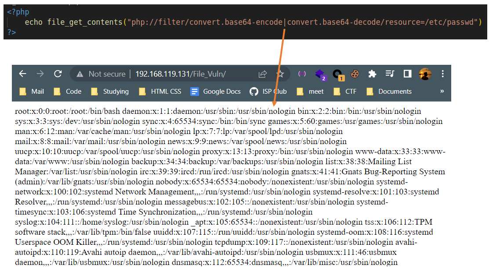
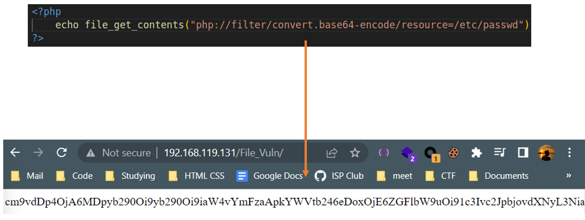
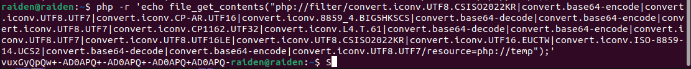
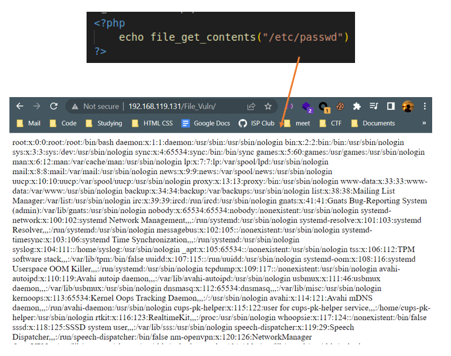

# **PHP Wrappers**
## *Some notes?*
- PHP wrappers can be ***piped*** using `|` or `/`
<p align="center">
    
</p>

- `file_get_contents()` và `include()` khác nhau ở chỗ: mọi nội dung trong `file_get_contents()` được trả về dưới dạng chuỗi, còn trong `include()` thì vẫn sẽ thực thi được PHP script

## *Some common wrappers:*
- `php://filter/convert.base64-encode/<string>`: to encode the specified string into base64 
<p align="center">
    
</p>

- - `php://filter/convert.base64-decode/<string>`: to decode the specified string from base64 to ASCII 
- `php://filter/convert.iconv.<input_enconding>.<output_enconding>/<string>`: nhận chuỗi đầu vào, coi chuỗi đó đang ở dạng `input_encoding`, rồi decode nó bằng `output_decoding` (iconv tắt của ***internationalization conversion***)
- `php://temp`: được gọi là temporary resource, dùng để lưu dữ liệu vào bộ nhớ (giống như lưu vào biến tạm thời). Điều này có ích khi muốn xử lý dữ liệu trước khi sử dụng. Nói đơn giản là nó tạo một cái file tạm thời trong cái dir tạm thời (dir tạm thời được specify trong `upload_tmp_dir` ở trong php.ini, hoặc gọi hàm `sys_get_temp_dir()` để trả về vị trí của dir đó)

## *php://filter/convert.iconv:*
- Wrapper này có thể được dùng để khai thác LFI với một vài tricks
- Nếu ta pipe các conversion nào đó với nhau, ta hoàn toàn có thể có được một ký tự bất kỳ mà ta muốn
- Tham khảo các chữ cái tại [đây](./conversion.txt)

VD: Để có được chữ `vux`, payload của chúng ta là:
```
php://filter/convert.iconv.UTF8.CSISO2022KR|convert.base64-encode|convert.iconv.UTF8.UTF7 (phần start)
convert.iconv.CP-AR.UTF16|convert.iconv.8859_4.BIG5HKSCS (chữ x)
convert.base64-decode|convert.base64-encode|convert.iconv.UTF8.UTF7 (separator)
convert.iconv.CP1162.UTF32|convert.iconv.L4.T.61 (chữ u)
convert.base64-decode|convert.base64-encode|convert.iconv.UTF8.UTF7 (separator)
convert.iconv.UTF8.UTF16LE|convert.iconv.UTF8.CSISO2022KR|convert.iconv.UTF16.EUCTW|convert.iconv.ISO-8859-14.UCS2 (chữ v)
convert.base64-decode|convert.base64-encode|convert.iconv.UTF8.UTF7 (separator)
/resource=php://temp (phần end)
```
- Ta nối các convert với nhau và ta được `vux` ở đầu:
<p align="center">
    
</p>

- Ta có thể vận dụng cái trên để viết PHP script

# **Some functions**
- `readline("prompt")`: to take input from user. The `prompt` string is optional
```php
$string = readline("Enter something: ");
```
- `file_get_contents($filename)`: to return the ***contents of the file*** in a string
<p align="center">
    
</p>

# **Some useful tips**
- `echo -n <string>`: to print the string ***without any trailing newline***
- `xxd <file>`: idk, try it yourself
- `php -r '<code>'`: to run the specified PHP code right in terminal
- to prepend: gán chuỗi vào ***đầu chuỗi*** >< to append: gán chuỗi vào ***cuối chuỗi***
- PHP có cái gọi là ***Execution Operators*** và được sử dụng bằng cặp backticks \`...\` với nội dung trong nó là ***shell command***. Toán tử này trả về chuỗi là output của chính command đó