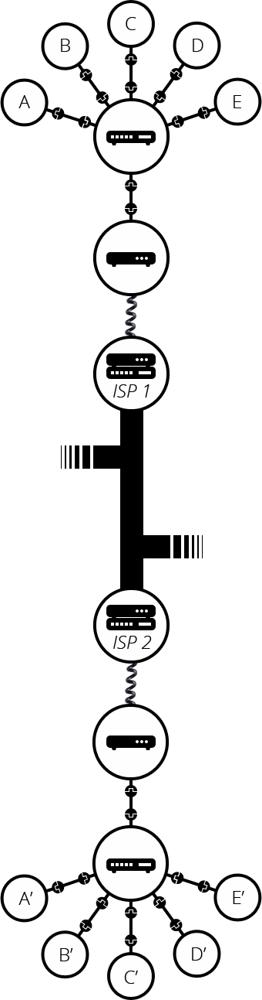

# **Cách thức hoạt động của Internet**
- Internet, hay Internetwork, được ví như ***"network of networks"***, một ***mạng lưới khổng lồ*** kết nối các ***mạng lưới máy tính*** trên khắp thế giới, và mọi máy tính đều có thể giao tiếp được với nhau khi kết nối với Internet

## *Một mạng máy tính đơn giản gồm những gì?*
- Khi chỉ có hai máy tính kết nối với nhau, chúng có hai cách: ***kết nối vật lý*** (sử dụng Ethernet cable - dây cáp Ethernet) hoặc ***kết nối không dây*** (Wifi hoặc Bluetooth)

    (Đây ta chỉ xét trường hợp sử dụng ***kết nối vật lý*** ở bên dưới, và hầu như việc trao đổi dữ liệu giữa các máy tính hiện nay là sử dụng ***cáp quang*** - optical fiber cable)
- Nhưng nếu có nhiều hơn hai máy, giả sử có 10 máy, thì để có thể kết nối được với nhau, ta cần đến 45 dây cáp, và mỗi máy cần 9 dây để nối với số còn lại
- Để giải quyết bài toán trong trường hợp này, mỗi máy sẽ kết nối với một thiết bị gọi là ***router***. Router cũng có ***CPU và bộ nhớ***, nên về bản chất nó cũng là một cái ***máy tính***. Tác dụng duy nhất của nó là ***truyền dữ liệu*** được gửi từ ***máy gửi*** đến ***đúng máy nhận***. Tức nếu máy A gửi dữ liệu cho máy B, A sẽ gửi cho router, và router gửi lại cho B và đảm bảo không được gửi nhầm sang máy nào khác. Vậy là bài toán đã được giải quyết phần nào: chỉ cần 10 dây cáp, mỗi máy có 1 dây kết nối với router

    

## *Mạng của mạng máy tính*
- So far so good. Nhưng nếu có hàng trăm, hàng nghìn, hàng tỉ máy tính thì sao? Một chiếc router thì sao mà cân nổi. Nhưng router cũng là một cái máy tính, nên ta cũng có thể ***kết nối các router với nhau***. Vậy nên nhờ đó ta có thể cân được một lượng lớn máy tính, tạo nên một mạng lưới máy tính khổng lồ

    

- Đó mới chỉ là mạng máy tính của riêng bạn, trong một phạm vi hẹp. Ngoài kia cũng còn nhiều mạng lưới máy tính khác: của bạn bè, hàng xóm, hay của người bên kia trái đất. May mắn là ở nhà chúng ta có các dây cáp khác như dây điện hoặc ***dây điện thoại (của bên viễn thông)***. Trong cơ sở hạ tầng của viễn thông, nhà chúng ta có thể kết nối với mọi người trên trái đất này. Vậy nên để ***kết nối mạng máy tính của chúng ta với cơ sở hạ tầng của viễn thông***, ta sử dụng thiết bị gọi là **modem**. Tác dụng của nó là biến ***dữ liệu*** của mạng chúng ta thành ***dữ liệu có thể xử lý được*** ở cở sở hạ tầng viễn thông và ngược lại 

    

- Thế là ta đã kết nối được với cơ sở hạ tầng viễn thông. Để có thể truyền dữ liệu đến ***đúng mạng đích***, ta cần kết nối tới ***nhà cung cấp dịch vụ Internet (ISP - Internet Service Provider)***. Ở VN, top 3 nhà cung cấp dịch vụ mạng là VNPT, Viettel, FPT. Mỗi nhà cung cấp dịch vụ mạng có những ***router riêng*** mà có thể ***kết nối với nhau*** và cũng có thể ***kết nối tới router của nhà cung cấp khác***. Vậy là dữ liệu của ta được truyền đi thông qua ***"mạng lưới ISP"*** để tới được mạng đích

    

## *Làm thế nào để dữ liệu gửi tới đúng máy tính?*
- Trong mạng máy tính được kết nối như trên, có cả tỉ các thiết bị và máy tính kết nối với nhau. Để có thể chia sẻ dữ liệu đến một máy tính cụ thể, ta cần có ***địa chỉ IP*** của máy tính đó. Địa chỉ IP là một ***định danh duy nhất*** của mỗi máy tính khi kết nối vào mạng máy tính để phân biệt giữa các máy. Nếu là IPv4 thì nó là chuỗi gồm 4 số, còn IPv6 là chuỗi gồm 8 thành phần cả chữ và số

    ❗Địa chỉ IP của mỗi máy là do ***ISP cấp***. Các ISP mua địa chỉ IP public và phân phối cho người dùng. Vậy nên không có chuyện sẽ có 2 IP giống nhau đến từ 2 ISP khác nhau

- Việc xử lý các chuỗi kia đối với máy tính thì là cỏn con. Nhưng con người chúng ta thì chịu, thế nên ta có một thứ coi là "tên thay thế" cho cái chuỗi dài kia gọi là ***tên miền (domain name)***. VD: google.com sẽ được phân giải 142.250.190.78

## Vậy Internet và Web nhìn chung có giống nhau không?
- Câu trả lời là, về cơ bản là không. Internet là một ***cơ sở hạ tầng đồ sộ*** kết nối tỉ tỉ các máy tính với nhau, và trong số đó có những máy được gọi là Web server có thể truyền dữ liệu tới trình duyệt web của chúng ta, được gọi là Web client. Như vậy, Internet là cơ sở hạ tầng, còn Web là ***một dịch vụ*** được xây dựng trên cơ sở hạ tầng đó. Ngoài Web ra còn cả rất nhiều dịch vụ khác, quen thuộc nhất là gửi mail

Nguồn: [mozilla](https://developer.mozilla.org/en-US/docs/Learn/Common_questions/How_does_the_Internet_work) (checked nhưng bỏ intranets và extranets)