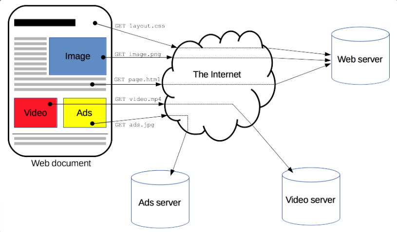
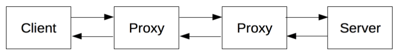
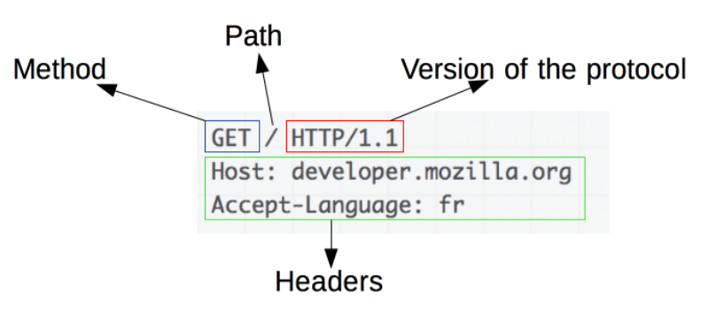
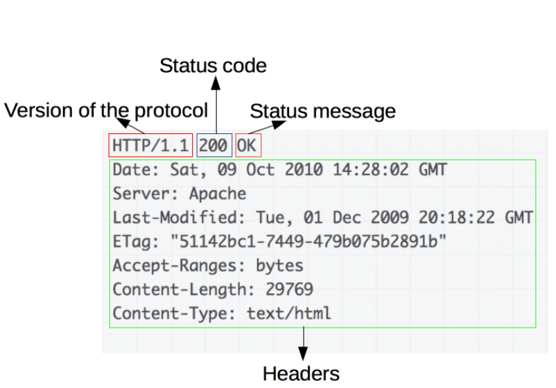

# **Overview về HTTP**
- HTTP là một giao thức dùng để ***lấy tài nguyên*** như file HTML. "Lấy" ở đây từ gốc là "fetch", tức đến đâu đó rồi mang về. Nó là ***nền tảng*** cho mọi sự ***trao đổi dữ liệu*** trên web và nó là một ***giao thức Client-Server***, tức ***request*** được tạo bởi ***client*** (thường là trình duyệt) để gửi cho ***server*** để nhận về ***response***. Một văn bản toàn vẹn được (document) xây dựng từ các văn bản con (subdocument) lấy được, như là text, bố cục, ảnh, video, script...

    

- Client và server giao tiếp bằng các đoạn tin nhắn riêng lẻ. Đoạn tin nhắn mà client gửi được gọi là ***HTTP request***, hoặc request, còn server gửi được gọi là ***HTTP response***, hoặc response
- HTTP không chỉ dùng để lấy tài nguyên mà cũng có thể ***upload tài nguyên*** lên server, như làm nộp form

## *Các thành phần trong **hệ thống được xây dựng dựa trên HTTP** (HTTP-based system):*
- Request thông thường được gửi từ trình duyệt, hoặc cũng có thể là proxy đại diện, hoặc cũng có thể là một con bot đang crawl web để cập nhật search engine index

    

- Ở giữa client và server có thể có rất nhiều các thiết bị khác, gọi là proxy với nhiều chức năng khác nhau. Các thiết bị đó có thể là router, modem... nhưng nó không nằm ở tầng mạng hay tầng giao vận trong mô hình OSI. HTTP là giao thức ở tầng trên cùng, tầng ứng dụng

### *1. Client - the user-agent:*
- User-agent là bất cứ cái gì đại diện cho người dùng. Thông thường nó là trình duyệt, nhưng cũng có thể là các ứng dụng khác
- Trình duyệt luôn luôn tạo request và nó không thể là server (tuy nhiên gần đây đã có một vài cách để giả lập hóa server)
- Để hiển thị trang web (web page), trình duyệt gửi request để lấy về HTML. Sau đó nó phân tích file, tạo thêm các request tương ứng với script như JS, hoặc thông tin về cách trình bày như CSS để hiển thị, hoặc các tài nguyên khác như ảnh và video. Sau đó trình duyệt kết hợp các tài nguyên và hiển thị một trang web hoàn chỉnh. Trình duyệt còn có khả năng thực thi script để lấy thêm tài nguyên cho các thao tác sau để cập nhật lại trang web
- Một trang web, thông thường, là một trang văn bản chứa hypertext, tức sẽ có một vài chỗ trong đống nội dung được hiển thị là link, và thường thường khi click chuột vào đó ta được một trang web mới. Như vậy là trình duyệt dịch các thao tác của người dùng thành HTTP request, sau đó phân tích response để hiển thị nội dung

### *2. Web server:*
- Server có thể chỉ là một máy hoặc là nhiều máy kết hợp với nhau, cùng chia sẻ công việc để ***cân bằng trọng tải*** (Load Balancing), hoặc cũng có thể chỉ là một máy có nhiệm vụ lấy dữ liệu từ máy khác (cache, Database server). Như vậy server, tự thân nó làm hết hoặc một phần, tạo ra trang văn bản hoặc cung cấp dịch vụ tương ứng
- Server không nhất thiết là chỉ một máy, và nhiều server (dưới dạng phần mềm) cũng có thể được host trên một máy. Với HTTP/1.1 và `Host` request header, nhiều server cũng có thể có chung địa chỉ IP

### *3. Proxy:*
- Giữa client và server có nhiều thiết bị khác nhận và truyền (relay) tin nhắn HTTP. Do cấu trúc xây dựng dựa trên các tầng của Web stack, hầu hết các thiết bị này nằm ở tầng giao vận, tầng mạng, hoặc tầng vật lý. Những thiết bị nằm ở tầng ứng dụng thì được gọi là Proxy
- Những thiết bị này có thể không nhìn thấy được (transparent, tức nó chỉ việc gửi request, không đả động gì thêm) hoặc nhìn thấy được (tức nó có đả động gì đấy đến request trước khi gửi đi)
- Một số chức năng thông thường của proxy:
    * ***Lưu dữ liệu vào bộ nhớ đệm (Caching)***. Dữ liệu có thể được public hoặc private (đúng với transparent proxy)
    * ***Lọc (Filtering)*** : chặn virus hoặc mối nguy hiểm tiềm tàng (đúng với reverse proxy)
    * ***Cân bằng tải (Load Balancing)*** : cho phép nhiều server tiếp nhận request
    * ***Xác thực (Authentication)*** : quản lý truy cập tới các tài nguyên khác nhau
    * ***Logging*** : lưu lịch sử truy cập dữ liệu

## *Các tính chất của HTTP:*
### *1. Đơn giản (Simple):*
- Vốn từ đầu, HTTP được sinh ra để con người hiểu được, mặc dù đã được cho thêm sự phức tạp trong phiên bản HTTP/2 như encapsulate HTTP message thành frame
- Ta có thể hiểu HTTP message, vậy nên việc test ứng dụng dễ dàng hơn cho dev và việc học cũng dễ dàng hơn cho người mới

### *2. Có thể mở rộng (Extensible):*
- HTTP header là thứ giúp HTTP dễ dàng mở rộng hơn. Ta cũng có thể thêm chức năng mới trong tương lai thông qua việc tạo thêm header mới

### *3. Vô trạng thái, nhưng không vô phiên (Stateless, but not sessionless):*
- Vô trạng thái ở đây có nghĩa là, không có một mối quan hệ nào giữa 2 request được gửi từ trong kết nối giữa client và server. Điều này thực sự sẽ khá là khoai và khó chịu cho người dùng khi họ đang tương tác liên tục với server, ví dụ như sử dụng giỏ hàng khi shopping online hoặc duy trì đăng nhập trong phiên kết nối tới server, và điều này cũng đã được xử lý thông qua HTTP Cookie. HTTP Cookie request header giúp tạo ra phiên làm việc để duy trì trạng thái làm việc

### *4. Liên hệ giữa HTTP và kết nối:*
- Sự kết nối giữa client và server nằm ở tầng giao vận, không liên quan gì đến HTTP. HTTP chỉ cần giao thức vận chuyển ở tầng dưới thống nhất nội dung từ đầu đến cuối (reliable), tức không để mất đi message nào, hoặc ít nhất là phải phản hồi lỗi. Hai giao thức vận chuyển phổ biến nhất là TCP và UDP, và TCP thì reliable còn UDO thì không. Do vậy HTTP sẽ phụ thuộc vào TCP
- Trước khi client và server có thể trao đổi HTTP message, hai đứa phải có kết nối TCP trước. Mặc định ở phiên bản HTTP/1.0 thì là mở kết nối TCP với mỗi cặp request-response. Điều này không hề năng suất bằng việc có một kết nối TCP giữa các request-response được gửi liền nhau, do vậy HTTP/1.1 đã khắc phục tình trạng này nhờ phương pháp ***pipeline*** hay thông qua `Connection` header

## *Ứng dụng của HTTP:*
### *Caching:*
- Dữ liệu được lưu trong bộ nhớ đệm là nhờ HTTP. Server "chỉ dẫn" proxy và client lưu cái gì và lưu trong bao lâu. Client cũng có thể "chỉ dẫn" proxy bỏ qua các dữ liệu được lưu

### *Nới lỏng SOP - Same Origin Policy:*
- SOP là một chính sách của trình duyệt nhằm tránh một số cuộc tấn công mạng bằng cách chỉ cho phép truy cập tài nguyên có cùng origin. Nhờ một số HTTP header mà chính sách này được nới lỏng, giúp đỡ phần nào khó khăn cho server mà vẫn đảm bảo được tính bảo mật

### *Xác thực - Authentication (chưa dịch)*

### *Proxy và tunneling (chưa dịch)*

### *Tạo phiên làm việc - Session:*
- HTTP cookies cho phép liên kết các request với nhau và với trạng thái của server

## *Quá trình làm việc của HTTP:*
1. Thiết lập kết nối TCP
2. Gửi request
3. Đọc response
4. Đóng và tái sử dụng kết nối cho các request phía sau
- Nếu HTTP kích hoạt pipeline, nhiều request có thể được gửi mà không cần đợi request đầu tiên được xử lý xong

## *Cấu trúc của HTTP Message:*

    

### *Request:*
- Thành phần thứ nhất gọi Request line, bao gồm:
    * Giao thức (Method): như GET, POST, HEAD, OPTIONS... dùng để định nghĩa client muốn làm gì
    * Đường dẫn (Path): là nơi đến tài nguyên
    * Phiên bản HTTP
- Thành phần thứ hai là các header của request
- Thành phần thứ ba là body. Không phải request nào cũng cần body

### *Response:*

    

- Thành phần thứ nhất gọi là Status line, bao gồm:
    * Phiên bản HTTP
    * Status code: cho biết xem request được tiếp nhận như nào
    * Status message: đoạn mô tả ngắn của status code
- Thành phần thứ hai là các header của response
- Thành phần thứ ba là body

## *Các APIs dựa trên HTTP (chưa dịch)*

Nguồn: https://developer.mozilla.org/en-US/docs/Web/HTTP/Overview