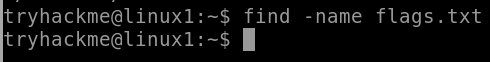
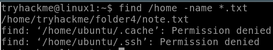

# **Một số cách dùng hay gặp của `find`**
## *Tìm file theo tên:*
```
find <directory> -name <file_name>
```
- Tìm file có tên `flags.txt` trong dir hiện tại:
<p align="center">
    
</p>

- Tìm file có extion `.txt` trong `/home` directory:
<p align="center">
    
</p>

## *Tìm file hoặc thư mục theo quyền:*
```
find <directory> -perm <quyền>
```
- Tìm file/folder có permiss<p align="center">
    
</p>