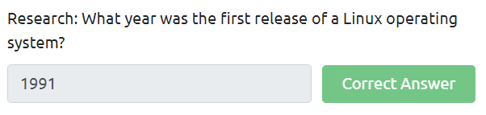
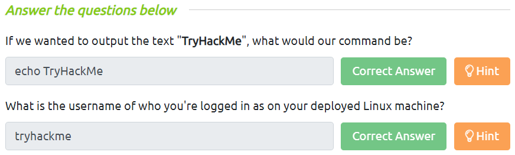
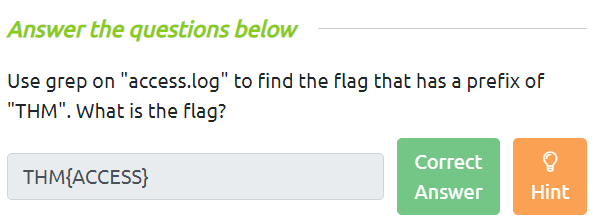
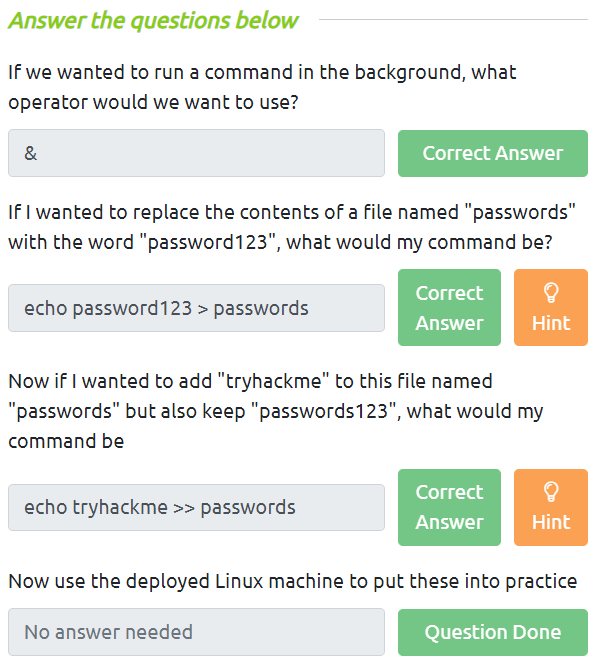

# **Linux**
- Bản chất từ `Linux` là một thuật ngữ chung dùng để chỉ tất cả các hệ điều hành được xây dựng trên `UNIX` - một hệ điều hành ***mã nguồn mở***
- Ubuntu và Debian là hai ***bản phân phối*** (distributions) phổ biến của Linux
- Linux lần đầu tiên được ban hành vào năm 1991
- Đáp án: `1991`
<p align="center">
    
</p>

- Một điểm đặc trưng của việc sử dụng các OS bên trên là do nó ***rất nhẹ*** (lightweight). Nhẹ ở đây hiểu là nó ***sử dụng rất ít tài nguyên hệ thống*** (CPU, memory, storage)

# **Một số câu lệnh thông dụng**
- `echo <string>`: in ra đoạn string bất kỳ trên Terminal
- `whoami`: in ra tên của người dùng hiện tại đang đăng nhập
<p align="center">
    
</p>

## *Tương tác với file/directory*
- `ls`: in ra các thư mục và file (ko bị ẩn) trong thư mục đang làm việc
- `cat <file>`: in ra nội dung file
- `pwd`: in ra đường dẫn đang làm việc hiện tại trên Terminal
<p align="center">
    
</p>

## *Tìm kiếm file/directory*
- `find -name <file>`: dùng để tìm file có tên được truyền vào, và việc tìm này sẽ quét tất cả folder trong folder hiện tại. Tìm hiểu thêm về `find` tại [đây](../In-depth/find.md)
- `grep <string> <filename>`: tìm dòng chứa chuỗi trong file được truyền. Tìm hiểu thêm về `grep` tại [đây](../In-depth/grep.md)
<p align="center">
    
</p>

# **Một số toán tử (Operators) trong Linux**
- `&`: thực thi lệnh ở background
- `&&`: thực thi nhiều lệnh cùng lúc với điều kiện lệnh phía trước phải thực thi được
```
command1 && command2 && ... && command n
```
- `>`: output của command trước sẽ được truyền tới chỗ nào đó, thường là cho vào file. Toán tử này sẽ ***thay thế/ghi đè*** (overwrite) nội dung file ban đầu thành output được trả về từ command trước
- `>>`: giống `>` nhưng khác ở chỗ, toán tử này sẽ ***gán kèm*** (append) nội dung file ban đầu với output được trả về từ command trước thay vì ghi đè
<p align="center">
    
</p>