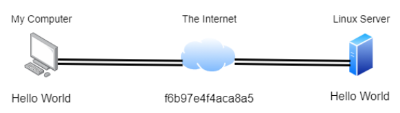
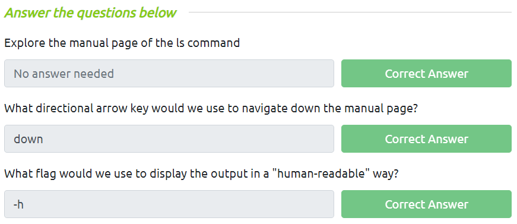
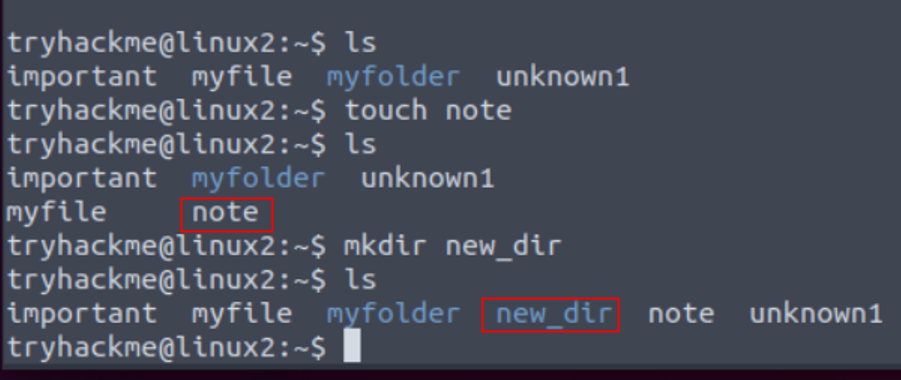
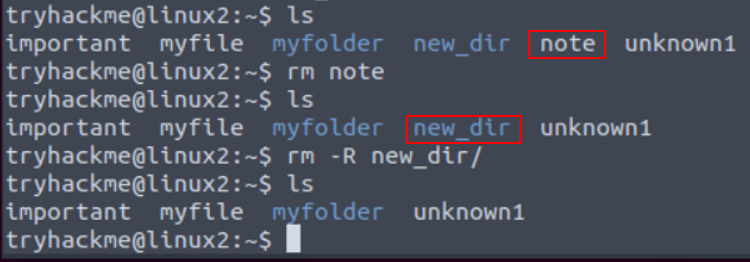
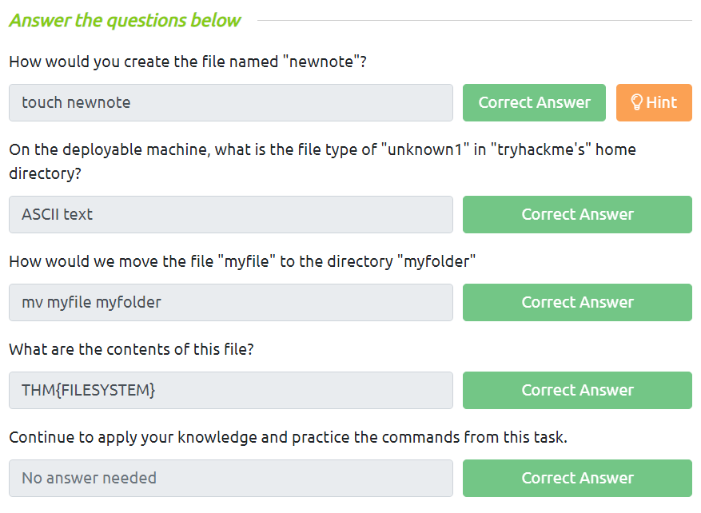

# **Introduction**
- Trong room này sẽ bao gồm:
    * Cách ***kết nối*** với ***máy chủ từ xa*** thông qua `SSH`
    * Các dùng lệnh với ***flags*** và ***truyền tham số*** (argument)
    * Hướng dẫn sử dụng `cp` và `mv`
    * Giới thiệu các cơ chế để giữ file và folder bảo mật
    * Viết script

# **Kết nối tới máy chủ thông qua SSH**
- SSH viết tắt của ***S***ecure ***Sh***ell, đây là ***giao thức bảo mật*** giúp ***kết nối với máy chủ từ xa*** thông qua ***Command Line***
- Nó bảo mật vì ***dữ liệu*** được trao đổi bằng phương thức này đều được ***mã hóa***
<p align="center">
    
</p>

- Cú pháp:
```
ssh <username>@<ip>
```

# **Flags và Switches**
- Hầu hết các câu lệnh đều có tham số được truyền vào, có dạng ***dấu gạch ngang `-`*** và một hoặc vài chữ cái
- Ví dụ: `ls -a` hoặc `ls --all` hiển thị toàn bộ file và thư mục (kể cả ẩn) trong thư mục hiện tại
- Để xem toàn bộ cách dùng, sử dụng flag `--help` hoặc dùng lệnh `man`
<p align="center">
    
</p>

# **Tiếp tục làm việc với hệ thống file**
- `touch <tên file>`: tạo file với tên được truyền vào
- `mkdir <tên dir>`: tạo thư mục với tên được truyền vào
<p align="center">
    
</p>

- `cp <file1> <file2>`: copy nội dung file1 sang file2. Nếu file2 không tồn tại thì tạo file mới
- `mv`: di chuyển/đổi tên file hoặc thư mục
    * `mv <old_file> <new_file>`: đổi tên file
    * `mv <tên file/dir> <dir>`: di chuyển file/dir sang dir mới
- `rm <tên file/folder>`: xóa file hoặc thư mục. Nếu muốn xóa thư mục thì cần thêm flag `-r` hoặc `-R`
<p align="center">
    
</p>

- `file <tên file>`: xác định kiểu file
<p align="center">
    
</p>

# **Permission**
- Không phải file và folder nào cũng có thể được truy cập bởi tất cả người dùng, mỗi người dùng sẽ có ***quyền riêng*** đối với một file hoặc folder nhất định
- Sử dụng `ls -l` hoặc `ll` để hiển thị toàn bộ nội dung trong folder hiện tại ở dạng đầy đủ nhất
- `su <username>`: đổi sang người dùng khác
    ❗Tuy nhiên, sử dụng như trên thì phiên làm việc của người dùng trước vẫn được giữ nguyên. Nếu ta thêm flag `-l` vào thì phiên làm việc mới sẽ được thiết lập với người dùng mới

# **Một số thư mục hay ho**
## *1. /etc*
- Viết tắt của ***etc***etera
- Lưu trữ các ***file hệ thống*** sử dụng bởi OS
- Trong này có một số files như:
    * `sudoer`: ở đây chứa danh sách các người dùng và nhóm có thể ***sử dụng lệnh `sudo`***
    * `passwd`: danh sách ***toàn bộ người dùng*** trong máy
    * `shadow`: danh sách ***mật khẩu được mã hóa*** của toàn bộ người dùng

## *2. /var*
- Viết tắt của ***var***iable data
- Lưu trữ ***dữ liệu thường xuyên được truy cập*** bởi các tiến trình đang chạy trên máy
- File log được lưu trong ***/var/log***

## *3. /root*
- Là thư mục gốc của ***root user***

## *4. /tmp*
- Viết tắt của ***t***e***mp***orary
- Lưu trữ dữ liệu mà chỉ cần được truy cập 1 đến 2 lần
- Dữ liệu trong này đều bị xóa mỗi lần reset máy