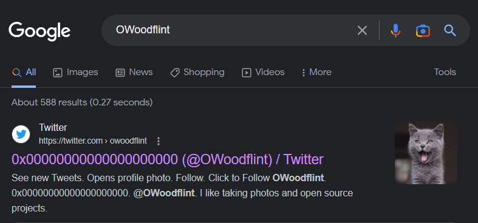

# **Trước khi vào bài thì, OSINT là cái gì đã?**
- Là cụm từ viết tắt của ***Open Source Intelligence***. Intelligence ngoài nghĩa là trí thông minh, sự thông minh ra thì nó còn có nghĩa, đúng trong ngữ cảnh này luôn, là ***việc thu thập thông tin***
- Vậy tức OSINT là ***việc thu thập thông tin từ các nguồn mở*** (open source). Cụm từ nguồn mở này ý chỉ những nguồn ***tài nguyên sẵn có và hợp pháp, có thể được tải về và sử dụng công khai***
- Đây được coi là bước đi đầu tiên trong mọi cuộc tấn công có chủ đích, dù là ý xấu hay ý tốt
- Việc thu thập thông tin này không chỉ là việc thu thập thông qua các phần mềm, công cụ trên máy tính mà là ***mọi cách thu thập từ các nguồn công khai***, ví dụ như đọc sách báo cũng có thể tính là OSINT
- Trên Internet, các thông tin có thể thu thập được từ ***văn bản, hình ảnh, videos, webinars, các trang mạng xã hội...***

## *EXIF là gì?*
- Là cụm từ viết tắt của ***Exchangeable image file format***
- Là một tiêu chuẩn xác định các thông tin liên quan của một bức ảnh số

# **Vào bài thôi**
- Đề có đúng duy nhất 1 task, với nội dung task *"Bạn có thể lấy được những thông tin gì từ trong bức ảnh này?"*
- Đây là ảnh của đề:

    

## *Câu hỏi đầu tiên nào: What is this user's avatar of?*
- Câu hỏi là `"Ảnh avatar của người dùng này là gì?"`. Tức ta có thể hiểu cần tìm thông tin của ***chủ sở hữu/đăng tải*** bức ảnh này
- Câu hỏi này có hint, xem luôn:

    

- Vậy ta sử dụng tool tên là `exiftool`. Đây là công cụ giúp đọc, ghi, điều chỉnh metadata của ảnh, audio, video, PDF, ...
- Ta sử dụng tool với cú pháp như sau và có được thông tin `Copyright` - Bản quyền, như sau:

    

- Như vậy ta có thể đoán bản quyền của bức ảnh này thuộc về `OWoodflint`. Lên Google tra thì ta nhận được tài khoản twitter sau:

    

- Ảnh avatar của tài khoản là con mèo. Vậy đáp án câu hỏi chính là con mèo - `cat`

    

## *What city is this person in?*
- Trên Google còn hiển thị ra trang github của người dùng này:

    

- Và trong này người đó nói tên thành phố mà người đó ở. Như vậy, đáp án là: `London`

    

## *What's the SSID of the WAP he connected to?*
- Ở trong hint câu trước, ta có được công cụ để tìm được đáp là là trong trang `Wigle.net`

    

- Trong trang cá nhân của chủ tài khoản có một đoạn tweet như sau, và ta có được BBSID của người đó:

    

- Sử dụng website, ta tra được SSID của người đó:

    

- Vậy đáp án là: `UnileverWiFi`

    

## *What is his personal email address?*

    

- Tại trang Github của người đó cũng đã nói kèm email. Vậy đáp án là: `OWoodflint@gmail.com`

    

## *What site did you find his email address on?*

    

- Như bên trên, email nằm trong Github. Vậy đáp án là: `github`

    

## *Where has he gone on holiday?*

    

- Trên Google còn có trang Wordpress của người này nữa, và trong đấy chứa nội dung cần tìm. Vậy đáp án là: `New York` 

    

## *What is this person's password?*
- Trong Wordpress của người này, khi check source code ta thấy được đoạn `
` bị ẩn trong nền

    

- Vậy đáp án là: `pennYDr0pper.!`

    

