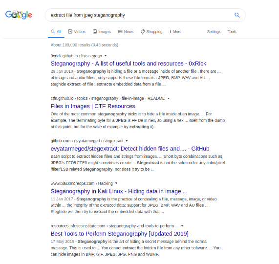
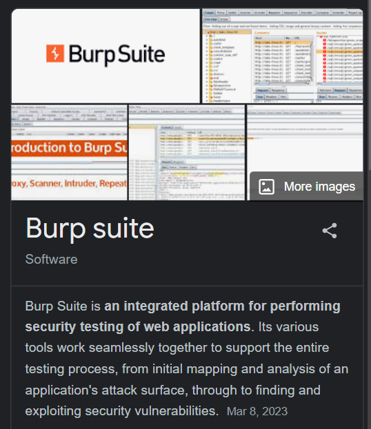
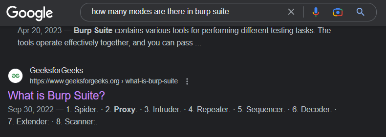
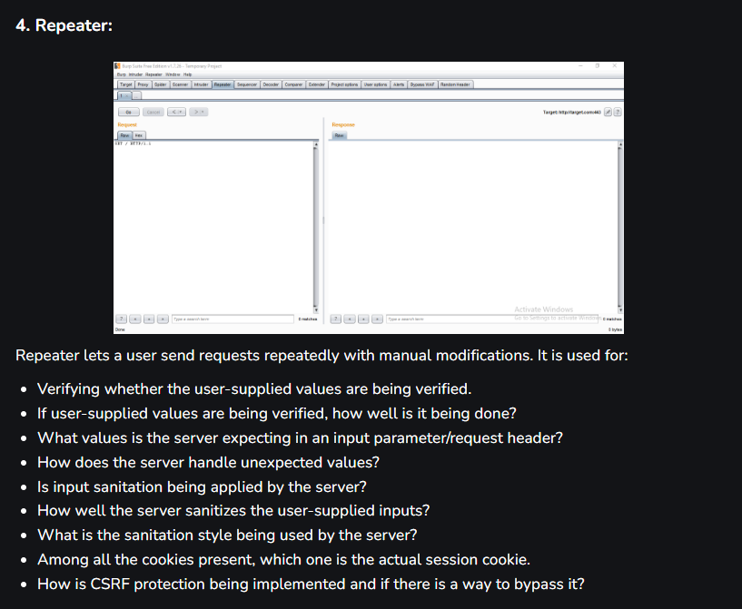
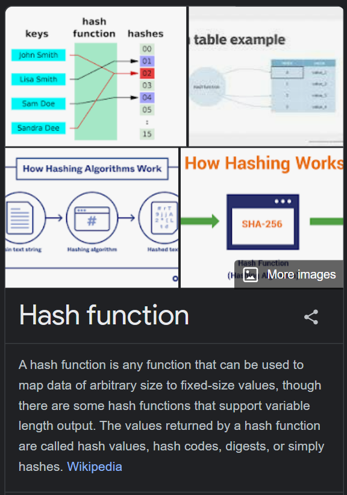
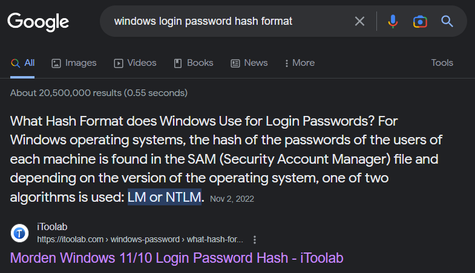
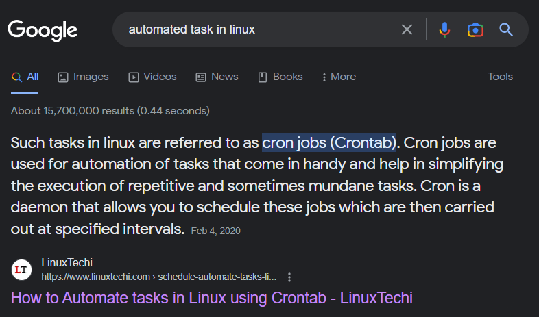
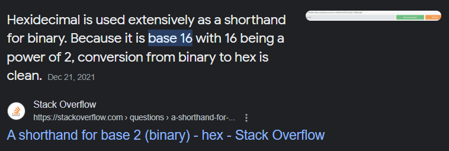

# **Introduction**
- ***Kỹ năng nghiên cứu hiệu quả*** (effective research) rất cần thiết cho các hacker
- Việc thực hiện hack đòi hỏi một ***lượng lớn kiến thức nền***, bởi vì muốn hack vào cái nào thì cần phải hiểu cách nó hoạt động chứ
- Không một ai có thể khi gặp một vấn đề sẽ nghĩ ngay được cách giải quyết cả. Lúc này, việc nghiên cứu trở nên thực sự cần thiết
- Càng lên cao, càng có nhiều kinh nghiệm thì những thứ mà bạn nghiên cứu cũng ***càng khó*** và nhiều theo, và đặc biệt trong cái ngành Bảo mật thông tin này, chưa bao giờ, và sẽ không bao giờ, có điểm dừng cho việc tìm hiểu kiến thức cả

# **Ví dụ về câu hỏi nghiên cứu**
- Giả sử trong các bài CTF thường gặp, có một bài yêu cầu tải ảnh về. Bạn nghi ngờ trong ảnh có cái gì đó, nhưng bạn không biết làm gì để kiểm chứng điều này. Vậy thì tại sao không thử search trên Google kiểu: *"Hiding things inside images"*

    

- Trong Link thứ 2, có kỹ thuật gọi là Steganography. Vào đấy, đọc nội dung, ta thấy được ta có thể giấu file trong ảnh
- Bây giờ thử tìm kiếm kiểu khác: *"Extract files from steganography"*

    

- Giờ thì mỗi link ta đều thấy có ích. Vậy thử cái link đầu tiên xem. Và trong đó ta thấy có một tool khá hay ho và hữu dụng

...

- Suy cho cùng, phương pháp nghiên cứu hiệu quả sẽ bao gồm:
    * Bắt đầu nghiên cứu với một câu hỏi
    * Tìm hiểu sơ qua, những ý hiểu ban đầu về topic này
    * Tiếp tục nghiên cứu sâu hơn vào từng khía cạnh để hiểu hơn về topic

## *Trả lời câu hỏi:*
### *1. Trong Burp Suite, chế độ nào giúp bạn gửi request thủ công, thường là liên tục lặp lại việc gửi request nhiều lần?*
- Đầu tiên ta cần biết Burp Suite là gì, vậy nên ta tra: ***"What is Burp Suite"***

    

- Như vậy, ta biết Burp Suite là một phần mềm tích hợp nhiều tính năng cho việc kiểm thử bảo mật của các ứng dụng web. Giờ ta cần biết trong Burp Suite có gì, trong cùng câu search trên, ta có thể tham khảo Geeksforgeeks vì nó đưa ra những tab mà trong Burp Suite có

    

- Đọc bài, thấy trong nó có mục "Repeater" giống như yêu cầu câu hỏi

    

- Câu trả lời: `repeater`

### *2. Dạng hash nào được sử dụng cho việc lưu trữ mật khẩu login của Windows?*
- Ta cần biết hash là gì, nên ta tra: ***"What is hash"***

    

- Vậy hash là việc biến dữ liệu đầu vào thành một chuỗi có độ dài cố định. Giờ để biết Windows sử dụng dạng Hash nào cho việc lưu trữ mật khẩu login

    

- Đáp án: `NTLM`

### *3. Các tác vụ được tự động hóa trên Linux được gọi là gì?*

    

- Đáp án: `cron jobs`

### *4. Hệ cơ số nào được sử dụng để "viết tắt" cho hệ cơ số 2?*

    

- Đáp án: `base 16`

### *5. Nếu mật khẩu hash bắt đầu bằng \$6\$, dạng hash của nó là gì?*
- Đáp án: `SHA512crypt`

# **Tìm kiếm lỗ hổng**
- Đôi khi chúng ta gặp những phần mềm, ứng dụng cần được khai thác lỗ hổng. Một vài ***hệ quản trị nội dung*** (Content Management System - CMS) như Wordpress giúp cho việc tạo website dễ dàng hơn, nhưng trong đó có nhiều cái dễ bị khai thác, tấn công
- Có một vài websites giúp cho việc khai thác lỗ hổng như 
    * [ExploitDB](https://www.exploit-db.com/): thường dùng cho các bài CTF hoặc đi pentest. Kali có tool tên `searchsploit` cho phép sử dụng ExploitDB ngay trên chính máy mình (tức offline đó) 
    * [NVD](https://nvd.nist.gov/vuln/search): NVD sẽ lưu các CVE - Common Vulnerabilities and Exposures, đây chính là nơi mà chúng ta muốn tìm hiểu về các lỗ hổng. Các CVE sẽ có dạng: `CVE-<năm>-<ID>` 
    * [CVE Mitre](https://cve.mitre.org/)