# **Task 1: Giới thiệu về Shodan.io**
- Shodan.io là một ***công cụ tìm kiếm cho IoT***
- Shodan quét toàn bộ Intenet và đánh chỉ mục cho các dịch vụ ở mỗi địa chỉ IP

## *Tìm kiếm dịch vụ:*
- Giả sử ta muốn thực hiện pentest cho một công ty, tìm kiếm các dịch vụ mà server của công ty đó có
- Việc đầu tiên là cần có địa chỉ IP của công ty đó. Ta dễ dàng có được bằng cách sử dụng [DNSDumpster](https://dnsdumpster.com/)

    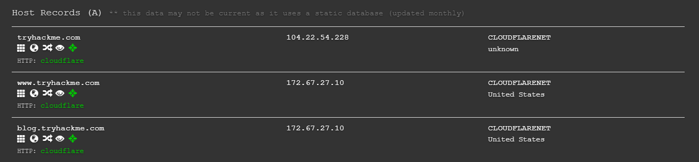

- Lấy được IP rồi thì ta cho lên phần tìm kiếm của Shodan.io và ta nhận được kết quả sau:

    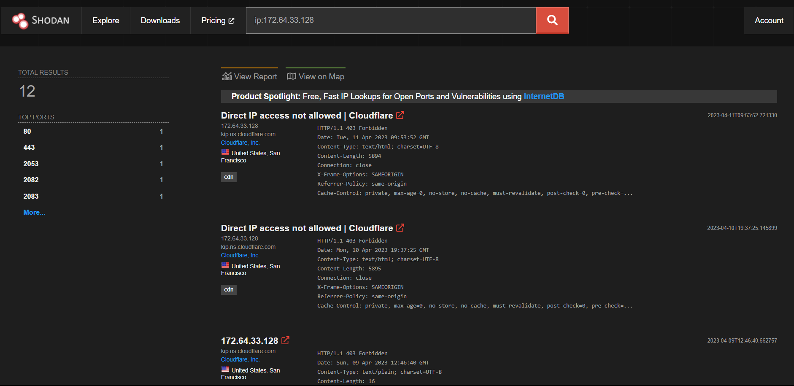

- Có thể thấy Tryhackme chạy bởi Cloudflare ở Mỹ và có ít nhất 12 ports được mở
- Truy nhiên Cloudflare đóng vai trò như người ở giữa Tryhackme và server thật của công ty. Để lấy được IP thật, ta có thể sử dụng đến cái gọi là `Autonomous System Numbers`

## *Autonomous System Numbers (ASNs):*
- Có thể hiểu đây là một ***định danh cho một chuỗi địa chỉ IP***. Đối với các công ty lớn như Google, việc có một ASN là cần thiết
- [Ultratools](https://www.ultratools.com/tools/asnInfo) là một trang web giúp tra cứu thông tin ASN
- Tryhackme không phải là một tập đoàn công ty lớn như Google nên nó không có ASN
- Dẫu vậy, Shodan.io có thể tìm kiếm bằng cách lọc ASN với cú pháp `ASN:[number]`, ví dụ `number` là AS15169 (ASN của Google), ta nhận được khoảng 6.2 triệu websites trả về trong một ASN duy nhất

## *Banners:*
- Để tận dụng tối đa được Shodan, ta nên hiểu ***cú pháp của lệnh truy vấn*** của nó
- Shodan chứa các thông tin về các dịch vụ có trên Internet, và thông tin đó được lưu trong cái gọi là `banner`
- Một cái banner có thể có cú pháp như sau:

    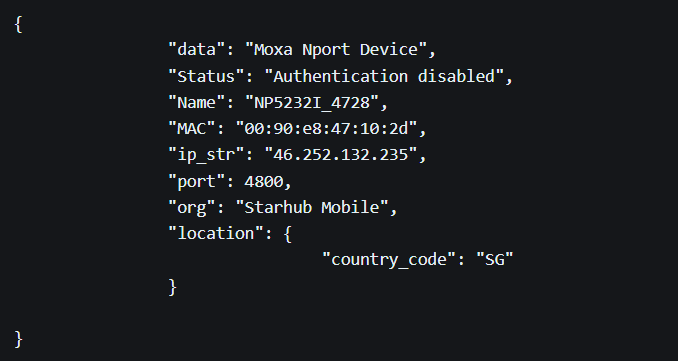

# **Task 2: Filters - Bộ lọc của Shodan**
- Trong trang chủ của Shodan.io, có tab `Explore` dùng để xem các lệnh truy vấn thường được sử dụng nhẩt

    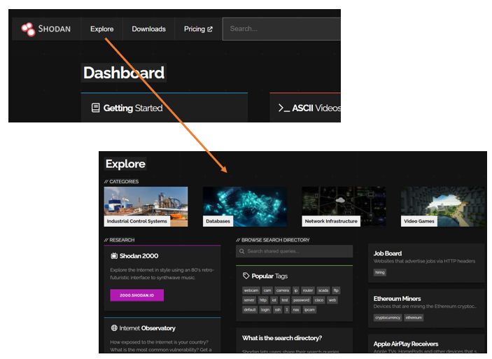

- Một trong những lệnh truy vấn đó chính là truy vấn các cơ sở dữ liệu của MySQL

    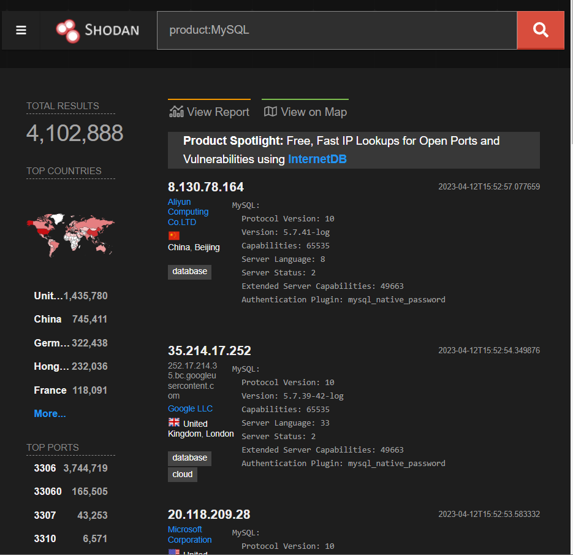

- Ta có thể kết hợp các filter lại với nhau, ví dụ câu lệnh truy vấn `asn:AS14061 product:MySQL` giúp truy vấn MySQL server ở trong Google ASN

    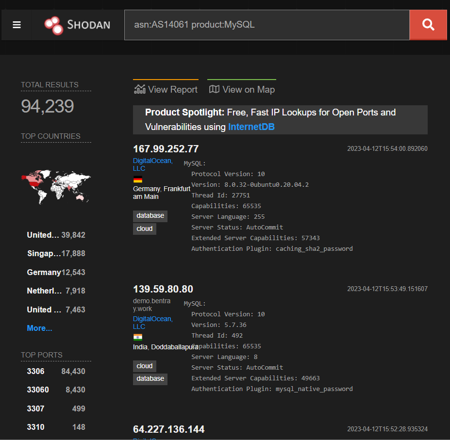

- Shodan có rất nhiều filter khác nhau. Trong đó có cả filter `vuln` dùng để check xem các địa chỉ IP nào có khả năng bị tấn công bởi lỗ hổng nào. Ví dụ, ta muốn tìm các địa chỉ IP dễ bị tấn công bởi Eternal Blue: ***`vuln: ms17-010`***
- Đáp án:

    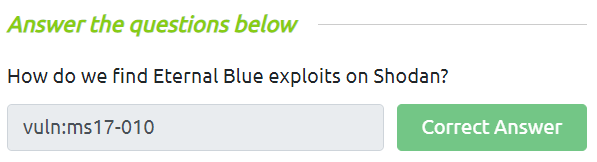

- Cheatsheet tham khảo các filter tại [đây](https://www.shodan.io/search/filters)

## *API:*
- Shodan.io cũng có API chứ. API này giúp ta có thể tìm kiếm một list địa chỉ IP trả về một cách bài bản, có kế hoạch hơn

# **Task 3: Google & Filtering**
## *What is the top operating system for MYSQL servers in Google's ASN?*
- Để truy vấn thực hiện trả lời câu này, ta sử dụng filter: `asn:AS15169 product:mysql`

    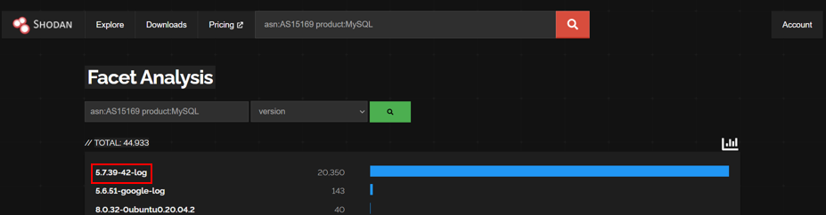

- Câu trả lời thực tế sẽ có sự thay đổi so với đáp án. Nên ta chọn đáp án của đề bài (trong hint) dù thực tế phải là `5.7.39-42-log`

    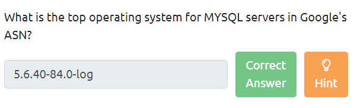

## *What is the 2nd most popular country for MYSQL servers in Google's ASN?*
- Cũng vẫn câu truy vấn trên, ta tìm được câu trả lời cho server MySQL phổ biến thứ 2 của Google ASN

    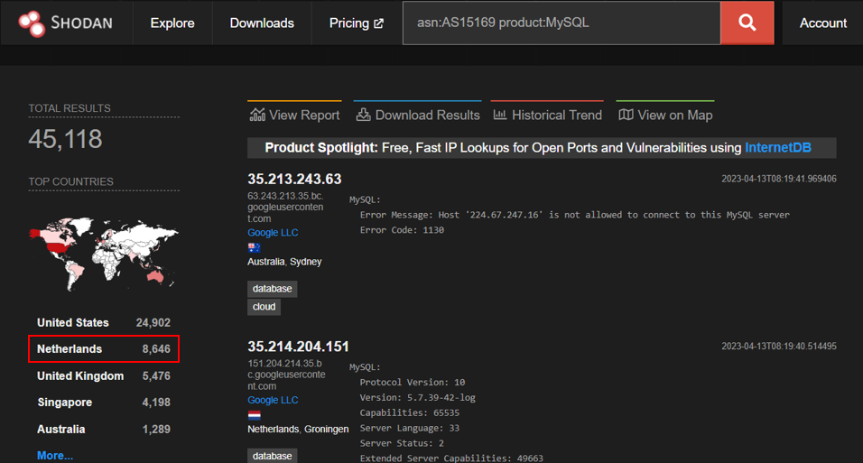

- Đáp án: `Netherlands`

    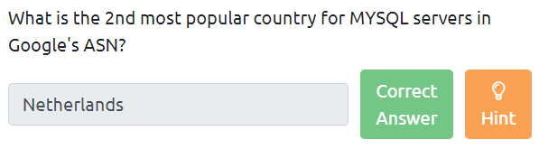

## *Under Google's ASN, which is more popular for nginx, Hypertext Transfer Protocol or Hypertext Transfer Protocol with SSL?*
- Câu hỏi đại khái là đối với NGINX của Google ASN thì HTTP hay HTTPS phổ biến hơn. Vậy nên ta có câu truy vấn sau: `asn:AS15169 product:nginx`. Trên mục `Top Ports`, ta nhận thấy port 443 (mặc định của HTTPS) nằm trên và được sử dụng nhiều hơn port 80 (mặc định của HTTP). Vậy nên HTTPS sẽ phổ biến hơn HTTP

    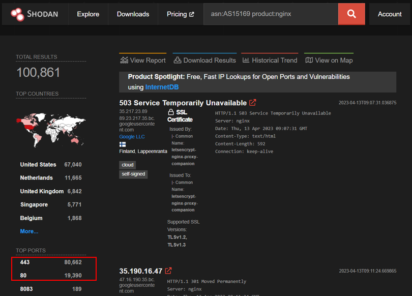

- Câu trả lời thực tế sẽ có sự thay đổi so với đáp án. Nên ta chọn đáp án của đề bài (trong hint) dù thực tế phải là `Hypertext Transfer Protocol with SSL`

    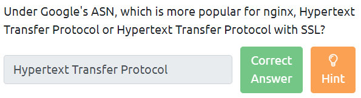

## *Under Google's ASN, what is the most popular city?*
- Để biết được thành phố phổ biến của Google ASN, ta đơn thuần dùng truy vấn `asn:AS15169`. Trên mục `Top Countries`, ta chọn ***United States***, trong đó sẽ cho kết quả `Top Cities` và `Kansas City` là thành phố phổ biến nhất

    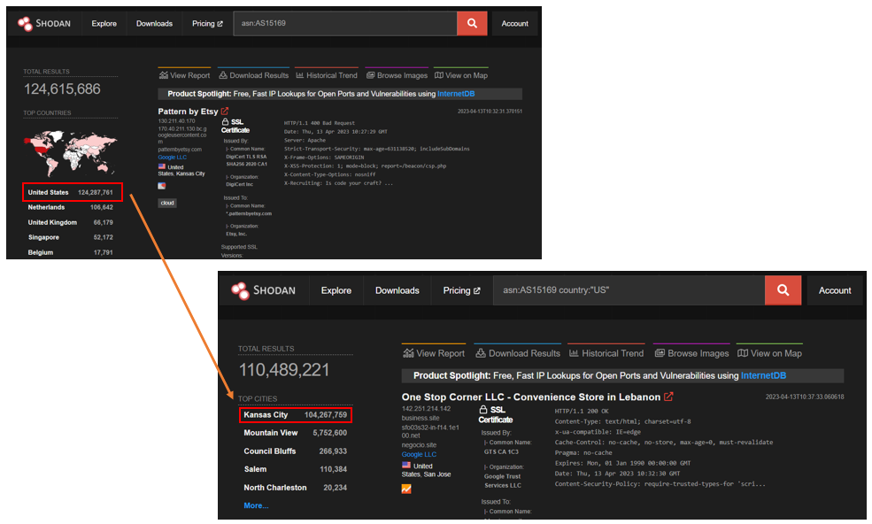

- Câu trả lời thực tế sẽ có sự thay đổi so với đáp án. Nên ta chọn đáp án của đề bài (trong hint) dù thực tế phải là `Kansas City`

## *Under Google's ASN in Los Angeles, what is the top operating system according to Shodan?*
- Ta có thể dùng truy vấn sau: `asn:AS15169 country:"US" city:"Los Angeles"`

    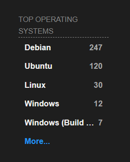

- Câu trả lời thực tế sẽ có sự thay đổi so với đáp án. Nên ta chọn đáp án của đề bài (trong hint) dù thực tế phải là `Debian`

## *Using the top Webcam search from the explore page, does Google's ASN have any webcams?*
- Có rất nhiều phần mềm kiểm tra webcam, ở đây ta sử dụng `webcamxp` với cú pháp: `webcamxp asn:AS15169`
- Ở đây ta không nhận được kết quả nào

    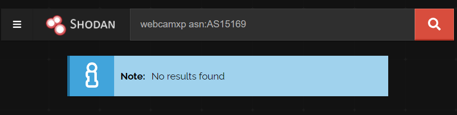

# **Task 4: Shodan Monitor**
- Đây là ứng dụng quản lý các thiết bị trong mạng của mình
- Truy cập vào [ứng dụng](https://monitor.shodan.io/dashboard) và nó yêu cầu nhập một dải IP

    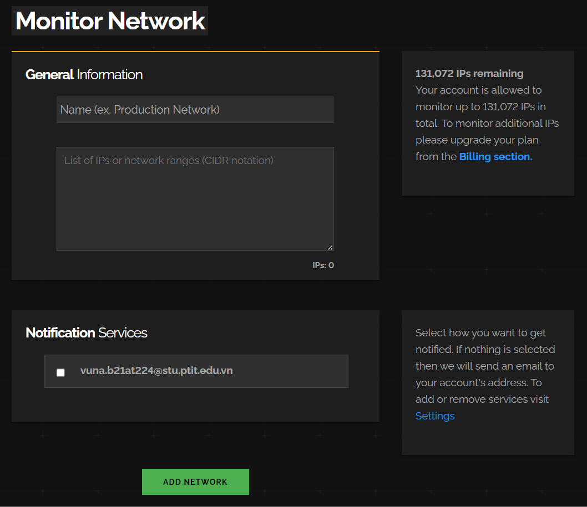

# **Task 5: Shodan Dorking**
- Shodan có cả một trang sử dụng Dork cho phép tìm kiếm vài thứ
## *Một số ví dụ:*
- `has_screenshot:true encrypted attention`: sử dụng ORC (optical character recognition - nhận dạng ký tự quang học, tức đọc text từ ảnh) và các máy tính từ xa để ***tìm kiếm xem máy nào đang bị dính ransomware***
- `screenshot.label:ics`: sử dụng máy học để nhận dạng các ICS (industrial control systems - hệ thống điều khiển công nghiệp) đang kết nối với Internet
- `vuln:CVE-2014-0160`: tìm kiếm các thiết bị kết nối với Internet mà bị lỗ hổng mang tên là ***heartbleed***
- Đáp án:

    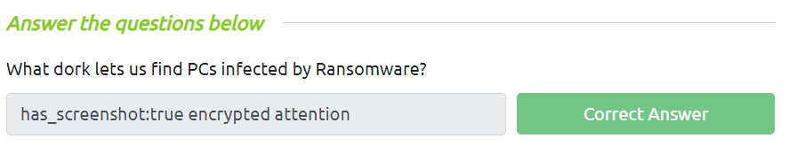

# **Task 6: Shodan Extension**
- [Đây](https://chrome.google.com/webstore/detail/shodan/jjalcfnidlmpjhdfepjhjbhnhkbgleap) là link tới một extension của Shodan, cho phép biết được địa chỉ IP của webserver, có những port nào đang mở, nằm ở đâu và có bất kỳ lỗ hổng bảo mật nào không
- Extension này phù hợp cho ai chơi Bug Bounty